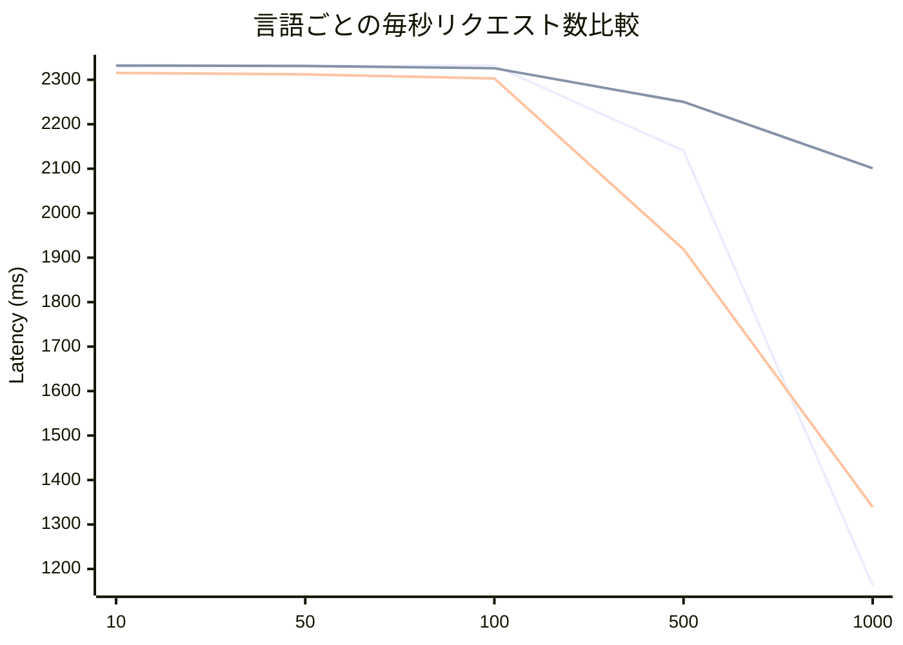

# 課題レポート

## 目次
- [概要](#1-概要)
- [システム構成と検証環境の選定](#2-システム構成と検証環境の選定)
- [実行環境](#3-実行環境)
- [負荷テストにおけるボトルネックの特定と最適化](#4-負荷テストにおけるボトルネックの特定と最適化)

## 1. 概要
本レポートは選考課題の実装、および本番想定の負荷環境におけるボトルネックの特定と、それを解消するためのアーキテクチャ最適化、複数言語・ランタイム（Go+gin, Rust+Axum, TypeScript + Bun/Hono）による比較検証結果をまとめたものです。それぞれのソースコードは [GitHub](https://github.com/RyOkEeeesh/finatext) にて、それぞれのブランチで公開しています。

**負荷テストにおける外部APIの制約について**

Step.2で指定された外部の住所取得APIは、短時間に大量のリクエストを送信すると、API提供元によるリクエスト制限によってエラーやブロックが発生する特性があります。
この制約は外部仕様上不可避であるため、本負荷テストにおいては外部APIの応答制限による影響を除外した上で、自作したアプリケーションおよびデータベースが到達できる限界のスループットと、キャッシュによる最適化効果を測定・検証することを目的としました。

## 2. システム構成と検証環境の選定
提出成果物は仕様に基づき、環境構築の容易性を担保するため `docker compose` によるコンテナ環境としてパッケージングしています。
しかし、コンテナ間の仮想ネットワークやリソース制限自体が負荷テスト時のボトルネックとなることを防ぎ、アプリケーションおよびミドルウェアの純粋な限界性能を測定するため、負荷テストはすべてホストマシン上のネイティブ環境にて実行しました。負荷テストは [k6](https://k6.io/) を使用して行いました。テストケースは主に２つで、[単一のエンドポイント](https://github.com/RyOkEeeesh/finatext/blob/test/test.js)と、[混在負荷テスト](https://github.com/RyOkEeeesh/finatext/blob/test/address_mixed_test.js)を行いました。また、テスト結果は[GitHub上](https://github.com/RyOkEeeesh/finatext/tree/test)で公開されており、以下のフォーマットで保存されています。

`言語名_エンドポイント('/'は'-'に変換)_VUs_Duration.md`

`VUs`は仮想ユーザー数を表しており、同時接続数や並行実行数を表しています。Durationはテストの実行時間を表しており、今回のテストは主に30秒の条件下で実施しました。また、通信速度は**1Gbps**の環境下で行いました。

## 3. 実行環境
| 項目 | OS | CPU | メモリ | GPU |
| --- | --- | --- | --- | --- |
| サーバー環境 | Fedora KDE 44 | Core Ultra 265k | 64GB | RTX 5070 |
| 負荷テスト実行環境 | macOS 26.5.1 | M5 | 32GB | 内臓GPU |

## 4. 負荷テストにおけるボトルネックの特定と最適化

### 4.1 初回実装における課題
Step.2までの外部API連携に加え、Step.3-1では `/address` へのアクセス毎にログをDBへ同期挿入する処理を追加し、Step.3-2では `/address/access_logs` へのアクセス毎にDBから集計データを取得する実装を行いました。
この状態で負荷テストを実施したところ、スループットの著しい低下とレイテンシの悪化が確認さました。原因は、リクエスト毎に発生する「大量の単発INSERTによるディスクI/Oオーバーヘッド」と、集計APIによる「COUNT や GROUP BY を伴う参照クエリの連打」がデータベース側で競合したことです。これにより、DBサーバーのCPUが飽和し、APIサーバー側のコネクションプールが完全に枯渇するボトルネックへと繋がりました。

### 4.2 解決アプローチ：インメモリ・バッファリングと `BigCache` による最適化
高頻度なリクエストによるデータベースの負荷集中を抑制し、スループットを最大化するため、以下の二段階のインメモリ最適化戦略を導入しました。

- **書き込み最適化（ライトバッファリングとバルクインサート）**:
  リクエスト毎にデータベースへ同期挿入（単発の INSERT）を行うのをやめ、`sync.Mutex` で保護されたスレッドセーフなインメモリバッファ（`map`）に郵便番号ごとのリクエスト数を一時的に集約（インクリメント）する構成に変更しました。
  蓄積されたログは、バックグラウンドの非同期ワーカーによって定期的に、または集計APIの呼び出し時に、GORM の `CreateInBatches` を用いて一括挿入（バルクインサート）することで、ディスク I/O オーバーヘッドを劇的に削減しました。
- **読み込み最適化（インメモリキャッシュと追記時クリア）**:
  `/address/access_logs` の重い集計結果（`COUNT` / `GROUP BY`）を `BigCache` に最大10秒間キャッシュし、データベースへのクエリ連打を回避しました。
  また、新規リクエスト（`/address`）の受付時には即座に対象のキャッシュキーを明示的に削除（Cache Eviction）し、バックグラウンドのフラッシュ処理と連携させることで、データの即時性とパフォーマンスのバランスを最適化しています。

### 4.3 結果
最適化の結果、`/access_logs` においてキャッシュ未適用時は **約397 req/s** で頭打ちだったスループットが、キャッシュ適用後は **約60,000 req/s（約150倍の性能向上）** を記録しました。

この劇的な変化は、データベースへの直接クエリや外部APIのネットワークI/O待ちが、システム全体のスループットを制限する主要な支配要因であったことを明確に示しています。
メモリ上で効率的にリクエストを集約してから一括挿入するアーキテクチャへの転換が、ボトルネック解消に極めて有効であることを実証できました。

実行結果の具体的な数値やグラフは[こちら](https://github.com/RyOkEeeesh/finatext/tree/test/tests_cache)からご覧ください。

## 5. 他言語との比較

### 5.1 他言語とライブラリについて
上記で実装した仕様を以下の構成でも実装し、Goとの違いや特徴を調べました。
- **Rust + Axum**
- **TypeScript + Bun/Hono**

どちらもモダンな構成となっており、BunはTypeScriptをシングルスレッドでネイティブで実行でき、Honoは高速なルーティングや軽量な実装、マルチランタイム対応が特徴となっています。また、Rustは高速かつメモリ効率よく動作し、AxumはRustの主要な非同期ランタイムである「Tokio」をベースにした高性能なWebフレームワークです。

### 5.2 結果
- **Rust (Axum):** 最も低いレイテンシと高い安定性を誇り、特にキャッシュヒットパスでの処理能力は極めて優秀でした。
- **Go (Gin):** Rustに匹敵するスループットを維持しつつ、高負荷時でも予測可能な挙動を示しました。
- **TypeScript (Bun/Hono):** 驚異的な実行速度を誇るものの、極端なテールレイテンシが発生しやすい傾向にあり、リソース競合に対する感度が高いことが判明しました。

詳細の結果は[こちら](https://github.com/RyOkEeeesh/finatext/tree/test/tests)です

### 5.3 言語・ランタイム別の詳細評価

#### 【Go + Gin】 高い安定性と予測可能性
- **強み:** `address/access_logs` において、高負荷時でも極めて安定したスループットを維持。Goroutineによる並行処理が、バックグラウンドのバルクインサートとフロントエンドのリクエスト処理を効果的に分離しています。
- **弱み:** Rustと比較すると、純粋な計算・メモリ操作におけるオーバーヘッドがわずかに大きいものの、実用的な範囲では無視できるレベルです。

#### 【Rust + Axum】 極限のパフォーマンスと低レイテンシ
- **強み:** 非常に低い平均レイテンシを達成。特にメモリ管理の最適化により、高負荷時でも「ノイズ」の少ないクリーンなレスポンスを提供します。
- **弱み:** 高度な非同期処理の実装において、リソース競合やコネクションプールの枯渇に対する挙動が非常にシビアであり、適切な設計がないと極端なテールレイテンシを招くリスクがあります。

#### 【TypeScript + Bun/Hono】 驚異的な実行速度と運用上の課題
- **強み:** BunのJITコンパイルによる高速化により、Goに匹敵するスループットを実現。開発スピードとパフォーマンスのバランスが良い。
- **弱み:** 高負荷・混合環境下において、テールレイテンシのスパイクが目立ちます。

### 5.4 結論
純粋な処理能力ではRustが優位ですが、開発効率と安定性のバランスを含めたバックエンド基盤としてはGoが非常に強力な選択肢となります。