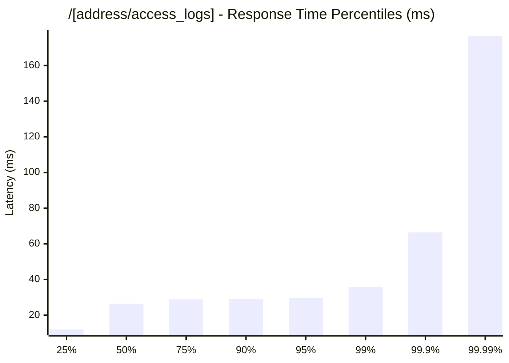
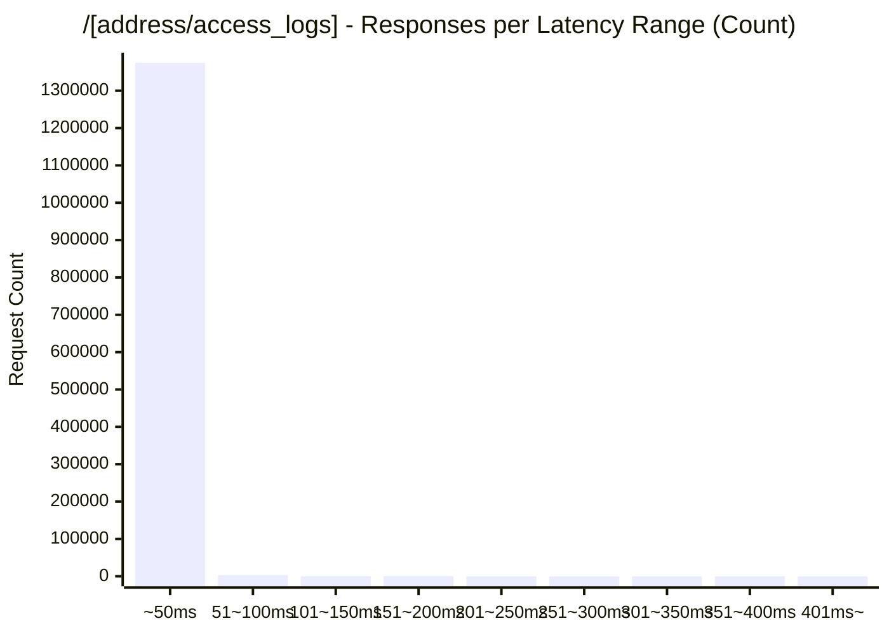

### /[address/access_logs]
| 項目 | 結果 |
| :--- | :--- |
| 成功率 | 100.00% |
| 最遅 | 258.0490 ms |
| 最速 | 0.2060 ms |
| 平均 | 21.7219 ms |
| 毎秒リクエスト数 | 45921.8079/sec |

```mermaid
xychart-beta
  title "/[address/access_logs] - Response Time Percentiles (ms)"
  x-axis ["25%", "50%", "75%", "90%", "95%", "99%", "99.9%", "99.99%"]
  y-axis "Latency (ms)"
  bar [12.0, 26.4, 28.9, 29.2, 29.7, 35.8, 66.4, 176.6]
```

```mermaid
xychart-beta
  title "/[address/access_logs] - Responses per Latency Range (Count)"
  x-axis ["~50ms", "51~100ms", "101~150ms", "151~200ms", "201~250ms", "251~300ms", "301~350ms", "351~400ms", "401ms~"]
  y-axis "Request Count"
  bar [1374761, 3189, 241, 328, 0, 1, 0, 0, 0]
```
