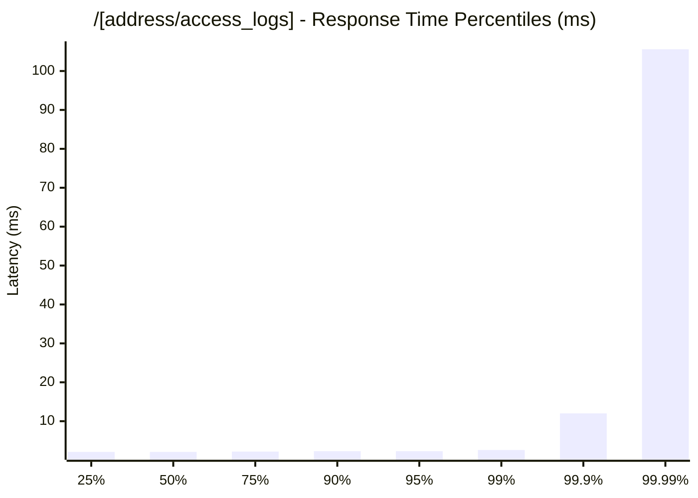
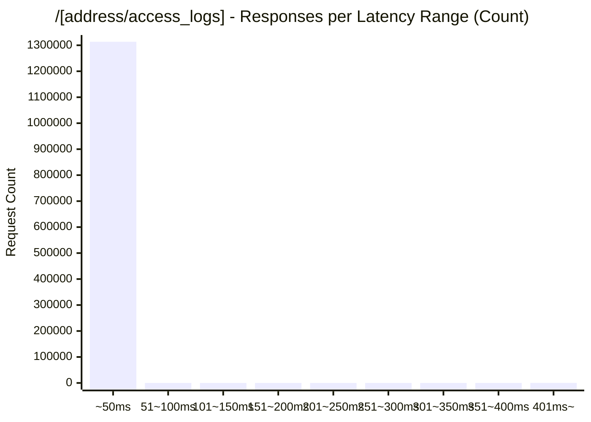

### /[address/access_logs]
成功率:      100.00%
最遅:        2177.5190 ms
最速:        0.1580 ms
平均:        2.2662 ms
毎秒リクエスト数:   43790.2496/sec

```mermaid
xychart-beta
  title "/[address/access_logs] - Response Time Percentiles (ms)"
  x-axis ["25%", "50%", "75%", "90%", "95%", "99%", "99.9%", "99.99%"]
  y-axis "Latency (ms)"
  bar [2.1, 2.1, 2.2, 2.3, 2.3, 2.6, 12.0, 105.6]
```

```mermaid
xychart-beta
  title "/[address/access_logs] - Responses per Latency Range (Count)"
  x-axis ["~50ms", "51~100ms", "101~150ms", "151~200ms", "201~250ms", "251~300ms", "301~350ms", "351~400ms", "401ms~"]
  y-axis "Request Count"
  bar [1313663, 0, 65, 0, 0, 0, 0, 0, 100]
```
