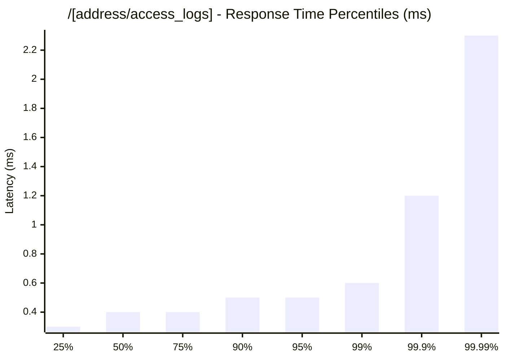
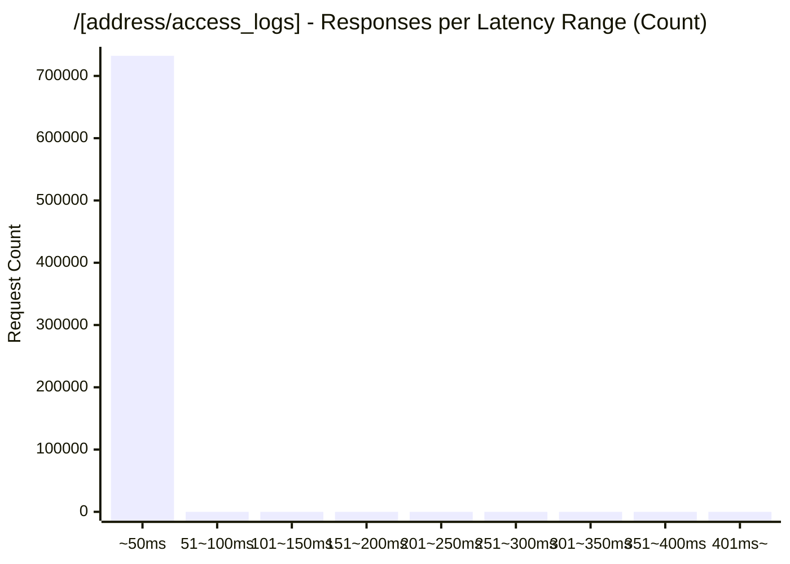

### /[address/access_logs]
| 項目 | 結果 |
| --- | --- |
| 成功率 | 100.00% |
| 最遅 | 457.0250 ms |
| 最速 | 0.1480 ms |
| 平均 | 0.3965 ms |
| 毎秒リクエスト数 | 24412.5706/sec |

```mermaid
xychart-beta
  title "/[address/access_logs] - Response Time Percentiles (ms)"
  x-axis ["25%", "50%", "75%", "90%", "95%", "99%", "99.9%", "99.99%"]
  y-axis "Latency (ms)"
  bar [0.3, 0.4, 0.4, 0.5, 0.5, 0.6, 1.2, 2.3]
```

```mermaid
xychart-beta
  title "/[address/access_logs] - Responses per Latency Range (Count)"
  x-axis ["~50ms", "51~100ms", "101~150ms", "151~200ms", "201~250ms", "251~300ms", "301~350ms", "351~400ms", "401ms~"]
  y-axis "Request Count"
  bar [732399, 0, 0, 3, 1, 0, 1, 4, 1]
```
