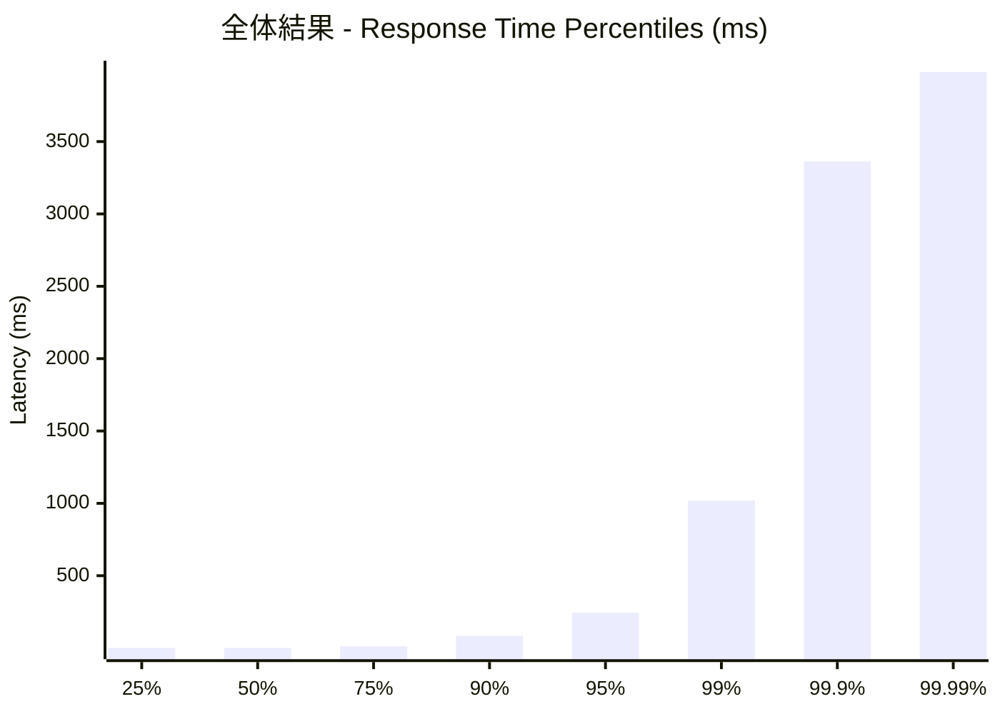
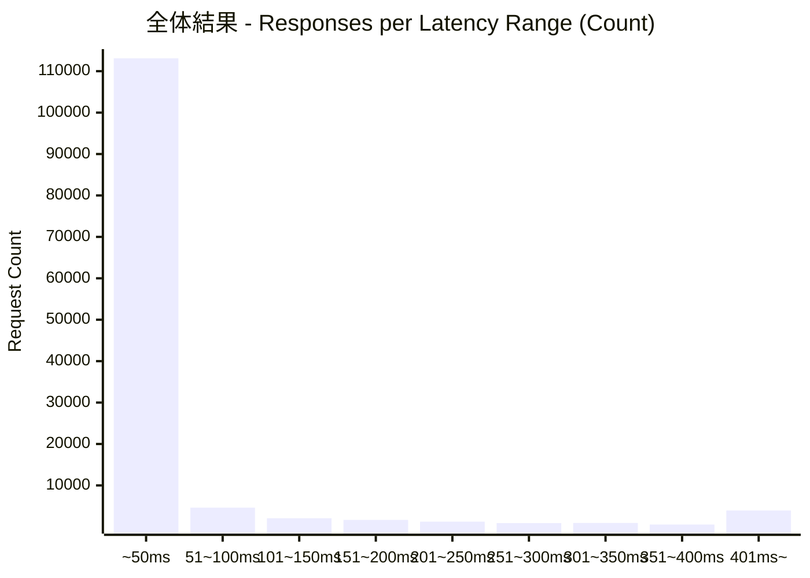
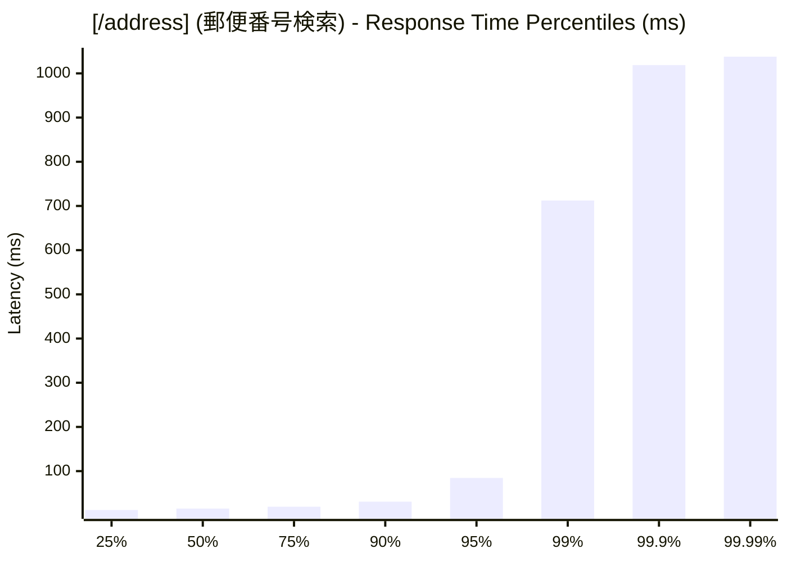
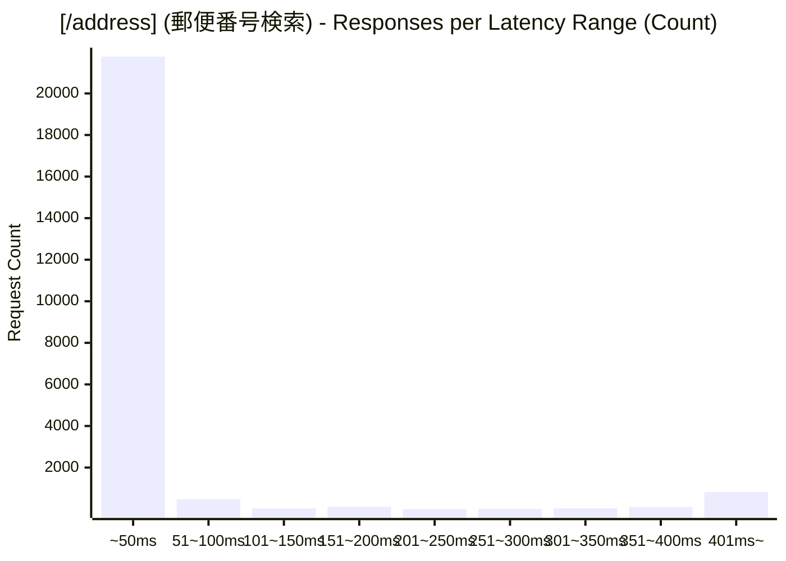
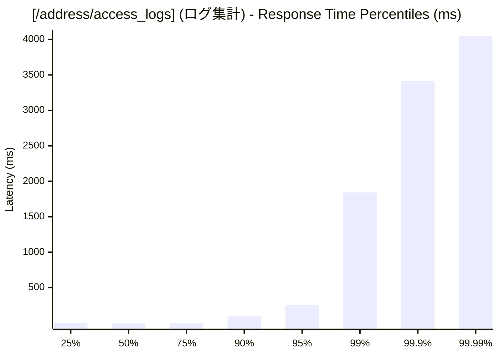
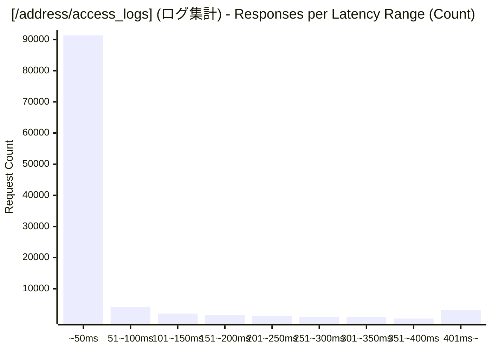

# 負荷テスト結果レポート: go_address-mixed_1000_30s
テスト実行時間: 31.1836 sec

## エンドポイント別詳細

### 全体結果
成功率:      72.25%
最遅:        5582.5530 ms
最速:        0.1590 ms
平均:        55.1056 ms
毎秒リクエスト数:   4138.8703/sec

---

### [/address] (郵便番号検索)
成功率:      0.67%
最遅:        1037.9190 ms
最速:        6.3600 ms
平均:        44.5687 ms
毎秒リクエスト数:   749.2713/sec

---

### [/address/access_logs] (ログ集計)
成功率:      88.07%
最遅:        5582.5530 ms
最速:        0.1590 ms
平均:        57.4347 ms
毎秒リクエスト数:   3389.5990/sec

