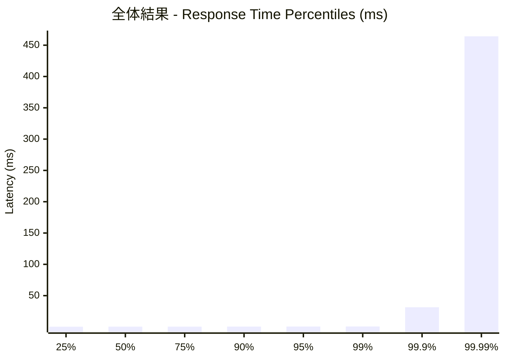
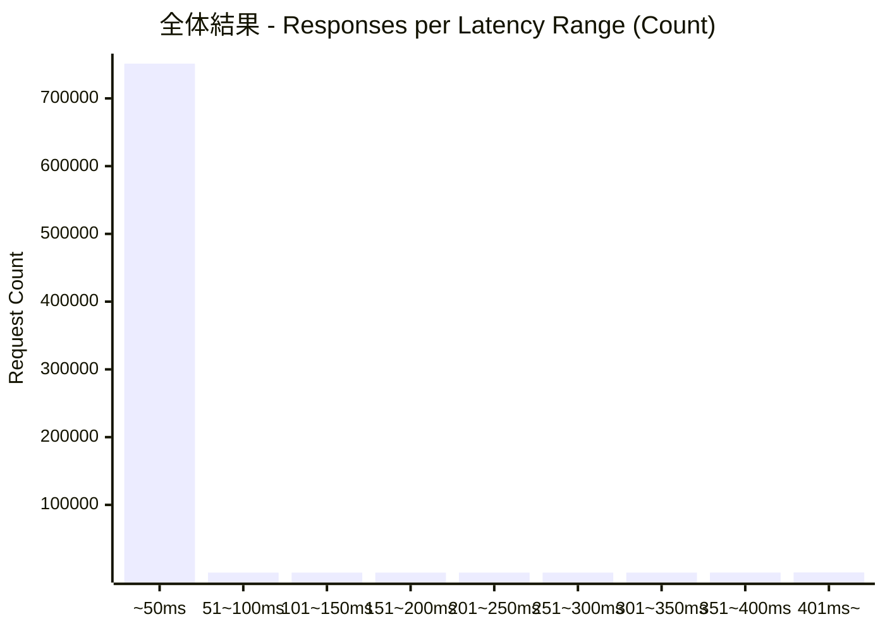
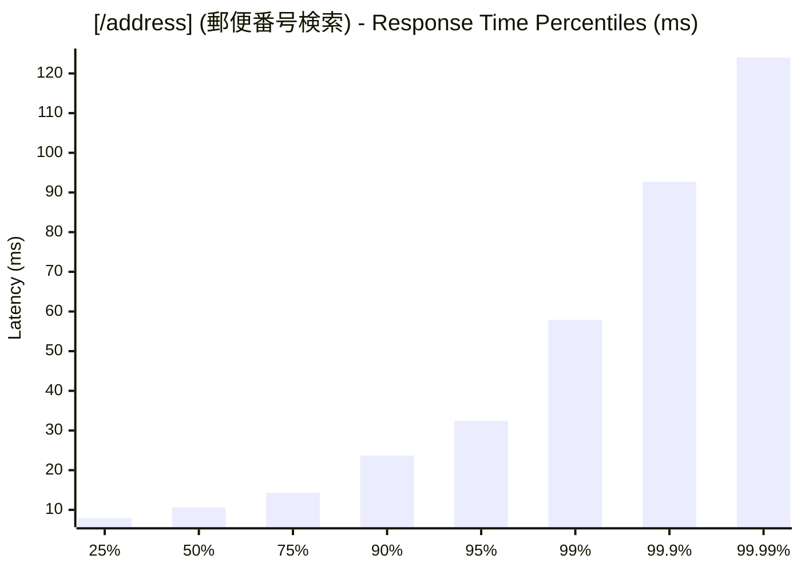
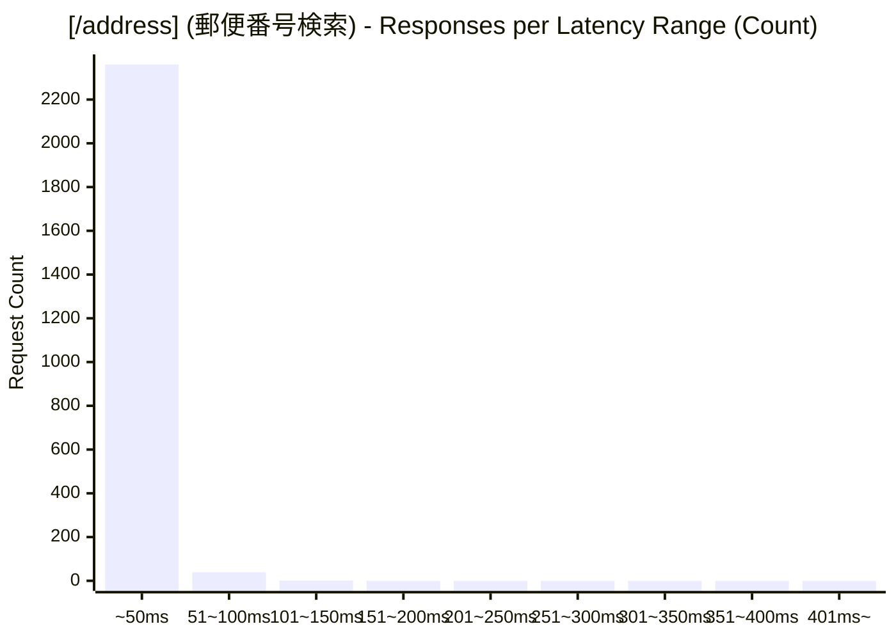
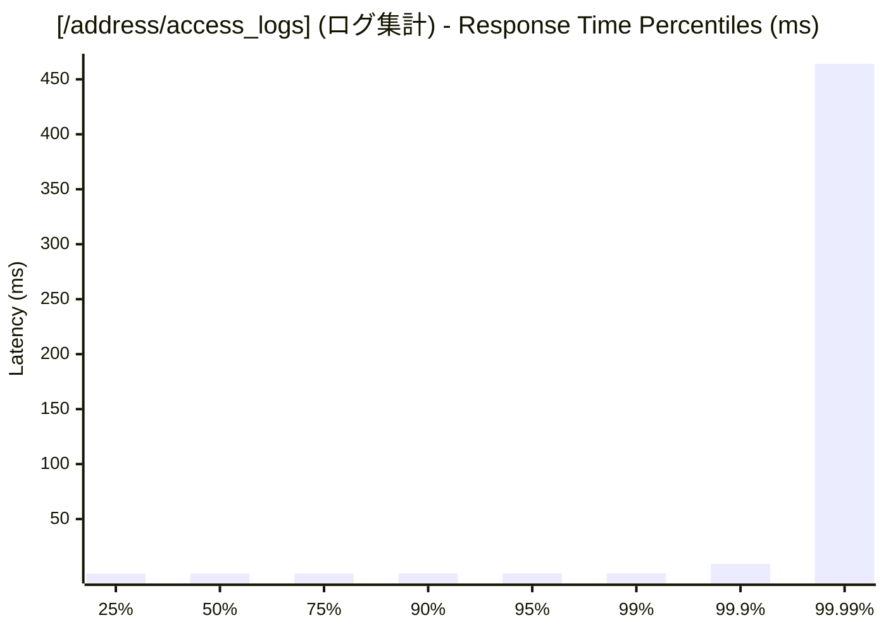
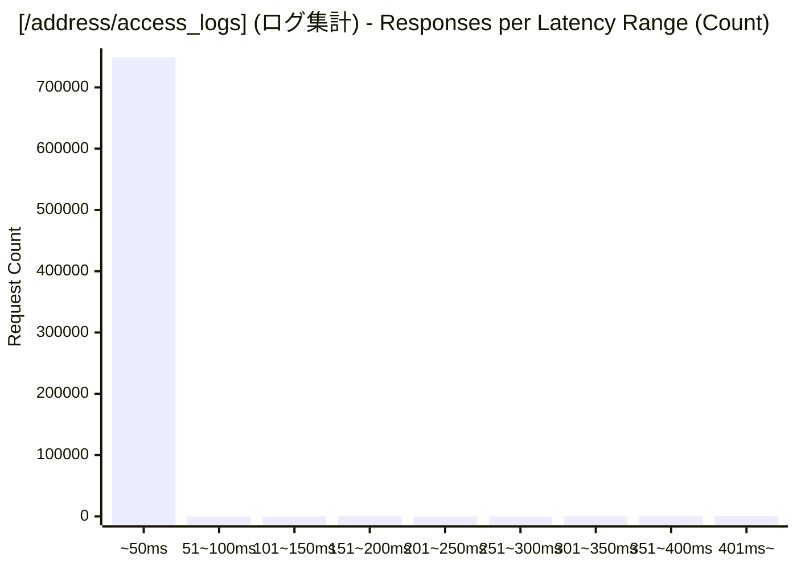

# 負荷テスト結果レポート: go_address-mixed_100_30s
テスト実行時間: 30.5391 sec

## エンドポイント別詳細

### 全体結果

| 項目 | 結果 |
| :--- | :--- |
| 成功率 | 99.70% |
| 最遅 | 603.3110 ms |
| 最速 | 0.1540 ms |
| 平均 | 0.8237 ms |
| 毎秒リクエスト数 | 24622.6297/sec |

---

### [/address] (郵便番号検索)
| 項目 | 結果 |
| :--- | :--- |
| 成功率 | 6.50% |
| 最遅 | 133.1890 ms |
| 最速 | 4.9980 ms |
| 平均 | 13.5249 ms |
| 毎秒リクエスト数 | 78.5878/sec |

---

### [/address/access_logs] (ログ集計)
| 項目 | 結果 |
| :--- | :--- |
| 成功率 | 100.00% |
| 最遅 | 603.3110 ms |
| 最速 | 0.1540 ms |
| 平均 | 0.7830 ms |
| 毎秒リクエスト数 | 24544.0419/sec |

