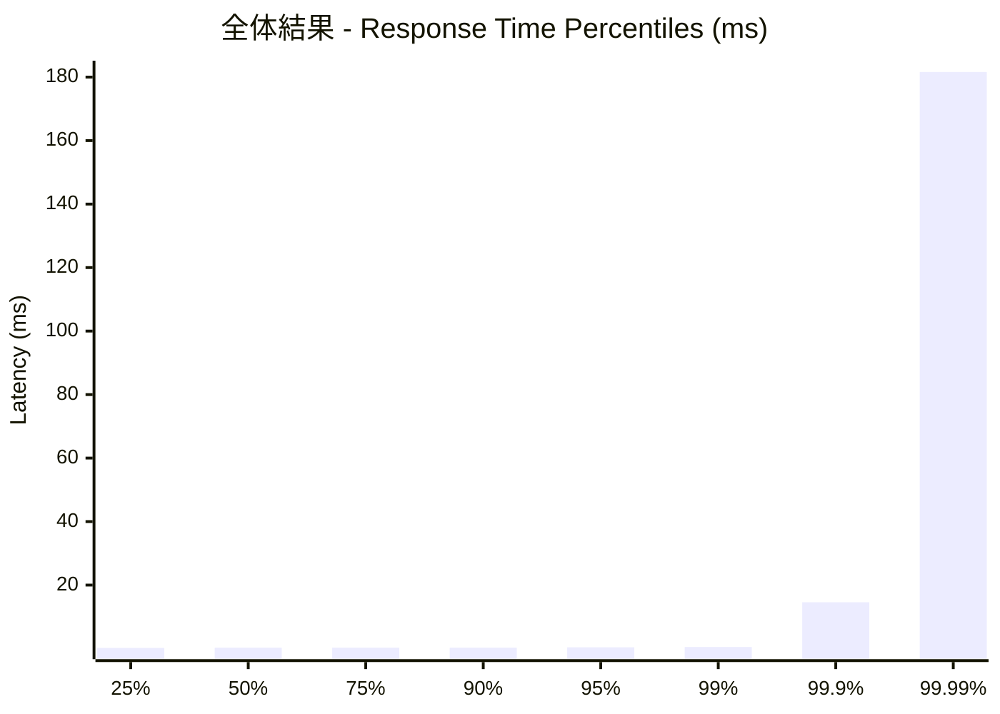
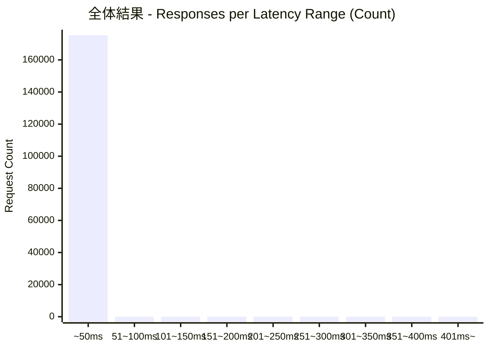
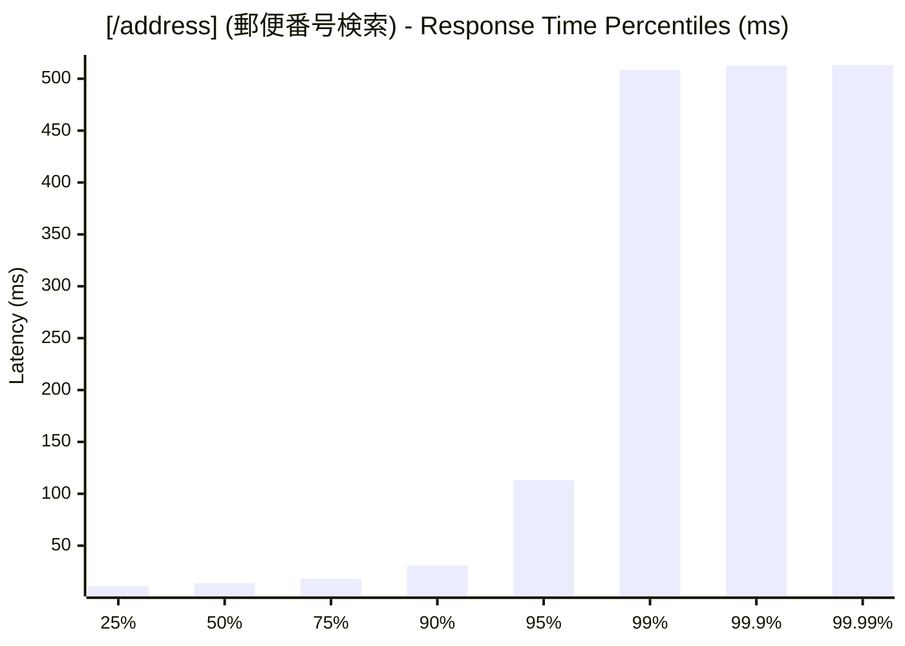
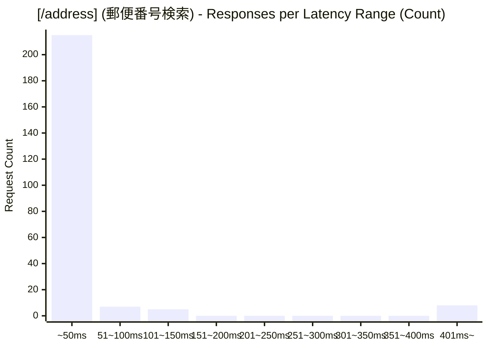
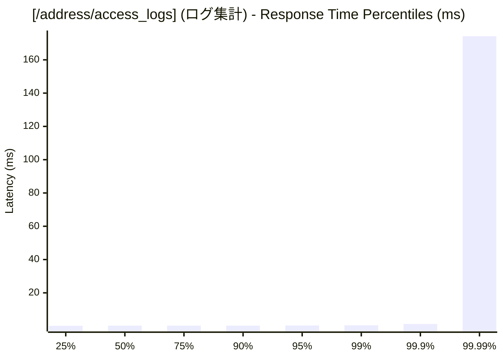
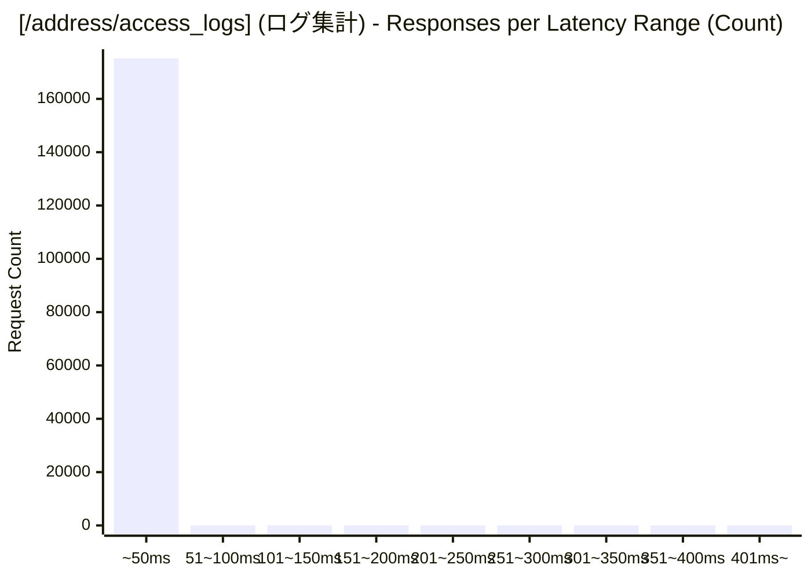

# 負荷テスト結果レポート: go_address-mixed_10_30s
テスト実行時間: 30.9767 sec

## エンドポイント別詳細

### 全体結果
成功率:      99.95%
最遅:        513.1250 ms
最速:        0.1460 ms
平均:        0.3766 ms
毎秒リクエスト数:   5664.8338/sec

---

### [/address] (郵便番号検索)
成功率:      66.38%
最遅:        513.1250 ms
最速:        6.0970 ms
平均:        34.8455 ms
毎秒リクエスト数:   7.5863/sec

---

### [/address/access_logs] (ログ集計)
成功率:      100.00%
最遅:        195.8370 ms
最速:        0.1460 ms
平均:        0.3303 ms
毎秒リクエスト数:   5657.2475/sec

