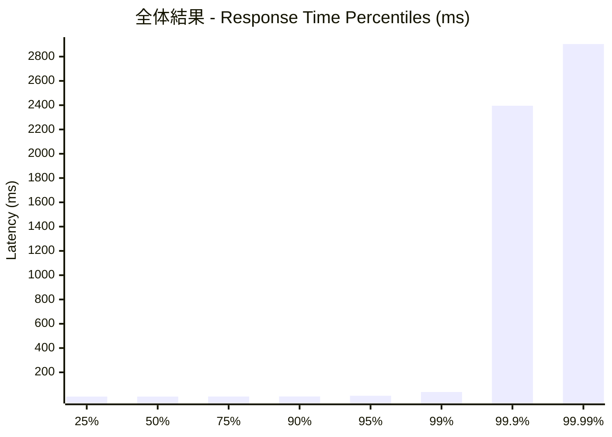
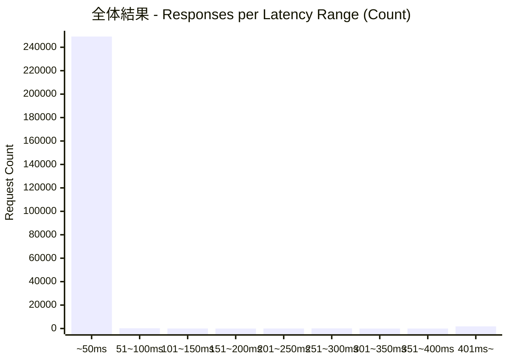
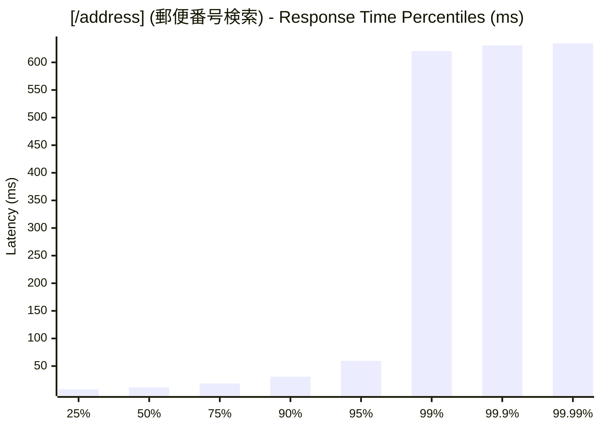
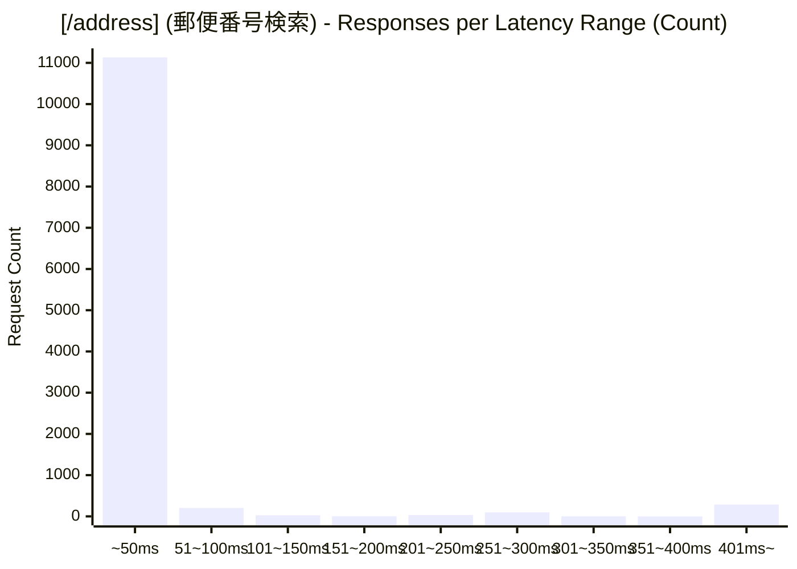
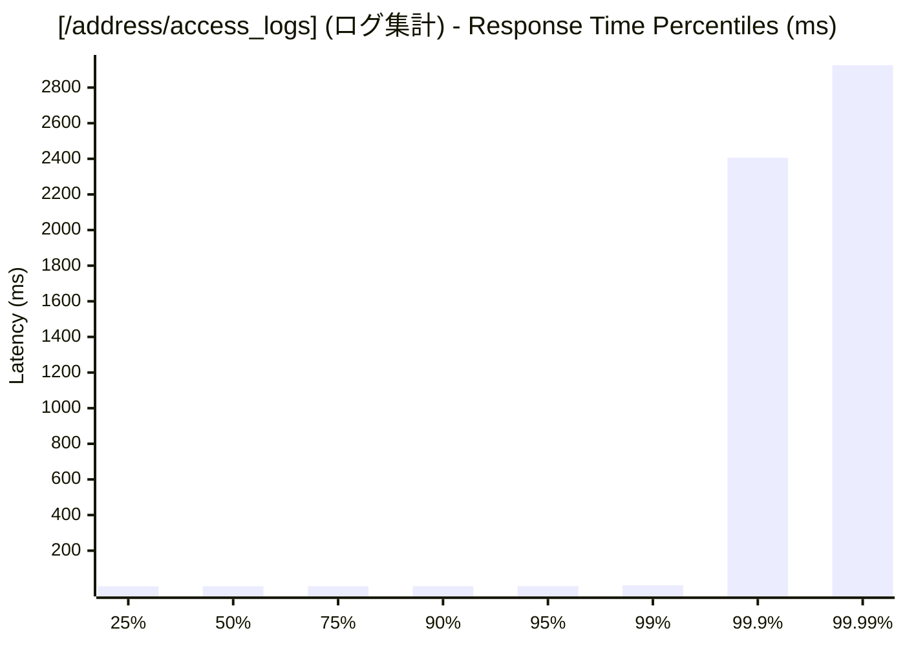
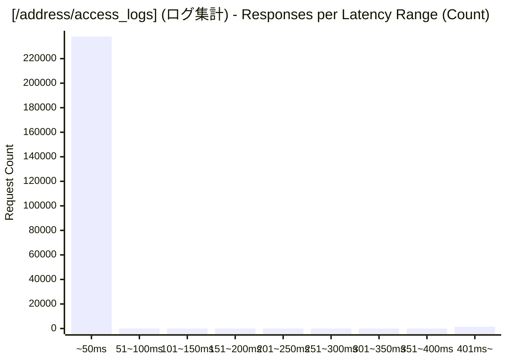

# 負荷テスト結果レポート: go_address-mixed_500_30s
テスト実行時間: 31.1009 sec

## エンドポイント別詳細

### 全体結果
成功率:      95.37%
最遅:        3452.7720 ms
最速:        0.1530 ms
平均:        13.6551 ms
毎秒リクエスト数:   8082.9706/sec

---

### [/address] (郵便番号検索)
成功率:      1.33%
最遅:        635.4700 ms
最速:        4.7600 ms
平均:        31.7303 ms
毎秒リクエスト数:   379.0239/sec

---

### [/address/access_logs] (ログ集計)
成功率:      100.00%
最遅:        3452.7720 ms
最速:        0.1530 ms
平均:        12.7659 ms
毎秒リクエスト数:   7703.9467/sec

