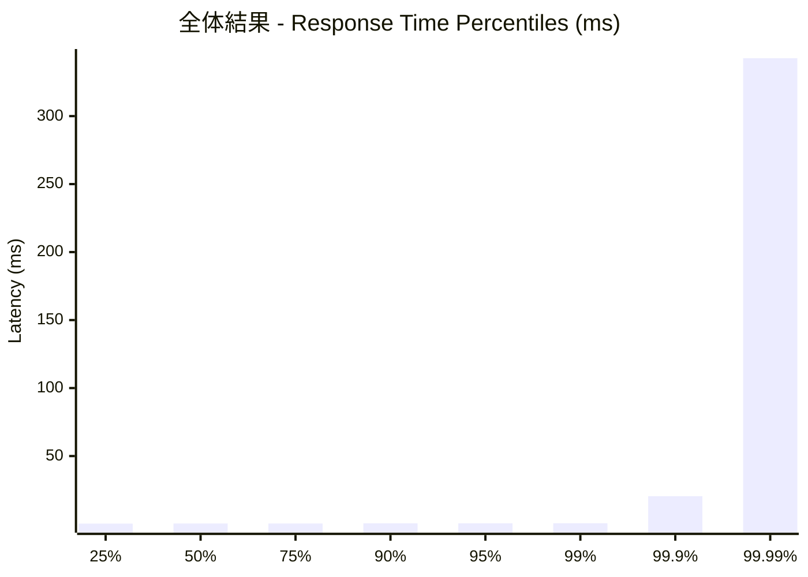
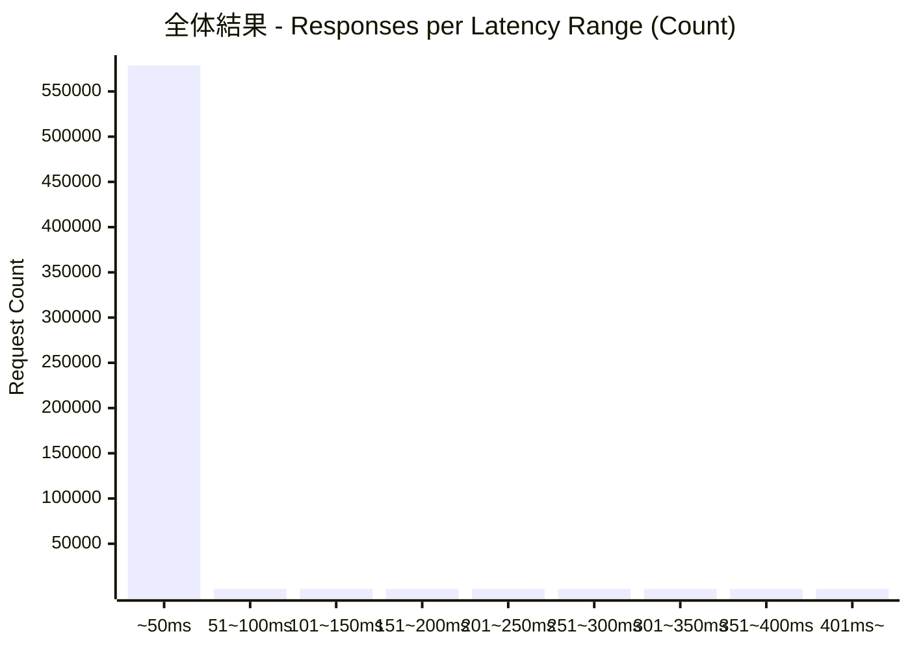
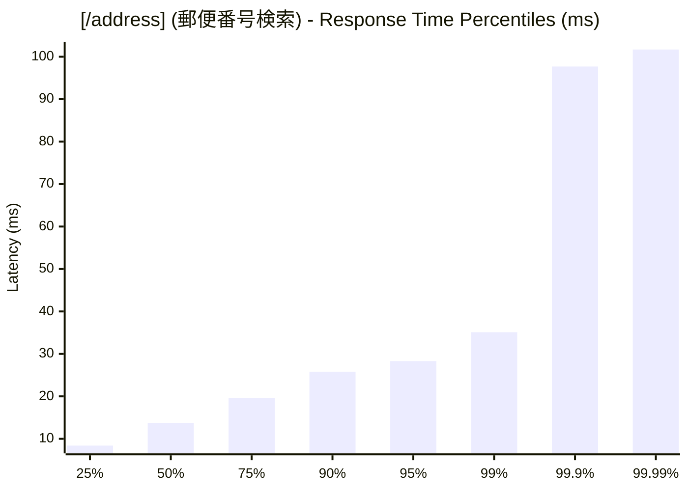
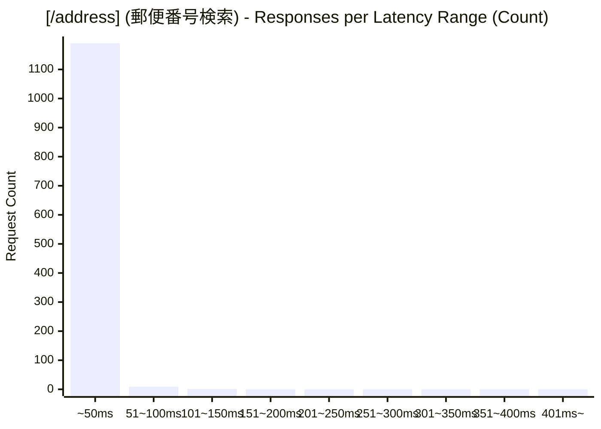
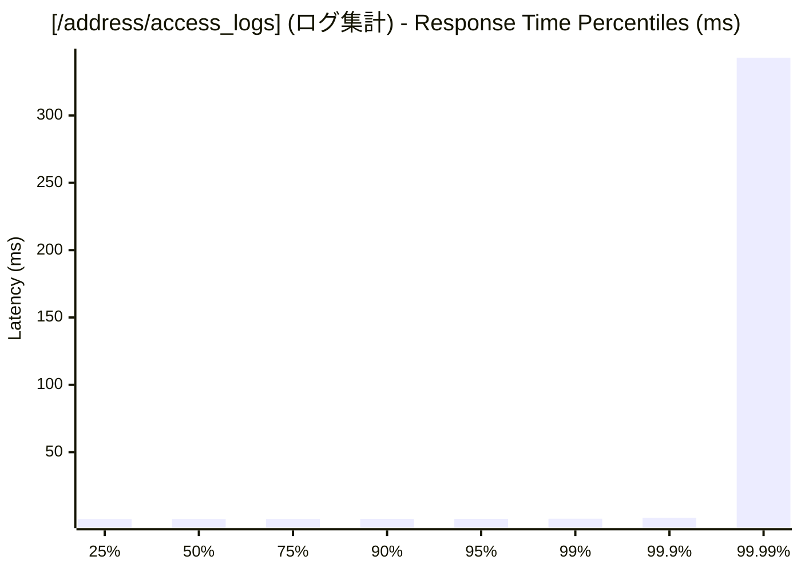
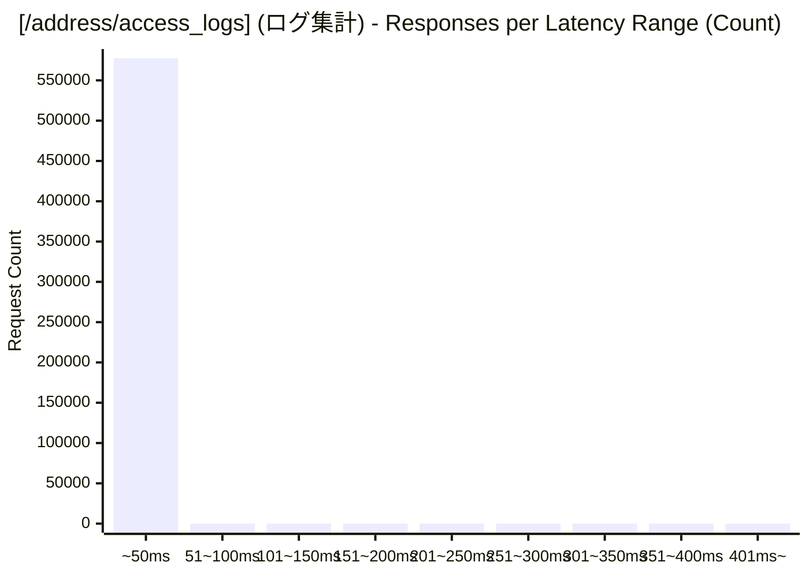

# 負荷テスト結果レポート: go_address-mixed_50_30s
テスト実行時間: 30.4747 sec

## エンドポイント別詳細

### 全体結果
成功率:      99.82%
最遅:        438.0120 ms
最速:        0.1510 ms
平均:        0.5346 ms
毎秒リクエスト数:   19000.3089/sec

---

### [/address] (郵便番号検索)
成功率:      13.00%
最遅:        102.2350 ms
最速:        5.2300 ms
平均:        15.1786 ms
毎秒リクエスト数:   39.3769/sec

---

### [/address/access_logs] (ログ集計)
成功率:      100.00%
最遅:        438.0120 ms
最速:        0.1510 ms
平均:        0.5042 ms
毎秒リクエスト数:   18960.9320/sec

