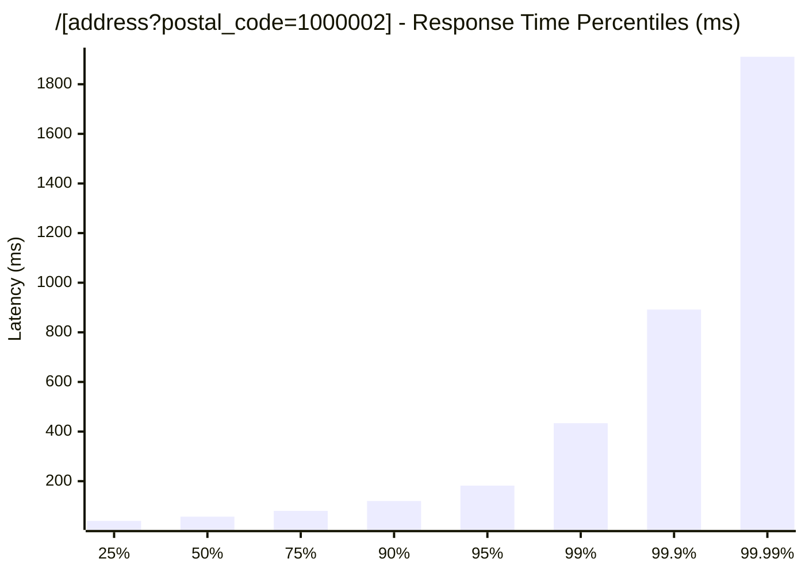
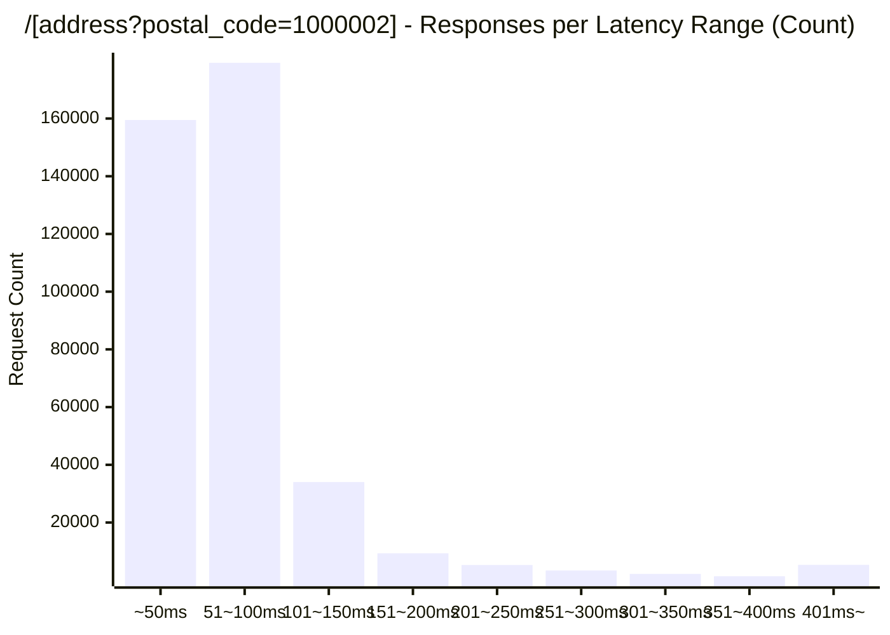

### /[address?postal_code=1000002]
| 項目 | 結果 |
| :--- | :--- |
| 成功率 | 0.04% |
| 最遅 | 1947.2540 ms |
| 最速 | 5.6940 ms |
| 平均 | 75.1418 ms |
| 毎秒リクエスト数 | 13157.7631/sec |

```mermaid
xychart-beta
  title "/[address?postal_code=1000002] - Response Time Percentiles (ms)"
  x-axis ["25%", "50%", "75%", "90%", "95%", "99%", "99.9%", "99.99%"]
  y-axis "Latency (ms)"
  bar [39.9, 56.9, 80.4, 120.3, 182.2, 433.7, 891.7, 1910.8]
```

```mermaid
xychart-beta
  title "/[address?postal_code=1000002] - Responses per Latency Range (Count)"
  x-axis ["~50ms", "51~100ms", "101~150ms", "151~200ms", "201~250ms", "251~300ms", "301~350ms", "351~400ms", "401ms~"]
  y-axis "Request Count"
  bar [159487, 179320, 34009, 9319, 5276, 3376, 2191, 1375, 5327]
```
