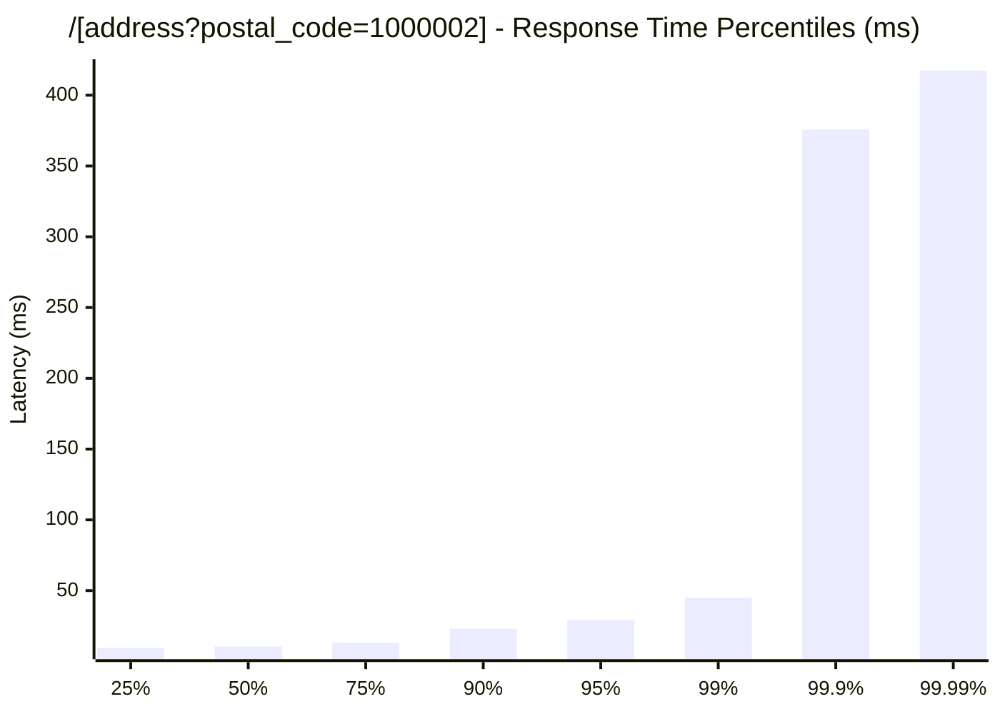
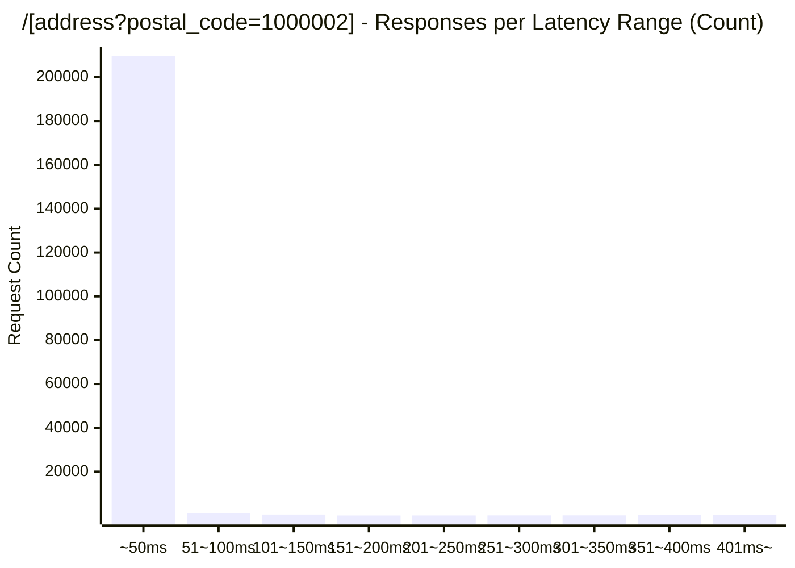

### /[address?postal_code=1000002]
成功率:      0.07%
最遅:        510.1720 ms
最速:        3.1250 ms
平均:        14.1598 ms
毎秒リクエスト数:   7039.7727/sec

```mermaid
xychart-beta
  title "/[address?postal_code=1000002] - Response Time Percentiles (ms)"
  x-axis ["25%", "50%", "75%", "90%", "95%", "99%", "99.9%", "99.99%"]
  y-axis "Latency (ms)"
  bar [9.5, 10.5, 13.4, 23.1, 29.3, 45.1, 375.8, 417.4]
```

```mermaid
xychart-beta
  title "/[address?postal_code=1000002] - Responses per Latency Range (Count)"
  x-axis ["~50ms", "51~100ms", "101~150ms", "151~200ms", "201~250ms", "251~300ms", "301~350ms", "351~400ms", "401ms~"]
  y-axis "Request Count"
  bar [209629, 900, 430, 6, 26, 52, 65, 126, 134]
```
