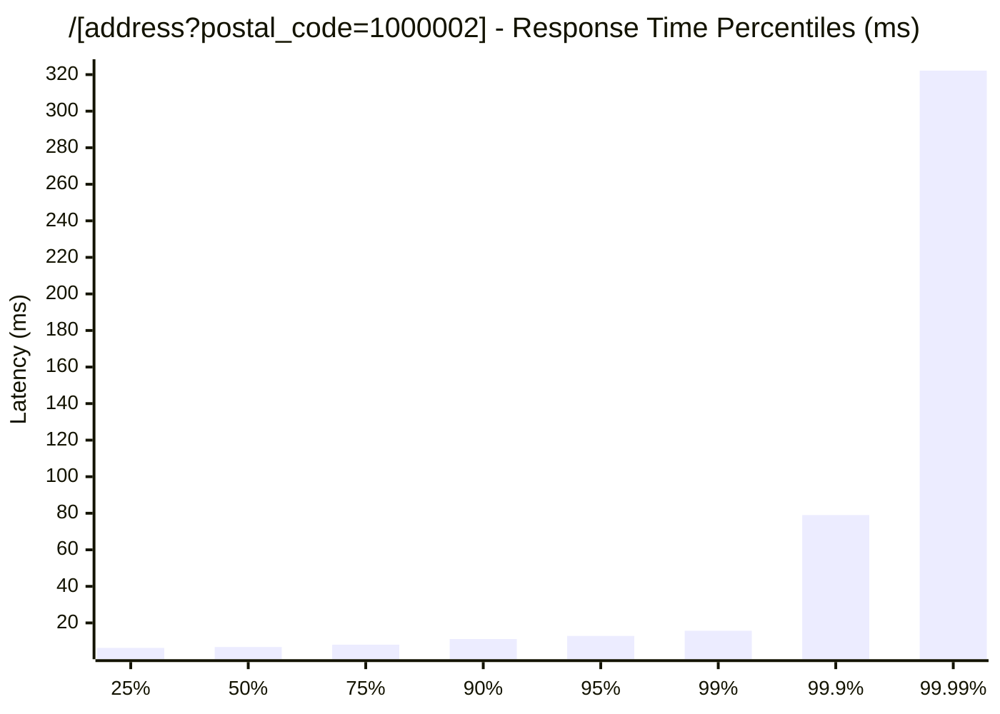
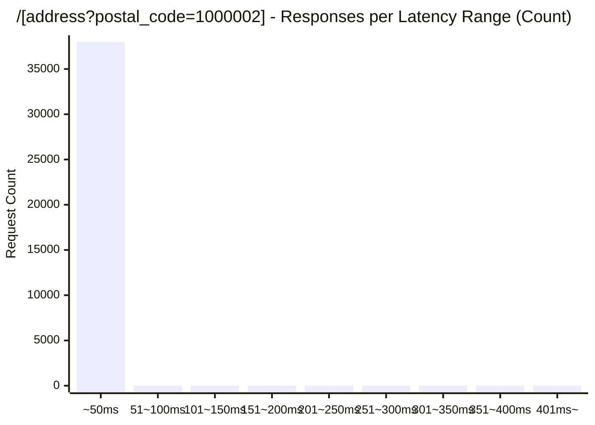

### /[address?postal_code=1000002]
| 項目 | 結果 |
| :--- | :--- |
| 成功率 | 0.42% |
| 最遅 | 330.0060 ms |
| 最速 | 4.3570 ms |
| 平均 | 7.8244 ms |
| 毎秒リクエスト数 | 1267.2406/sec |

```mermaid
xychart-beta
  title "/[address?postal_code=1000002] - Response Time Percentiles (ms)"
  x-axis ["25%", "50%", "75%", "90%", "95%", "99%", "99.9%", "99.99%"]
  y-axis "Latency (ms)"
  bar [6.3, 6.8, 8.1, 11.2, 12.9, 15.7, 79.0, 322.2]
```

```mermaid
xychart-beta
  title "/[address?postal_code=1000002] - Responses per Latency Range (Count)"
  x-axis ["~50ms", "51~100ms", "101~150ms", "151~200ms", "201~250ms", "251~300ms", "301~350ms", "351~400ms", "401ms~"]
  y-axis "Request Count"
  bar [37985, 12, 6, 10, 0, 10, 10, 0, 0]
```
