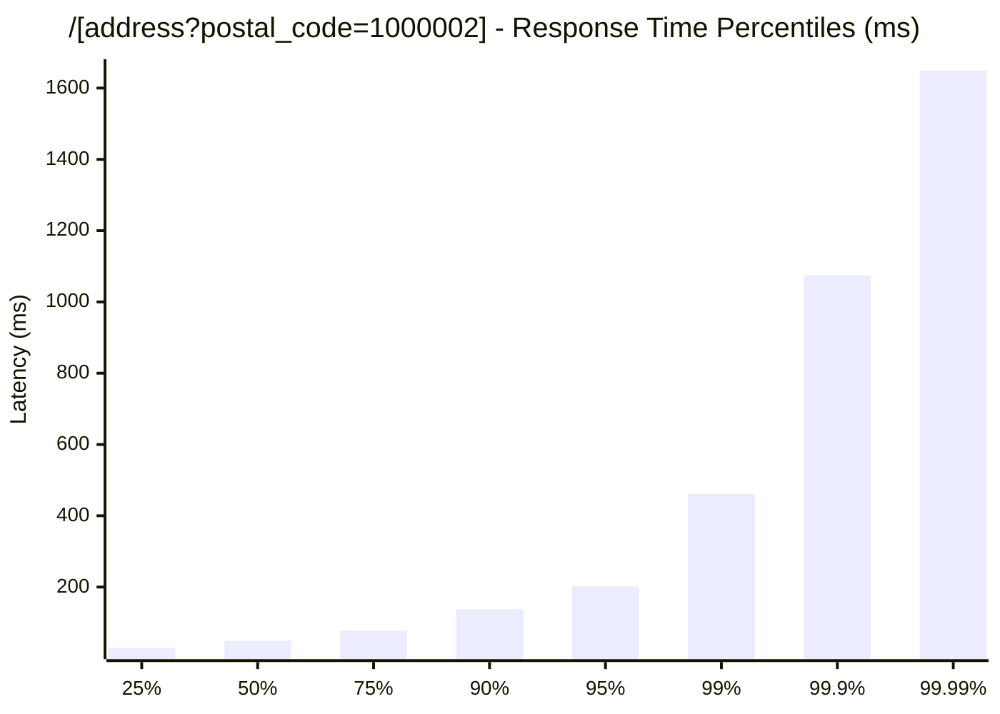
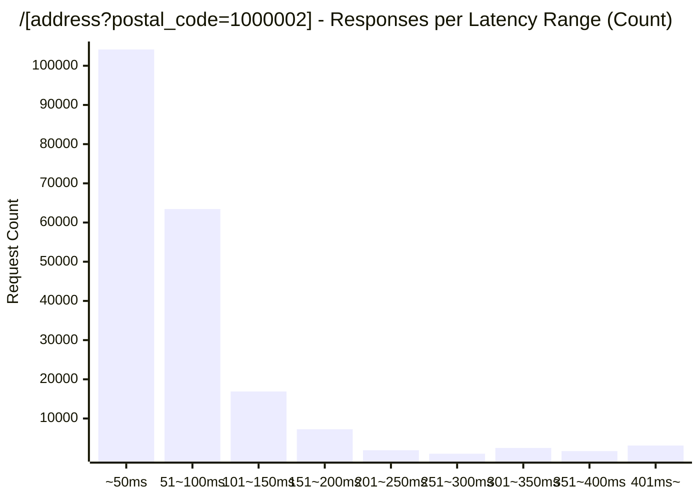

### /[address?postal_code=1000002]
成功率:      0.08%
最遅:        1652.1120 ms
最速:        4.9590 ms
平均:        74.2226 ms
毎秒リクエスト数:   6726.2027/sec

```mermaid
xychart-beta
  title "/[address?postal_code=1000002] - Response Time Percentiles (ms)"
  x-axis ["25%", "50%", "75%", "90%", "95%", "99%", "99.9%", "99.99%"]
  y-axis "Latency (ms)"
  bar [29.1, 48.9, 77.1, 137.9, 202.0, 461.2, 1075.0, 1649.1]
```

```mermaid
xychart-beta
  title "/[address?postal_code=1000002] - Responses per Latency Range (Count)"
  x-axis ["~50ms", "51~100ms", "101~150ms", "151~200ms", "201~250ms", "251~300ms", "301~350ms", "351~400ms", "401ms~"]
  y-axis "Request Count"
  bar [104166, 63442, 16905, 7263, 1909, 1006, 2487, 1675, 3097]
```
