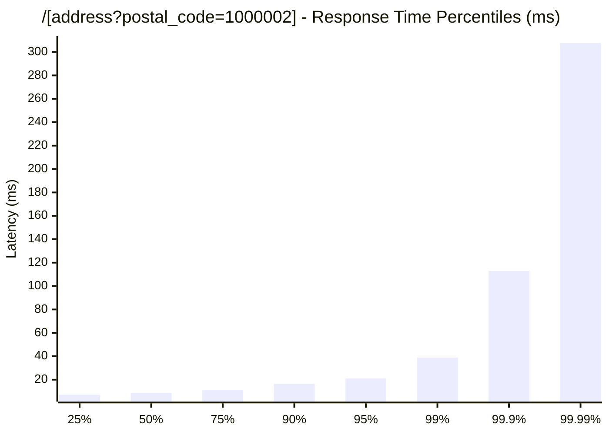
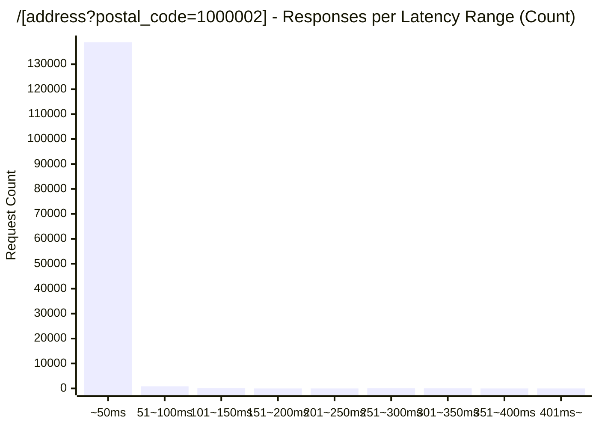

### /[address?postal_code=1000002]
成功率:      0.11%
最遅:        314.1890 ms
最速:        4.4630 ms
平均:        10.6847 ms
毎秒リクエスト数:   4649.8547/sec

```mermaid
xychart-beta
  title "/[address?postal_code=1000002] - Response Time Percentiles (ms)"
  x-axis ["25%", "50%", "75%", "90%", "95%", "99%", "99.9%", "99.99%"]
  y-axis "Latency (ms)"
  bar [7.1, 8.5, 11.3, 16.4, 21.0, 38.9, 112.9, 307.7]
```

```mermaid
xychart-beta
  title "/[address?postal_code=1000002] - Responses per Latency Range (Count)"
  x-axis ["~50ms", "51~100ms", "101~150ms", "151~200ms", "201~250ms", "251~300ms", "301~350ms", "351~400ms", "401ms~"]
  y-axis "Request Count"
  bar [138810, 848, 75, 7, 5, 54, 44, 0, 0]
```
