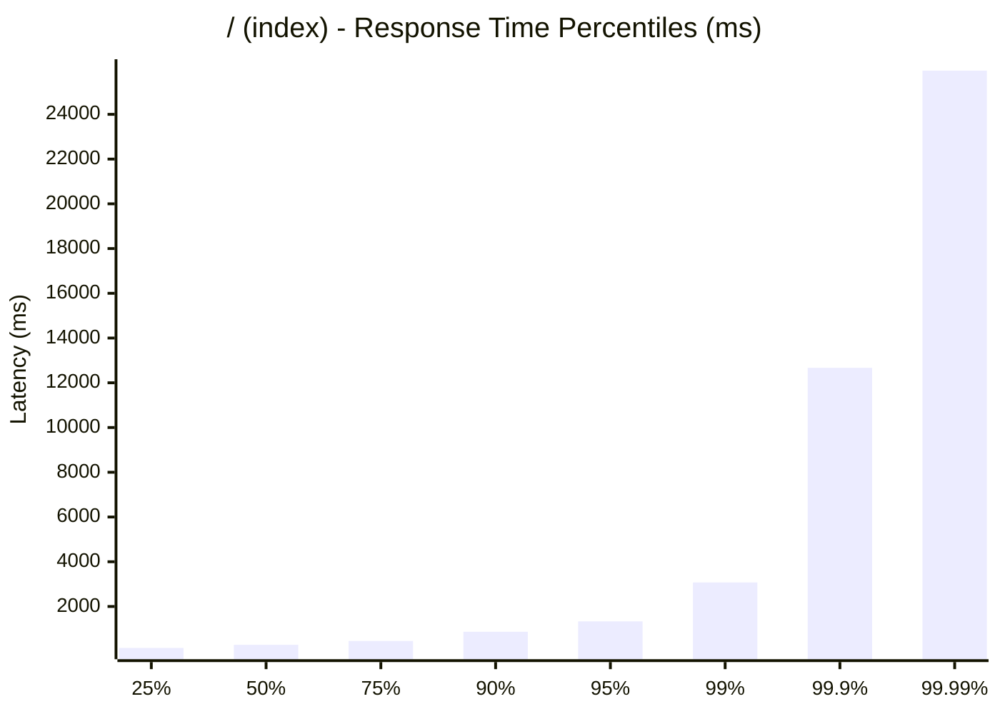
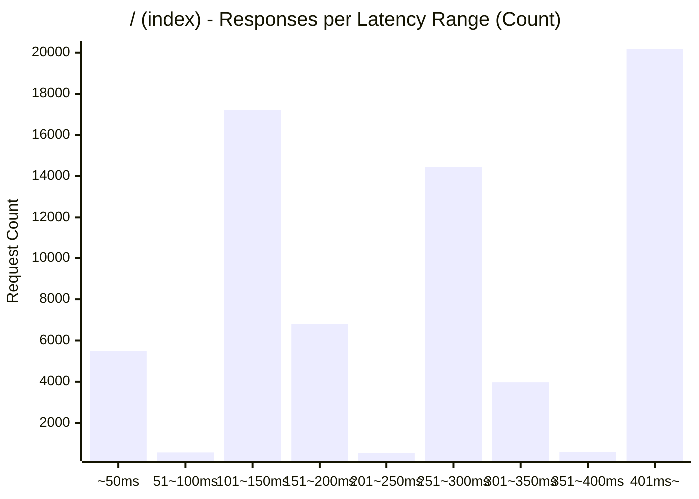

### / (index)
| 項目 | 結果 |
| :--- | :--- |
| 成功率 | 100.00% |
| 最遅 | 30274.9090 ms |
| 最速 | 7.2200 ms |
| 平均 | 435.6248 ms |
| 毎秒リクエスト数 | 1163.2346/sec |

```mermaid
xychart-beta
  title "/ (index) - Response Time Percentiles (ms)"
  x-axis ["25%", "50%", "75%", "90%", "95%", "99%", "99.9%", "99.99%"]
  y-axis "Latency (ms)"
  bar [146.2, 286.3, 459.7, 869.4, 1335.2, 3073.2, 12667.5, 25955.8]
```

```mermaid
xychart-beta
  title "/ (index) - Responses per Latency Range (Count)"
  x-axis ["~50ms", "51~100ms", "101~150ms", "151~200ms", "201~250ms", "251~300ms", "301~350ms", "351~400ms", "401ms~"]
  y-axis "Request Count"
  bar [5502, 565, 17212, 6795, 538, 14455, 3970, 593, 20168]
```
