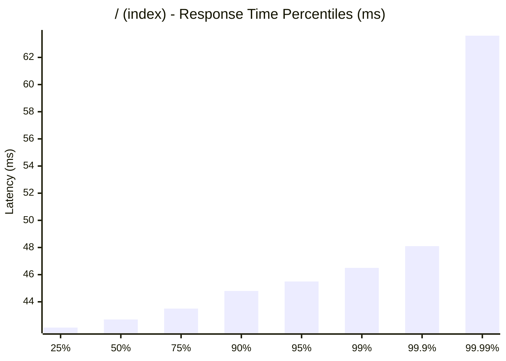
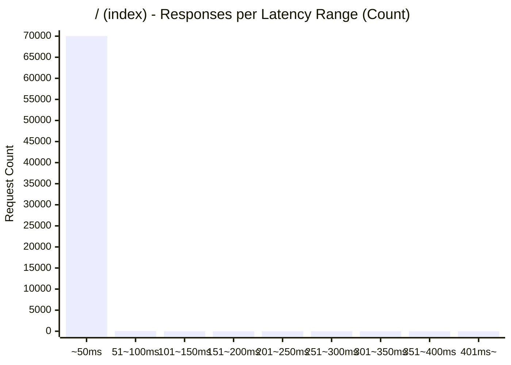

### / (index)
成功率:      100.00%
最遅:        66.6900 ms
最速:        9.1670 ms
平均:        42.8027 ms
毎秒リクエスト数:   2331.9174/sec

```mermaid
xychart-beta
  title "/ (index) - Response Time Percentiles (ms)"
  x-axis ["25%", "50%", "75%", "90%", "95%", "99%", "99.9%", "99.99%"]
  y-axis "Latency (ms)"
  bar [42.1, 42.7, 43.5, 44.8, 45.5, 46.5, 48.1, 63.6]
```

```mermaid
xychart-beta
  title "/ (index) - Responses per Latency Range (Count)"
  x-axis ["~50ms", "51~100ms", "101~150ms", "151~200ms", "201~250ms", "251~300ms", "301~350ms", "351~400ms", "401ms~"]
  y-axis "Request Count"
  bar [70022, 37, 0, 0, 0, 0, 0, 0, 0]
```
