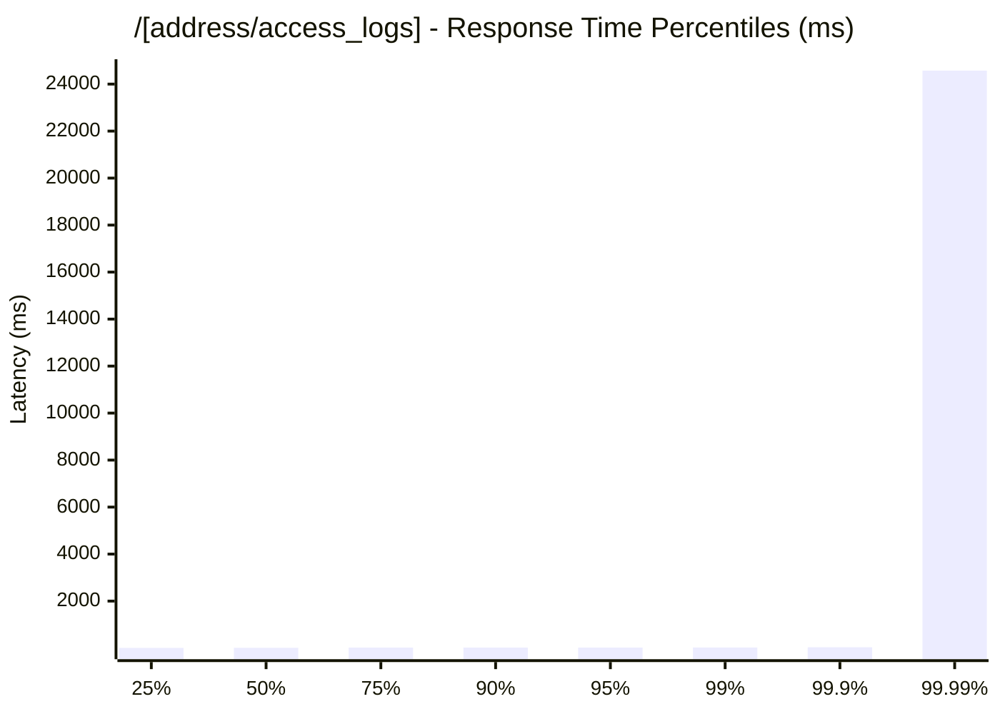
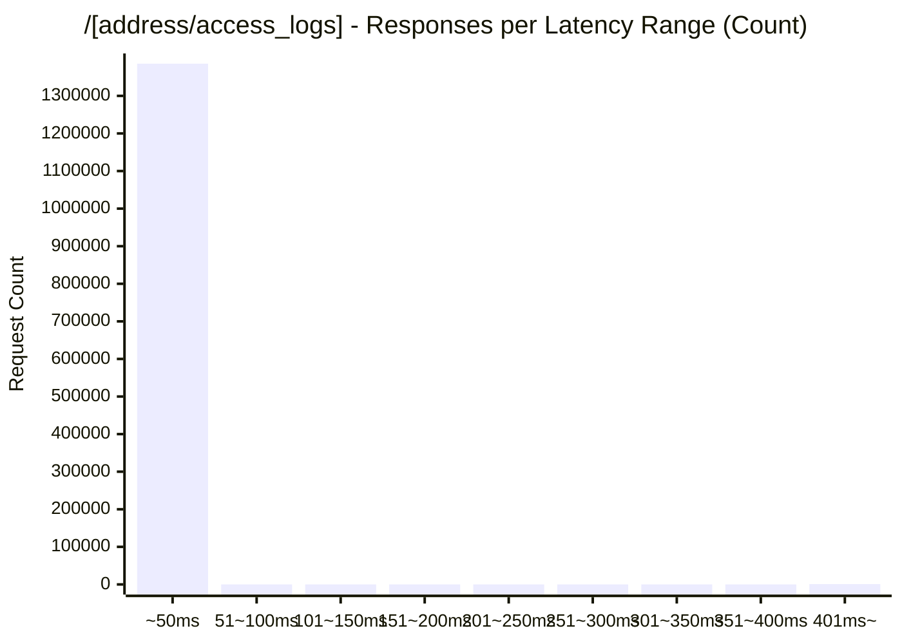

### /[address/access_logs]
成功率:      100.00%
最遅:        28347.2790 ms
最速:        0.1500 ms
平均:        22.4163 ms
毎秒リクエスト数:   36571.6519/sec

```mermaid
xychart-beta
  title "/[address/access_logs] - Response Time Percentiles (ms)"
  x-axis ["25%", "50%", "75%", "90%", "95%", "99%", "99.9%", "99.99%"]
  y-axis "Latency (ms)"
  bar [5.7, 11.2, 21.4, 21.7, 21.8, 25.0, 35.2, 24574.9]
```

```mermaid
xychart-beta
  title "/[address/access_logs] - Responses per Latency Range (Count)"
  x-axis ["~50ms", "51~100ms", "101~150ms", "151~200ms", "201~250ms", "251~300ms", "301~350ms", "351~400ms", "401ms~"]
  y-axis "Request Count"
  bar [1385699, 10, 0, 3, 1, 0, 4, 1, 992]
```
