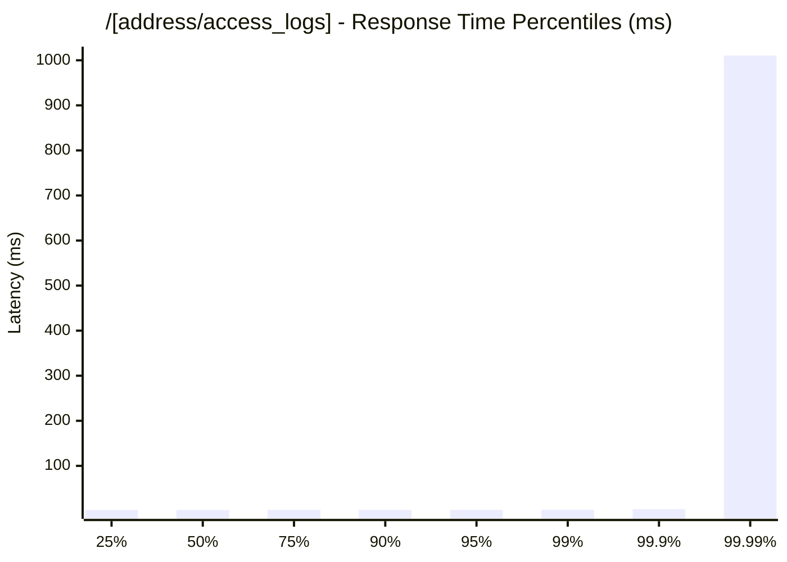
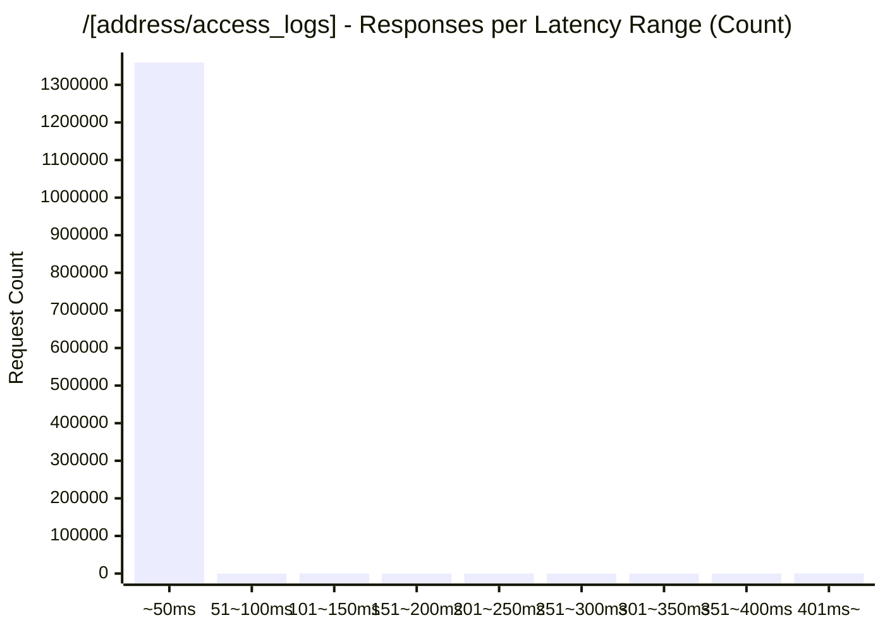

### /[address/access_logs]
成功率:      100.00%
最遅:        3083.8260 ms
最速:        0.1590 ms
平均:        2.1891 ms
毎秒リクエスト数:   45324.9398/sec

```mermaid
xychart-beta
  title "/[address/access_logs] - Response Time Percentiles (ms)"
  x-axis ["25%", "50%", "75%", "90%", "95%", "99%", "99.9%", "99.99%"]
  y-axis "Latency (ms)"
  bar [2.0, 2.1, 2.2, 2.2, 2.3, 2.5, 4.1, 1010.5]
```

```mermaid
xychart-beta
  title "/[address/access_logs] - Responses per Latency Range (Count)"
  x-axis ["~50ms", "51~100ms", "101~150ms", "151~200ms", "201~250ms", "251~300ms", "301~350ms", "351~400ms", "401ms~"]
  y-axis "Request Count"
  bar [1359538, 0, 94, 6, 2, 0, 4, 4, 184]
```
