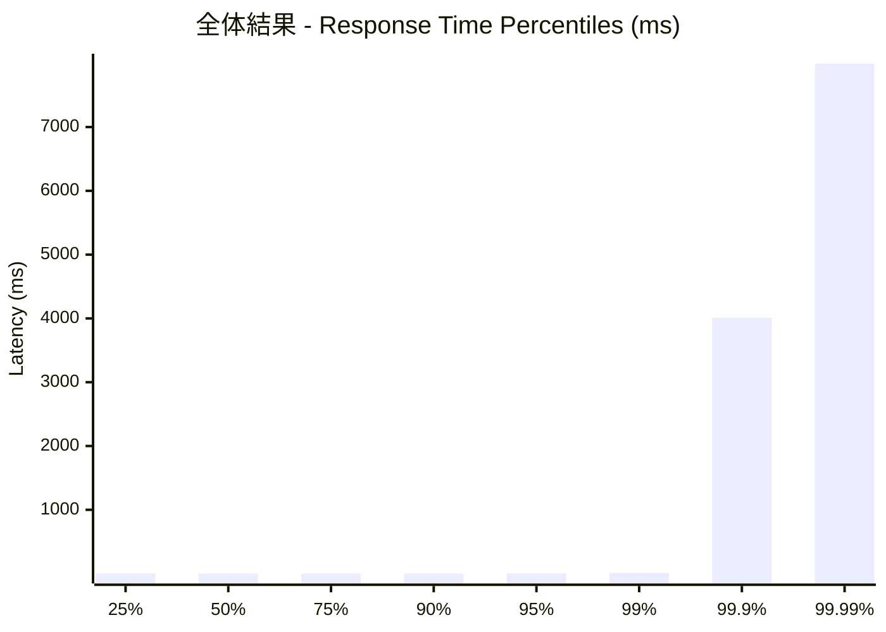
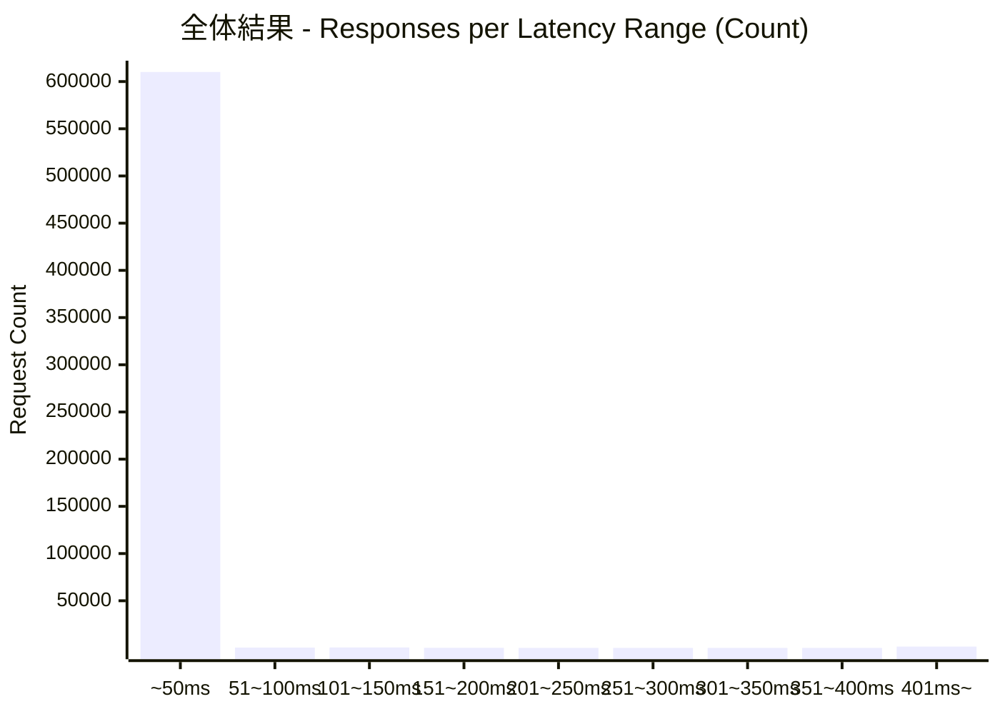
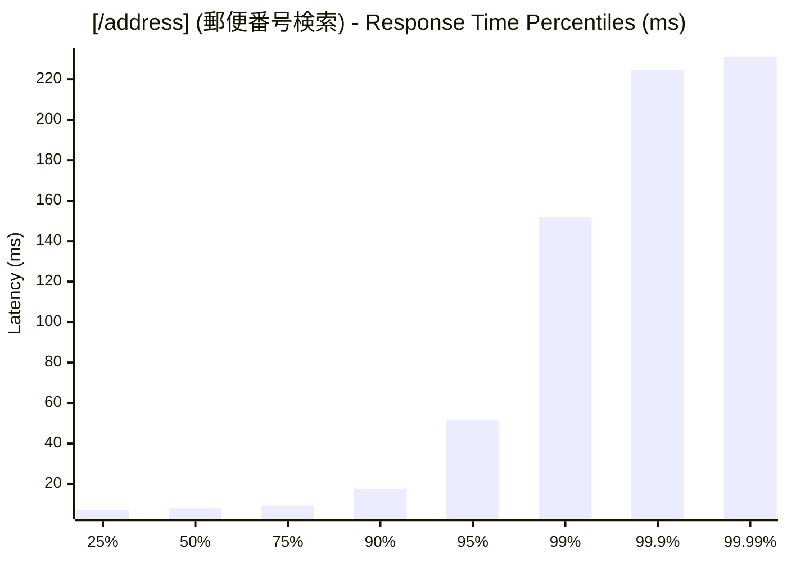
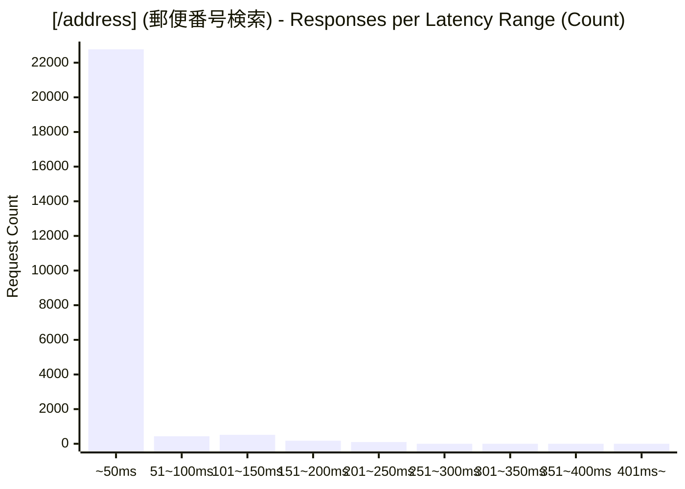
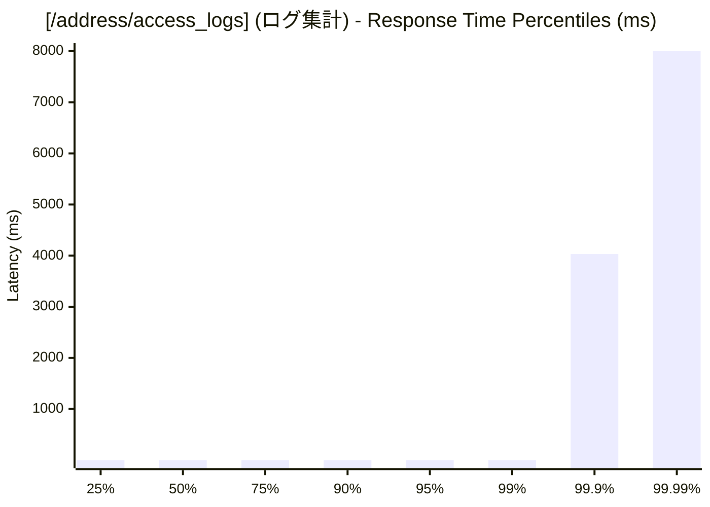
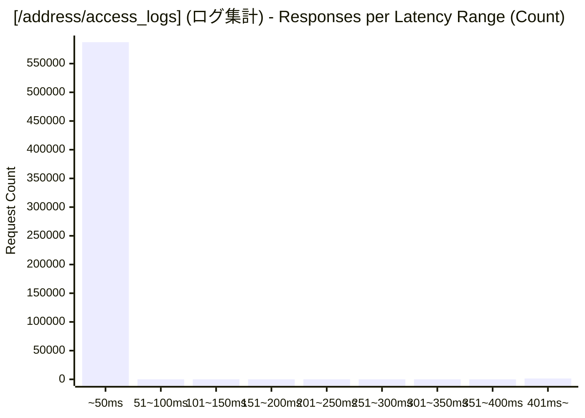

# 負荷テスト結果レポート: rust_address-mixed_1000_30s
テスト実行時間: 33.7555 sec

## エンドポイント別詳細

### 全体結果
成功率:      96.11%
最遅:        9726.1150 ms
最速:        0.1380 ms
平均:        10.9208 ms
毎秒リクエスト数:   18156.0694/sec

---

### [/address] (郵便番号検索)
成功率:      0.66%
最遅:        231.8840 ms
最速:        4.7390 ms
平均:        14.7834 ms
毎秒リクエスト数:   710.9955/sec

---

### [/address/access_logs] (ログ集計)
成功率:      100.00%
最遅:        9726.1150 ms
最速:        0.1380 ms
平均:        10.7634 ms
毎秒リクエスト数:   17445.0739/sec

