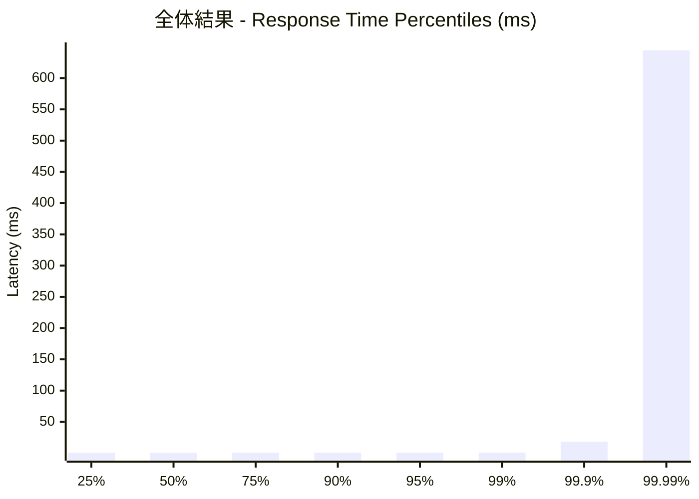
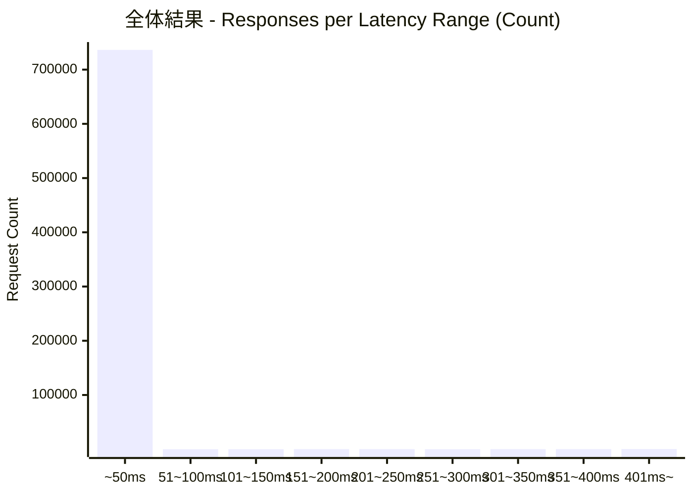
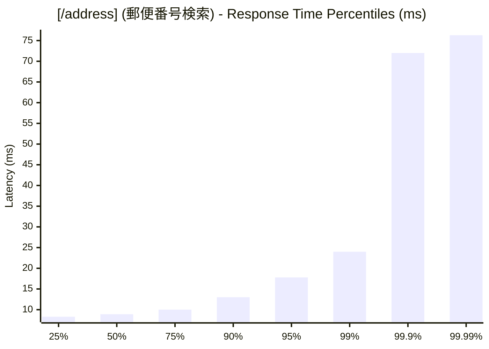
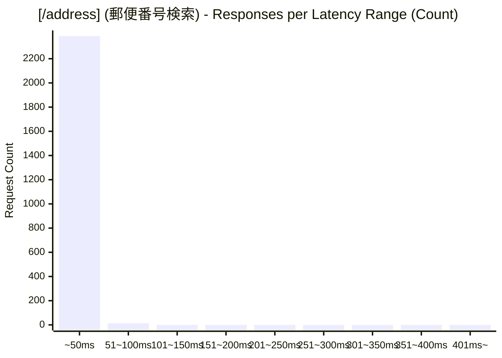
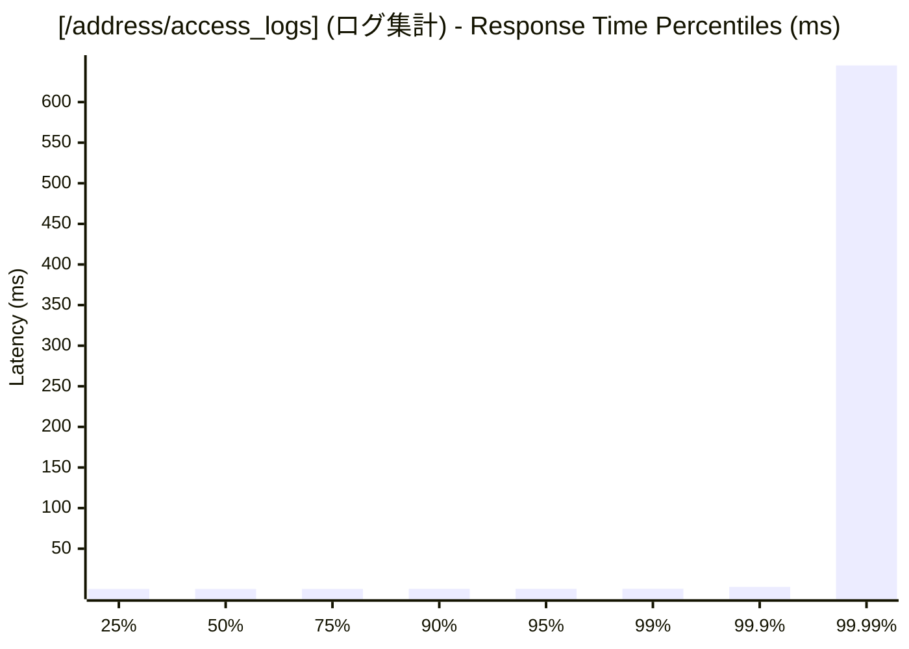
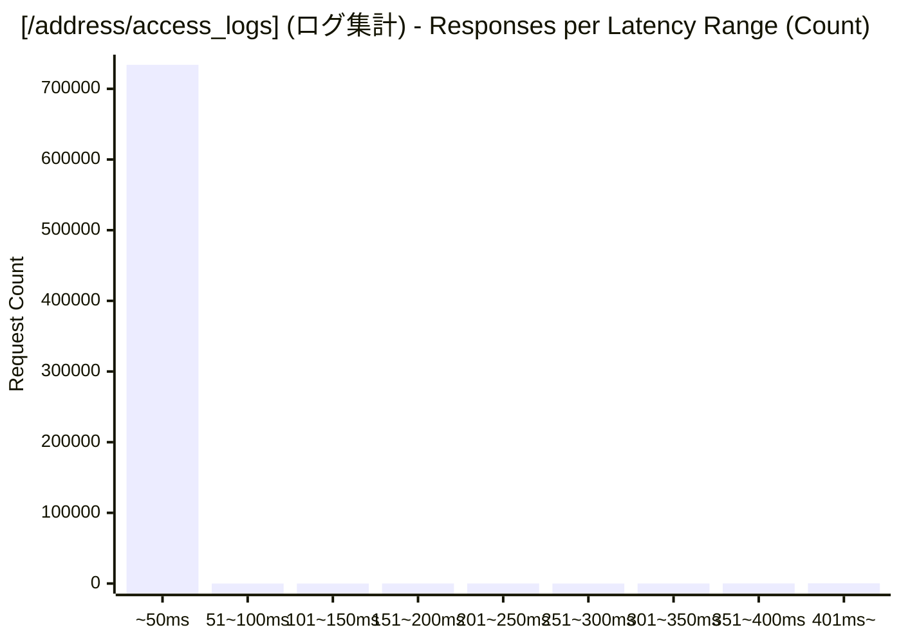

# 負荷テスト結果レポート: rust_address-mixed_100_30s
テスト実行時間: 30.3475 sec

## エンドポイント別詳細

### 全体結果

| 項目 | 結果 |
| :--- | :--- |
| 成功率 | 99.70% |
| 最遅 | 854.4600 ms |
| 最速 | 0.1320 ms |
| 平均 | 0.8307 ms |
| 毎秒リクエスト数 | 24284.9006/sec |

---

### [/address] (郵便番号検索)
| 項目 | 結果 |
| :--- | :--- |
| 成功率 | 6.38% |
| 最遅 | 76.9020 ms |
| 最速 | 7.1940 ms |
| 平均 | 10.2073 ms |
| 毎秒リクエスト数 | 79.0841/sec |

---

### [/address/access_logs] (ログ集計)
| 項目 | 結果 |
| :--- | :--- |
| 成功率 | 100.00% |
| 最遅 | 854.4600 ms |
| 最速 | 0.1320 ms |
| 平均 | 0.8001 ms |
| 毎秒リクエスト数 | 24205.8165/sec |

