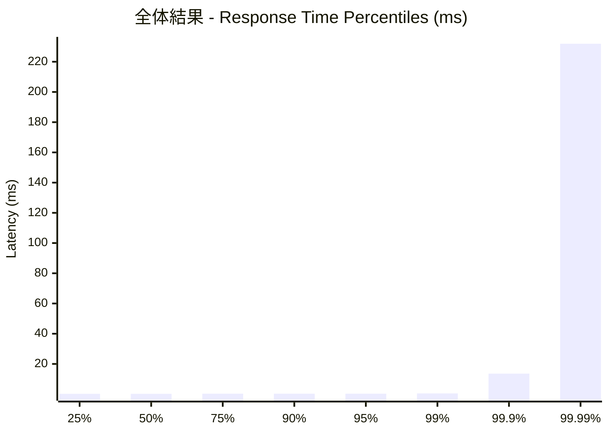
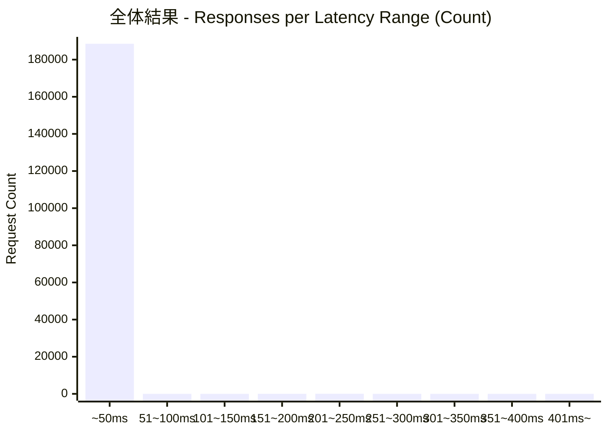
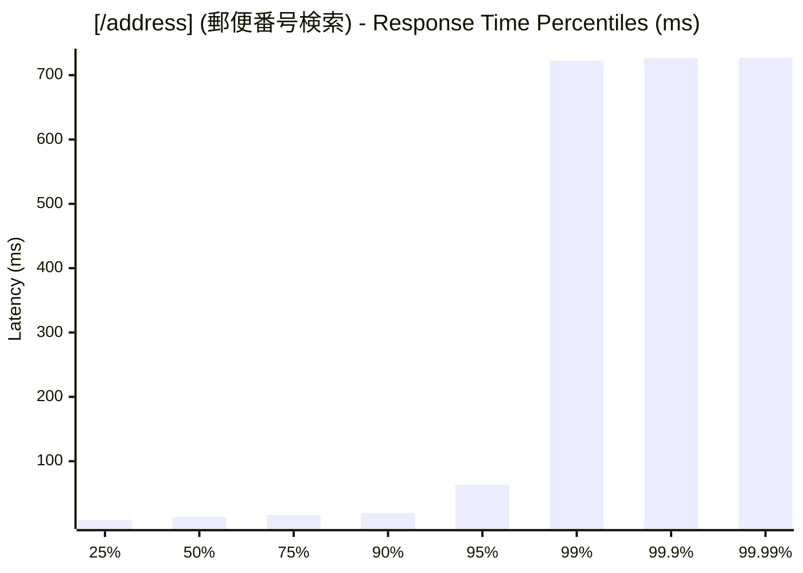
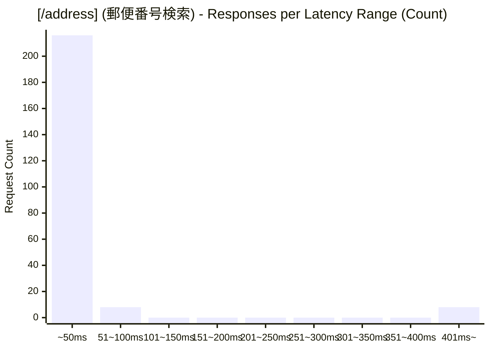
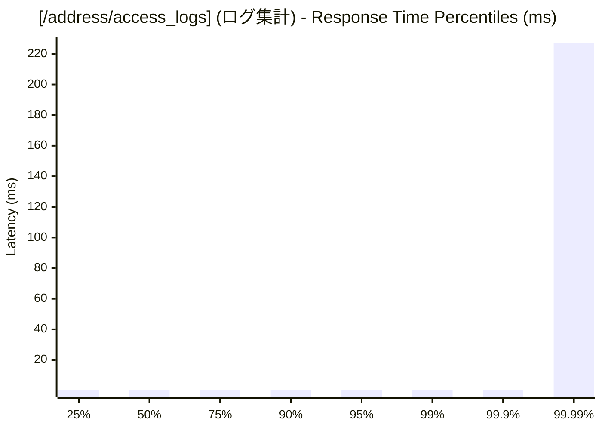
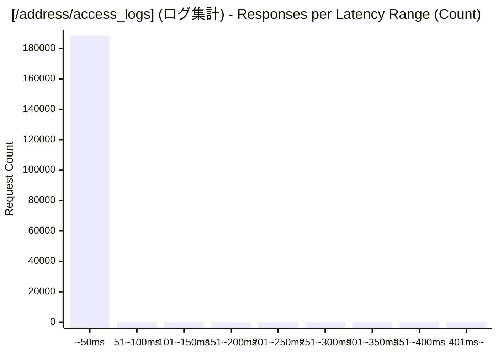

# 負荷テスト結果レポート: rust_address-mixed_10_30s
テスト実行時間: 29.9820 sec

## エンドポイント別詳細

### 全体結果

| 項目 | 結果 |
| :--- | :--- |
| 成功率 | 99.96% |
| 最遅 | 726.9960 ms |
| 最速 | 0.1430 ms |
| 平均 | 0.3506 ms |
| 毎秒リクエスト数 | 6291.0849/sec |

---

### [/address] (郵便番号検索)
| 項目 | 結果 |
| :--- | :--- |
| 成功率 | 65.95% |
| 最遅 | 726.9960 ms |
| 最速 | 7.7150 ms |
| 平均 | 38.9197 ms |
| 毎秒リクエスト数 | 7.7380/sec |

---

### [/address/access_logs] (ログ集計)
| 項目 | 結果 |
| :--- | :--- |
| 成功率 | 100.00% |
| 最遅 | 247.9480 ms |
| 最速 | 0.1430 ms |
| 平均 | 0.3031 ms |
| 毎秒リクエスト数 | 6283.3469/sec |

