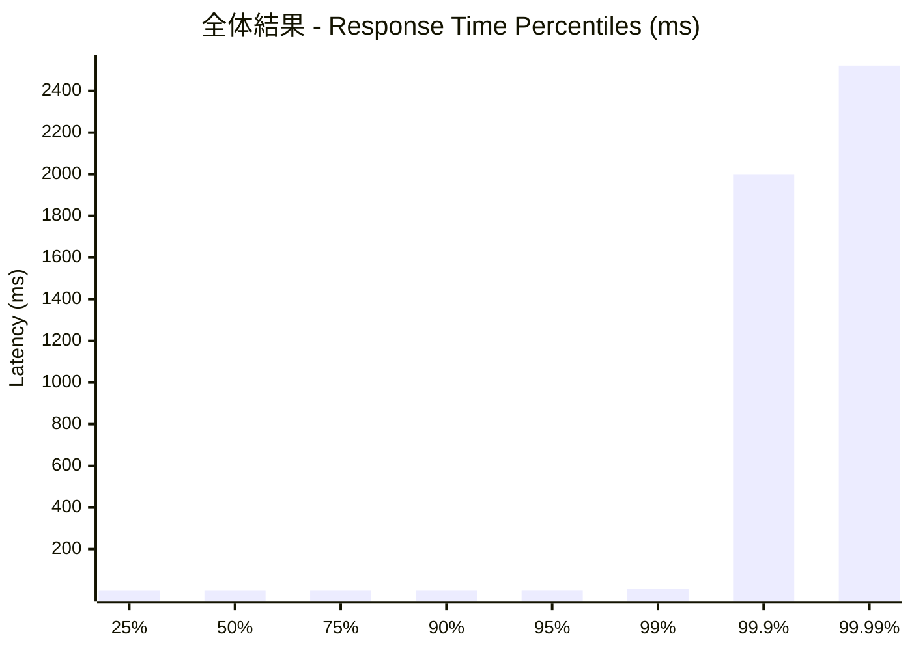
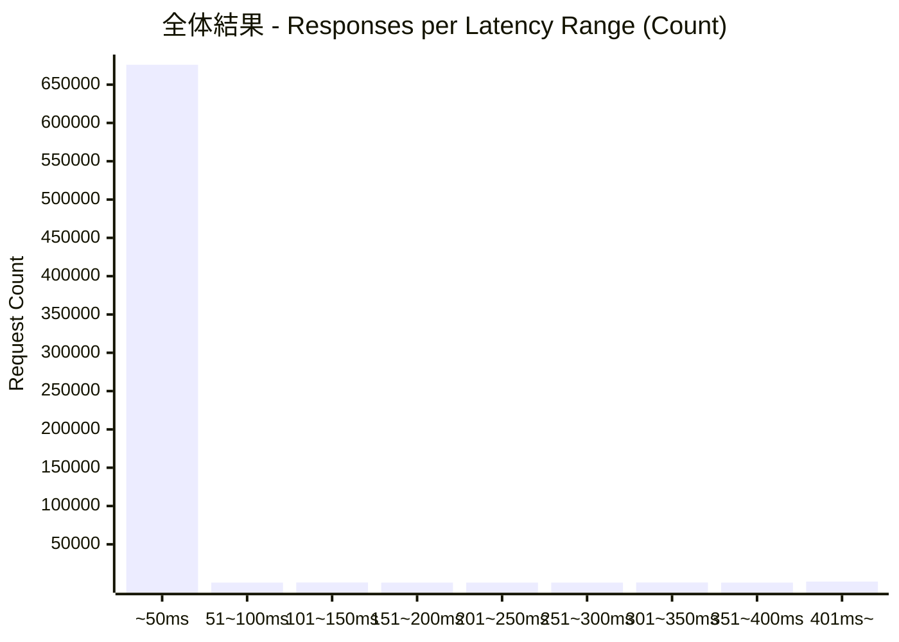
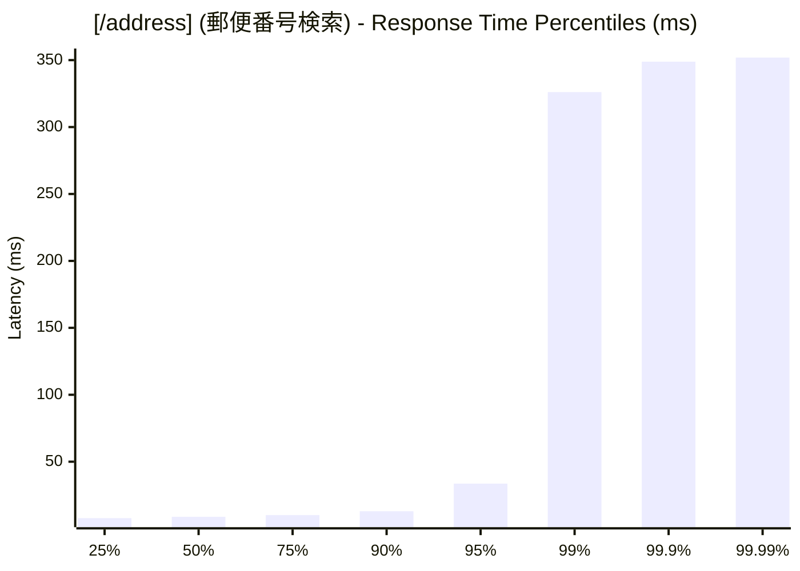
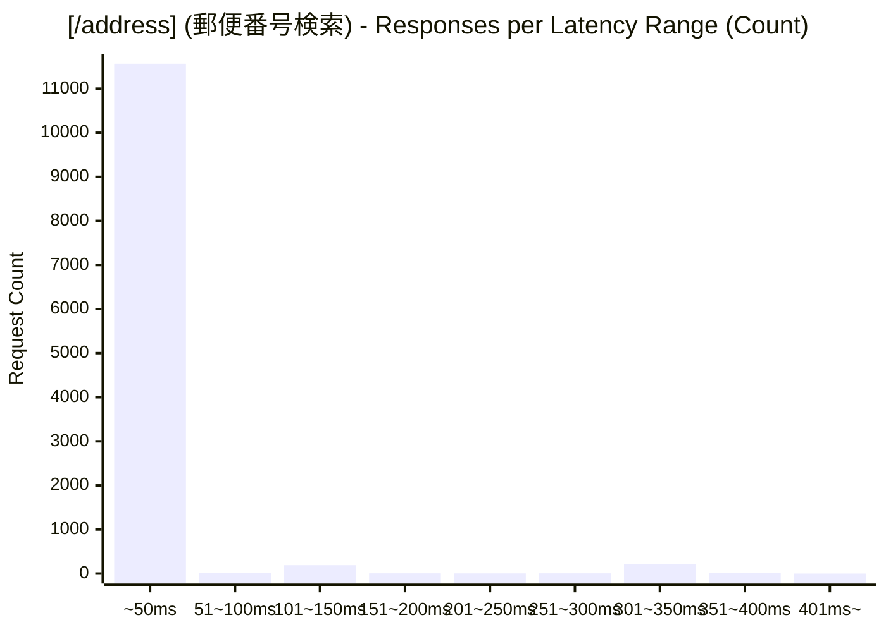
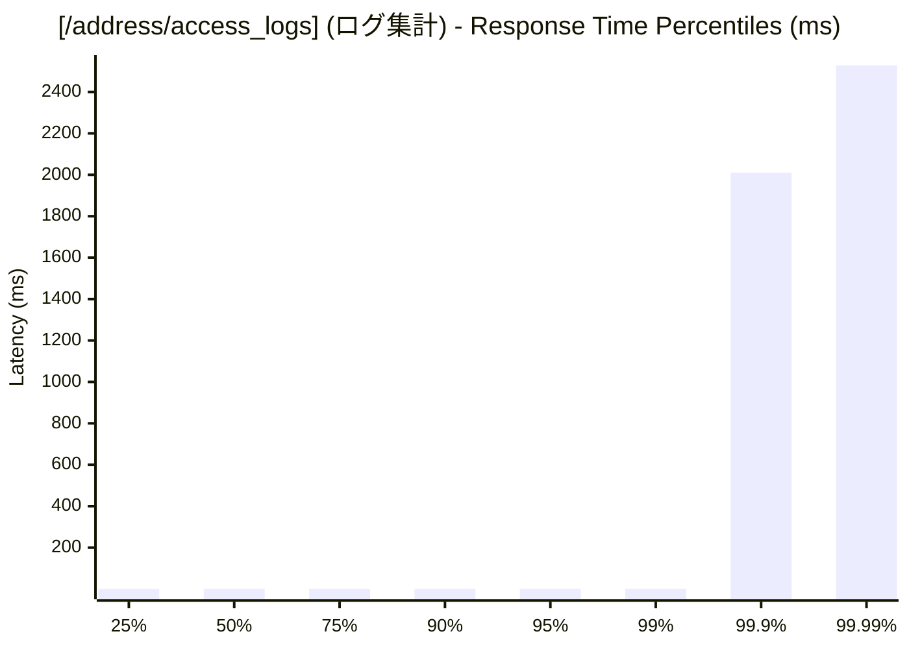
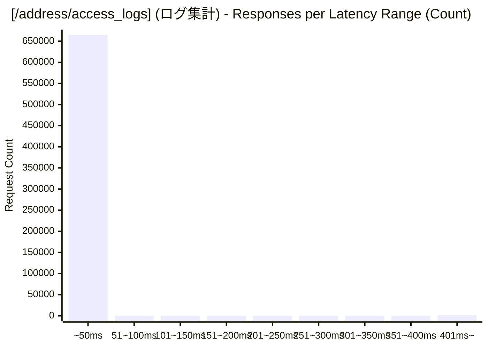

# 負荷テスト結果レポート: rust_address-mixed_500_30s
テスト実行時間: 32.0198 sec

## エンドポイント別詳細

### 全体結果
成功率:      98.25%
最遅:        4822.5580 ms
最速:        0.1370 ms
平均:        4.8603 ms
毎秒リクエスト数:   21167.3430/sec

---

### [/address] (郵便番号検索)
成功率:      1.33%
最遅:        355.9380 ms
最速:        6.2750 ms
平均:        17.7557 ms
毎秒リクエスト数:   374.7676/sec

---

### [/address/access_logs] (ログ集計)
成功率:      100.00%
最遅:        4822.5580 ms
最速:        0.1370 ms
平均:        4.6279 ms
毎秒リクエスト数:   20792.5754/sec

