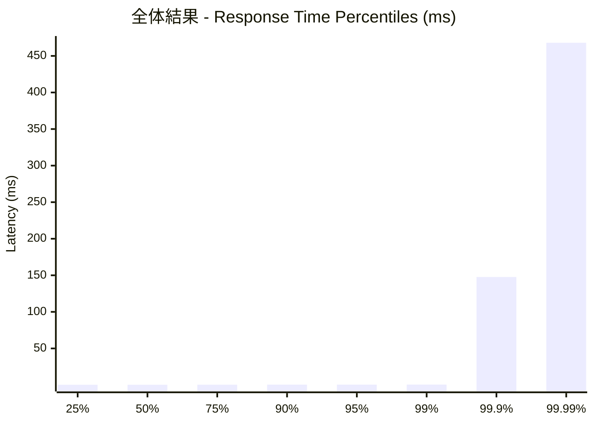
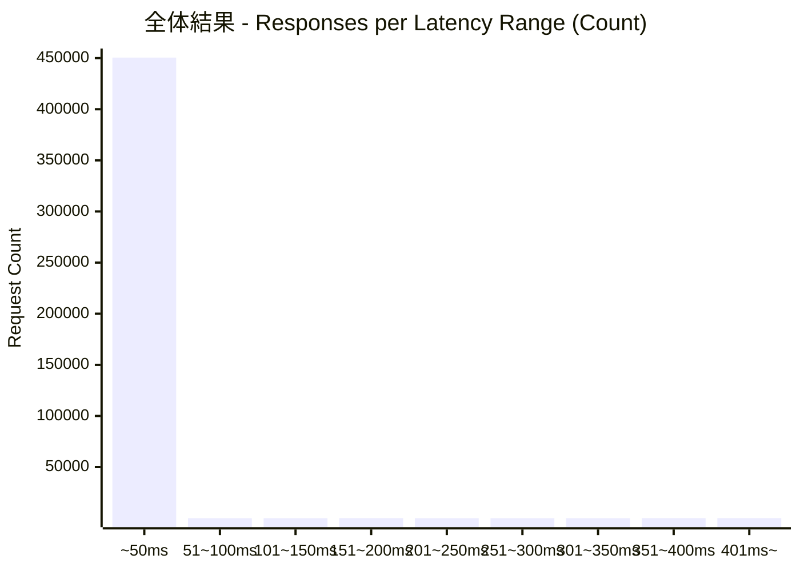
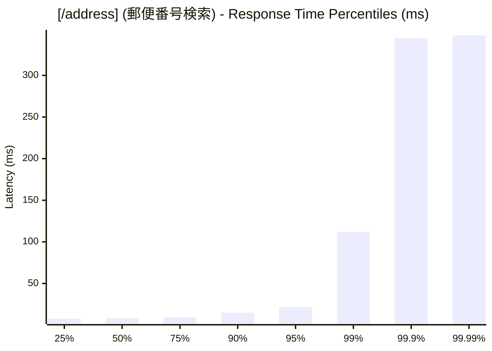
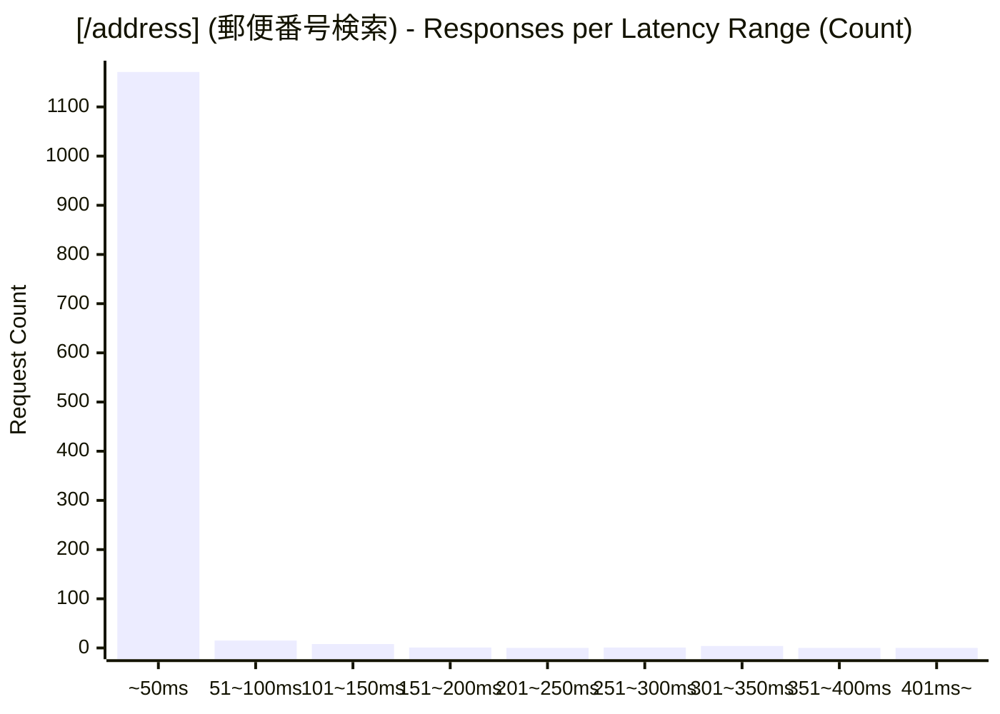
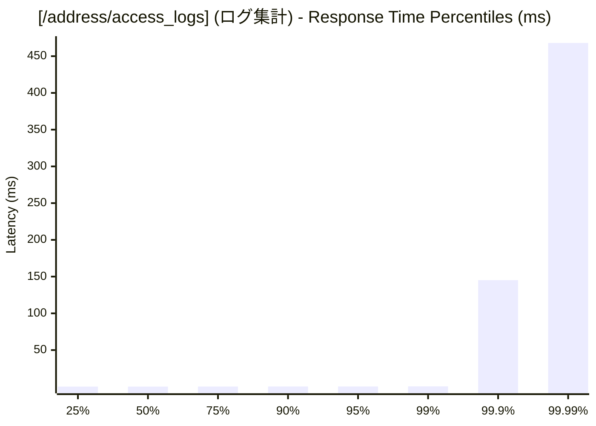
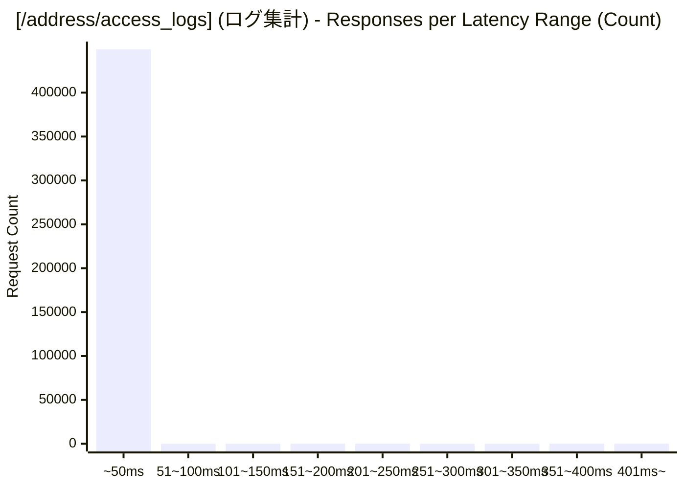

# 負荷テスト結果レポート: rust_address-mixed_50_30s
テスト実行時間: 30.9145 sec

## エンドポイント別詳細

### 全体結果
成功率:      99.77%
最遅:        652.3850 ms
最速:        0.1330 ms
平均:        0.6858 ms
毎秒リクエスト数:   14588.9750/sec

---

### [/address] (郵便番号検索)
成功率:      13.00%
最遅:        348.4230 ms
最速:        6.6580 ms
平均:        12.6190 ms
毎秒リクエスト数:   38.8167/sec

---

### [/address/access_logs] (ログ集計)
成功率:      100.00%
最遅:        652.3850 ms
最速:        0.1330 ms
平均:        0.6540 ms
毎秒リクエスト数:   14550.1583/sec

