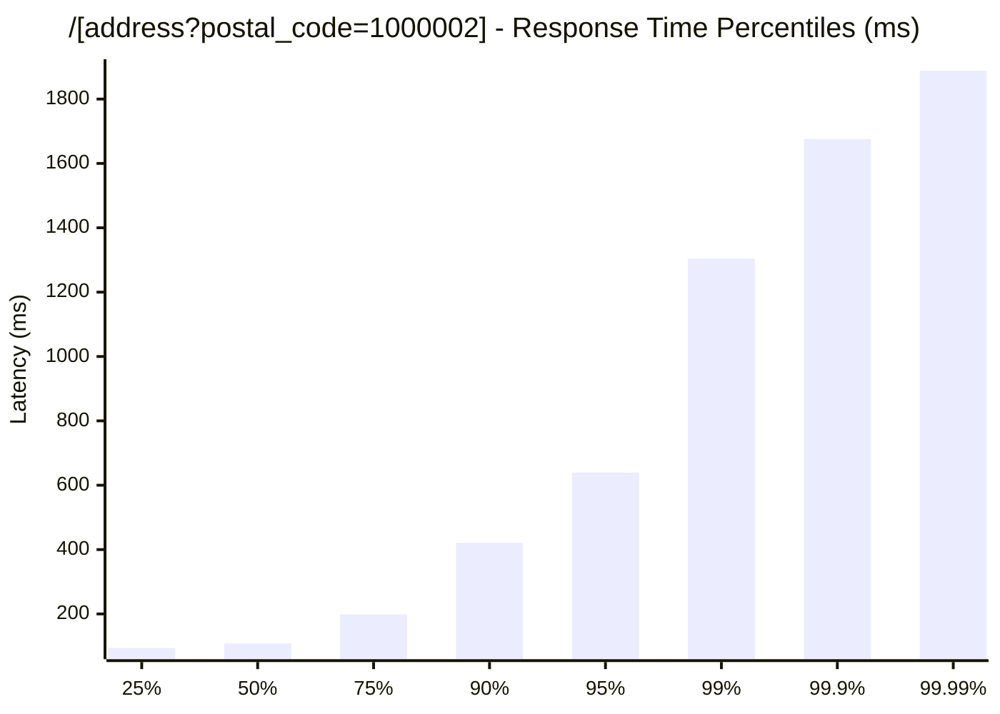
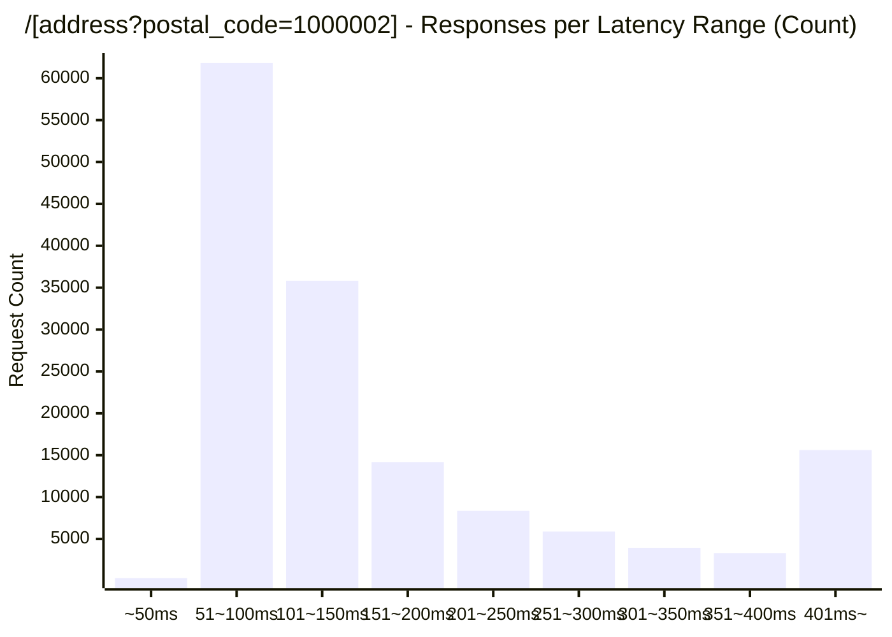

### /[address?postal_code=1000002]
| 項目 | 結果 |
| :--- | :--- |
| 成功率 | 0.11% |
| 最遅 | 1890.3450 ms |
| 最速 | 20.3150 ms |
| 平均 | 201.0244 ms |
| 毎秒リクエスト数 | 4961.1765/sec |

```mermaid
xychart-beta
  title "/[address?postal_code=1000002] - Response Time Percentiles (ms)"
  x-axis ["25%", "50%", "75%", "90%", "95%", "99%", "99.9%", "99.99%"]
  y-axis "Latency (ms)"
  bar [94.3, 108.8, 198.4, 420.9, 639.5, 1304.3, 1676.1, 1888.5]
```

```mermaid
xychart-beta
  title "/[address?postal_code=1000002] - Responses per Latency Range (Count)"
  x-axis ["~50ms", "51~100ms", "101~150ms", "151~200ms", "201~250ms", "251~300ms", "301~350ms", "351~400ms", "401ms~"]
  y-axis "Request Count"
  bar [334, 61821, 35817, 14185, 8372, 5886, 3950, 3311, 15618]
```
