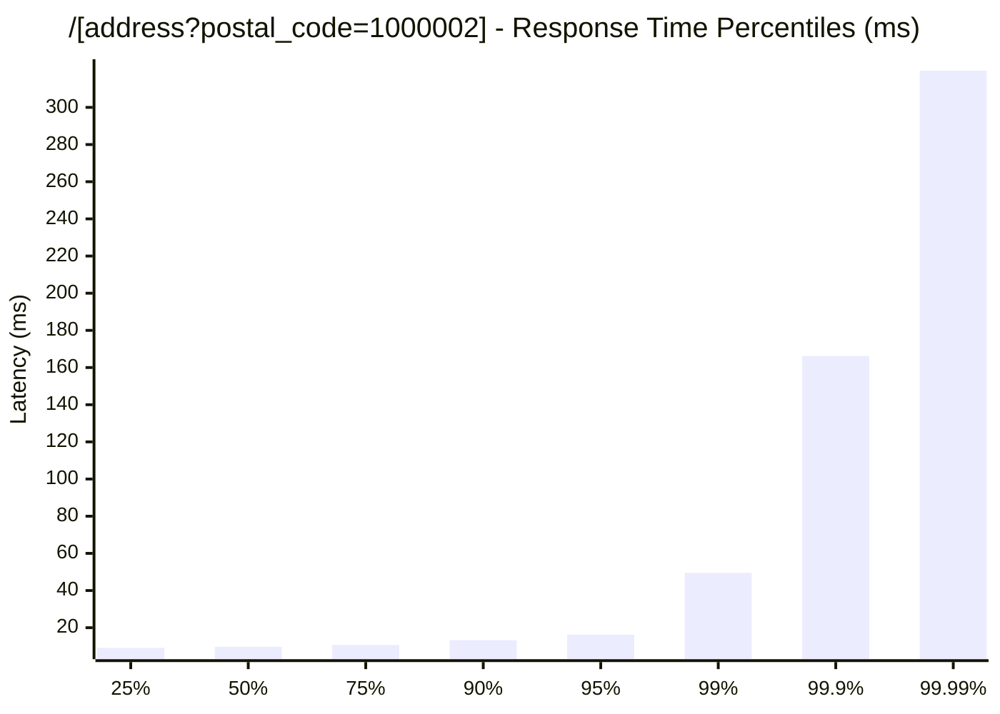
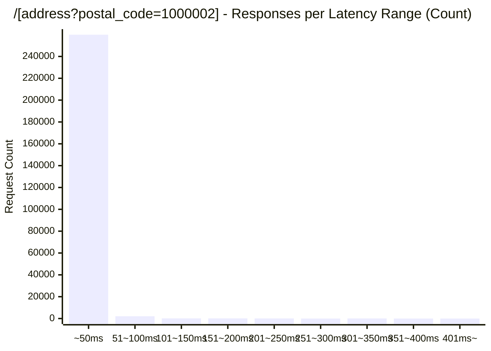

### /[address?postal_code=1000002]
成功率:      0.06%
最遅:        326.1880 ms
最速:        5.0640 ms
平均:        11.4030 ms
毎秒リクエスト数:   8737.9867/sec

```mermaid
xychart-beta
  title "/[address?postal_code=1000002] - Response Time Percentiles (ms)"
  x-axis ["25%", "50%", "75%", "90%", "95%", "99%", "99.9%", "99.99%"]
  y-axis "Latency (ms)"
  bar [9.1, 9.7, 10.7, 13.3, 16.3, 49.5, 166.2, 319.8]
```

```mermaid
xychart-beta
  title "/[address?postal_code=1000002] - Responses per Latency Range (Count)"
  x-axis ["~50ms", "51~100ms", "101~150ms", "151~200ms", "201~250ms", "251~300ms", "301~350ms", "351~400ms", "401ms~"]
  y-axis "Request Count"
  bar [259918, 2090, 156, 140, 84, 6, 99, 0, 0]
```
