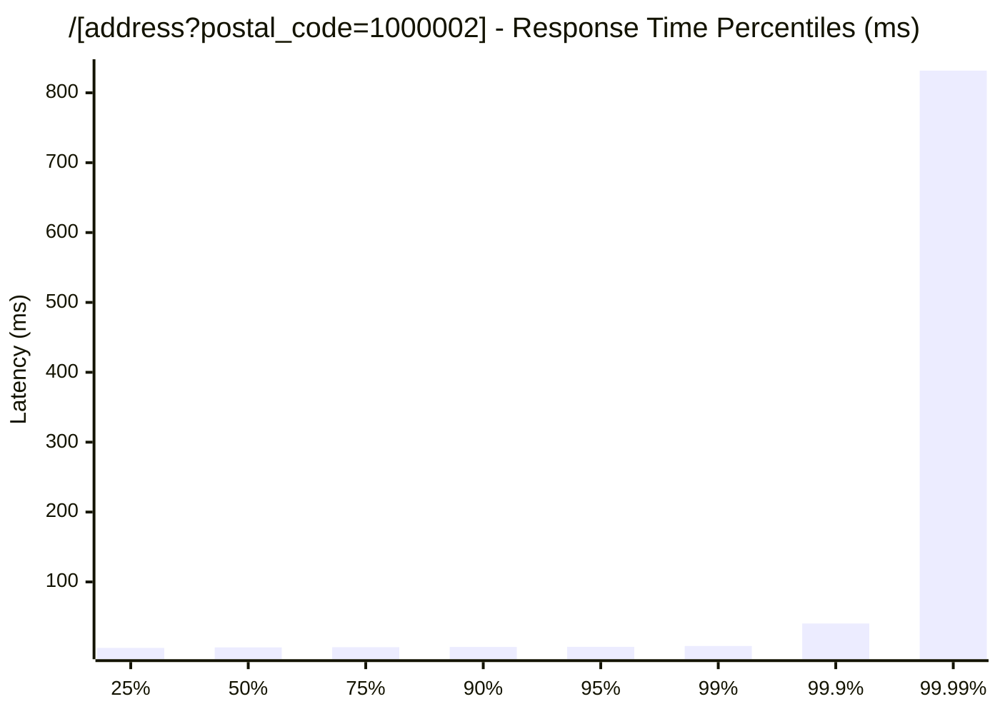
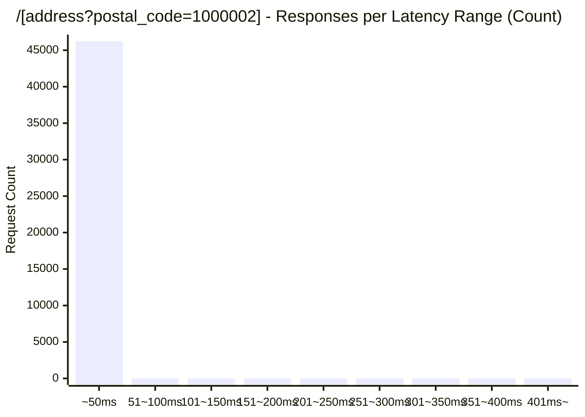

### /[address?postal_code=1000002]
成功率:      0.34%
最遅:        843.4900 ms
最速:        4.2130 ms
平均:        6.4235 ms
毎秒リクエスト数:   1542.0124/sec

```mermaid
xychart-beta
  title "/[address?postal_code=1000002] - Response Time Percentiles (ms)"
  x-axis ["25%", "50%", "75%", "90%", "95%", "99%", "99.9%", "99.99%"]
  y-axis "Latency (ms)"
  bar [5.5, 6.3, 6.6, 6.9, 7.1, 8.3, 40.5, 831.8]
```

```mermaid
xychart-beta
  title "/[address?postal_code=1000002] - Responses per Latency Range (Count)"
  x-axis ["~50ms", "51~100ms", "101~150ms", "151~200ms", "201~250ms", "251~300ms", "301~350ms", "351~400ms", "401ms~"]
  y-axis "Request Count"
  bar [46234, 10, 3, 2, 0, 10, 0, 0, 10]
```
