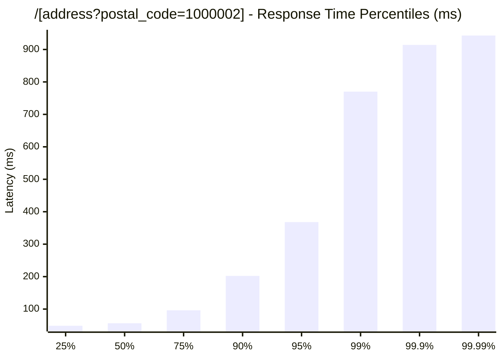
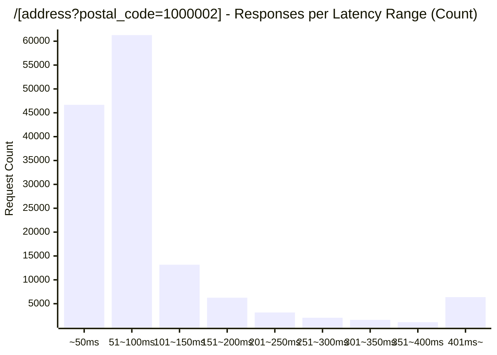

### /[address?postal_code=1000002]
成功率:      0.11%
最遅:        946.6040 ms
最速:        8.3190 ms
平均:        106.6315 ms
毎秒リクエスト数:   4630.6464/sec

```mermaid
xychart-beta
  title "/[address?postal_code=1000002] - Response Time Percentiles (ms)"
  x-axis ["25%", "50%", "75%", "90%", "95%", "99%", "99.9%", "99.99%"]
  y-axis "Latency (ms)"
  bar [48.5, 56.3, 96.2, 202.2, 368.1, 770.1, 914.1, 943.1]
```

```mermaid
xychart-beta
  title "/[address?postal_code=1000002] - Responses per Latency Range (Count)"
  x-axis ["~50ms", "51~100ms", "101~150ms", "151~200ms", "201~250ms", "251~300ms", "301~350ms", "351~400ms", "401ms~"]
  y-axis "Request Count"
  bar [46674, 61279, 13175, 6257, 3159, 2064, 1611, 1132, 6379]
```
