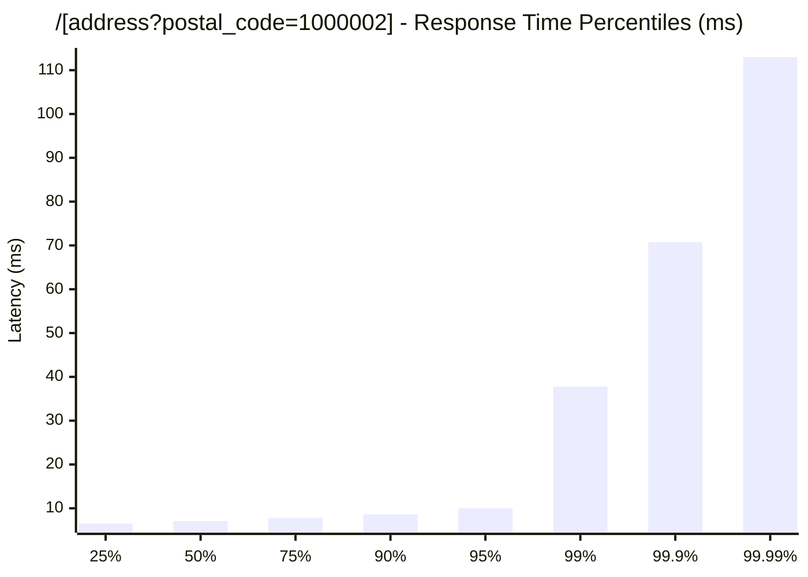
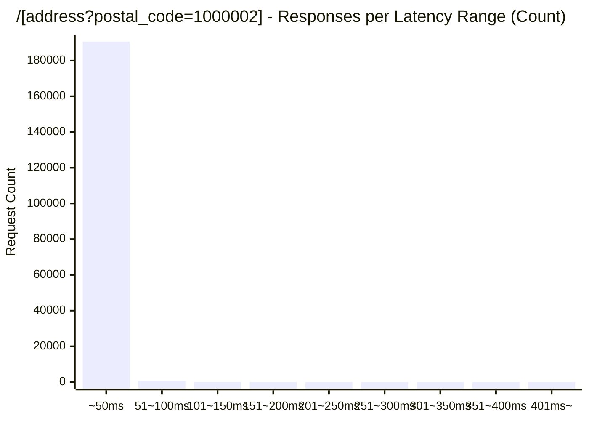

### /[address?postal_code=1000002]
| 項目 | 結果 |
| :--- | :--- |
| 成功率 | 0.08% |
| 最遅 | 317.5490 ms |
| 最速 | 4.3510 ms |
| 平均 | 7.8163 ms |
| 毎秒リクエスト数 | 6381.1140/sec |

```mermaid
xychart-beta
  title "/[address?postal_code=1000002] - Response Time Percentiles (ms)"
  x-axis ["25%", "50%", "75%", "90%", "95%", "99%", "99.9%", "99.99%"]
  y-axis "Latency (ms)"
  bar [6.5, 7.1, 7.8, 8.6, 10.0, 37.8, 70.7, 113.0]
```

```mermaid
xychart-beta
  title "/[address?postal_code=1000002] - Responses per Latency Range (Count)"
  x-axis ["~50ms", "51~100ms", "101~150ms", "151~200ms", "201~250ms", "251~300ms", "301~350ms", "351~400ms", "401ms~"]
  y-axis "Request Count"
  bar [190618, 839, 14, 3, 2, 2, 1, 0, 0]
```
