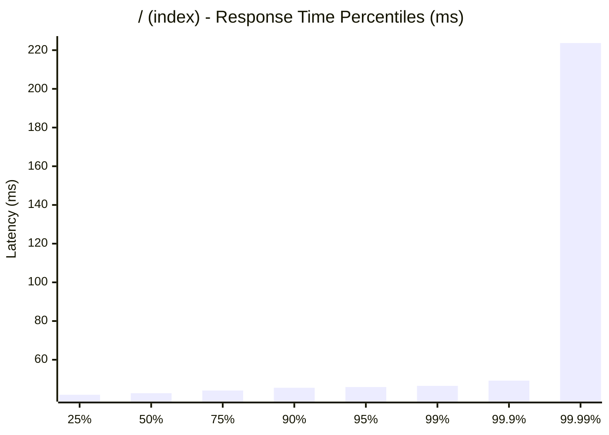
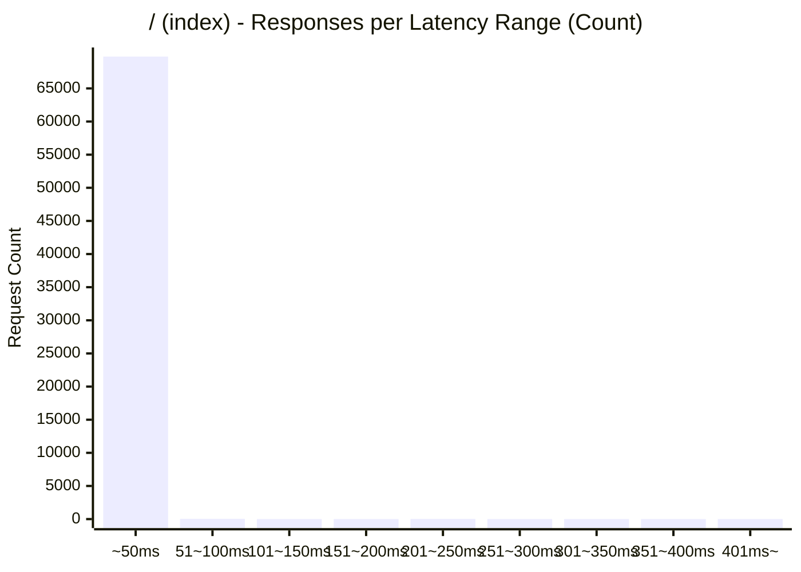

### / (index)
成功率:      100.00%
最遅:        229.8100 ms
最速:        12.0390 ms
平均:        42.9060 ms
毎秒リクエスト数:   2325.8476/sec

```mermaid
xychart-beta
  title "/ (index) - Response Time Percentiles (ms)"
  x-axis ["25%", "50%", "75%", "90%", "95%", "99%", "99.9%", "99.99%"]
  y-axis "Latency (ms)"
  bar [41.9, 42.7, 44.1, 45.5, 45.9, 46.5, 49.2, 223.7]
```

```mermaid
xychart-beta
  title "/ (index) - Responses per Latency Range (Count)"
  x-axis ["~50ms", "51~100ms", "101~150ms", "151~200ms", "201~250ms", "251~300ms", "301~350ms", "351~400ms", "401ms~"]
  y-axis "Request Count"
  bar [69808, 42, 0, 0, 20, 0, 0, 0, 0]
```
