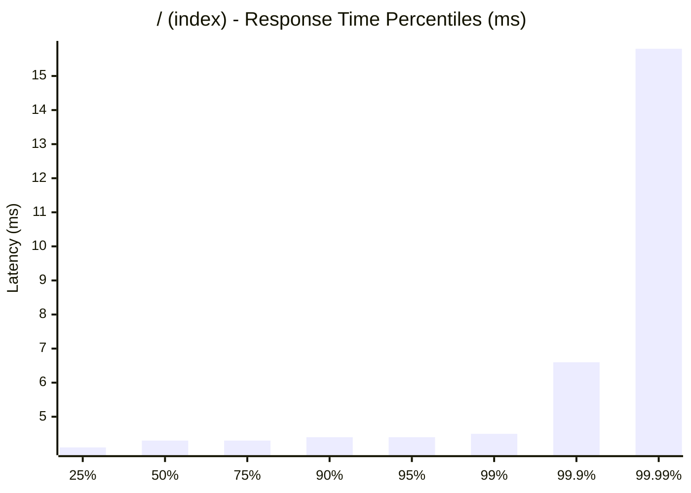
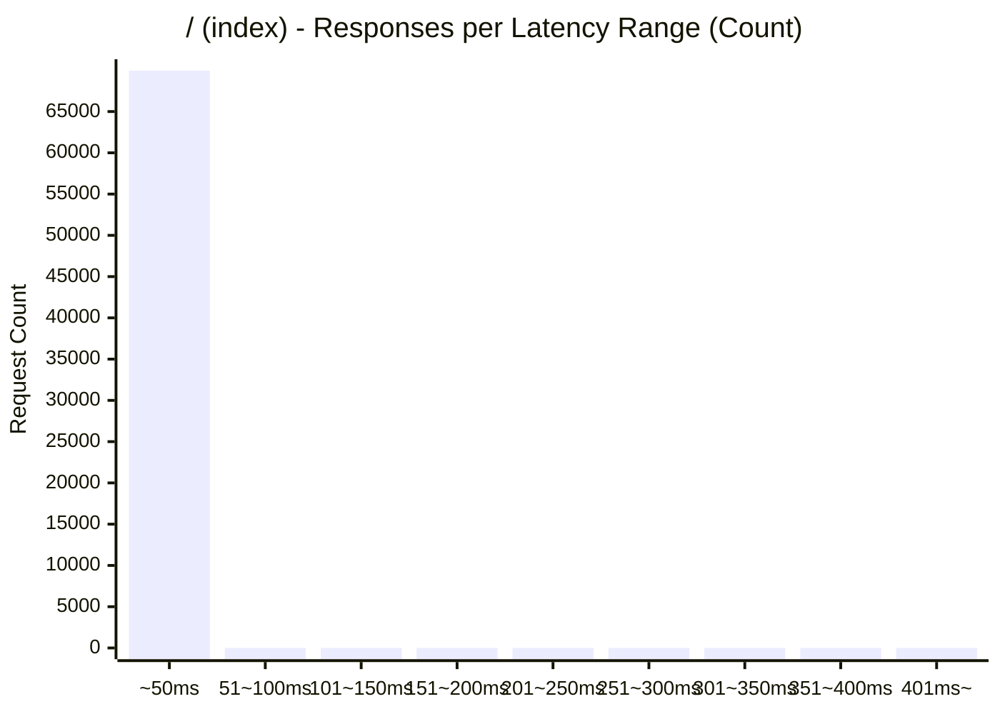

### / (index)
| 項目 | 結果 |
| :--- | :--- |
| 成功率 | 100.00% |
| 最遅 | 17.5970 ms |
| 最速 | 0.9820 ms |
| 平均 | 4.2378 ms |
| 毎秒リクエスト数 | 2331.8007/sec |

```mermaid
xychart-beta
  title "/ (index) - Response Time Percentiles (ms)"
  x-axis ["25%", "50%", "75%", "90%", "95%", "99%", "99.9%", "99.99%"]
  y-axis "Latency (ms)"
  bar [4.1, 4.3, 4.3, 4.4, 4.4, 4.5, 6.6, 15.8]
```

```mermaid
xychart-beta
  title "/ (index) - Responses per Latency Range (Count)"
  x-axis ["~50ms", "51~100ms", "101~150ms", "151~200ms", "201~250ms", "251~300ms", "301~350ms", "351~400ms", "401ms~"]
  y-axis "Request Count"
  bar [69964, 0, 0, 0, 0, 0, 0, 0, 0]
```
