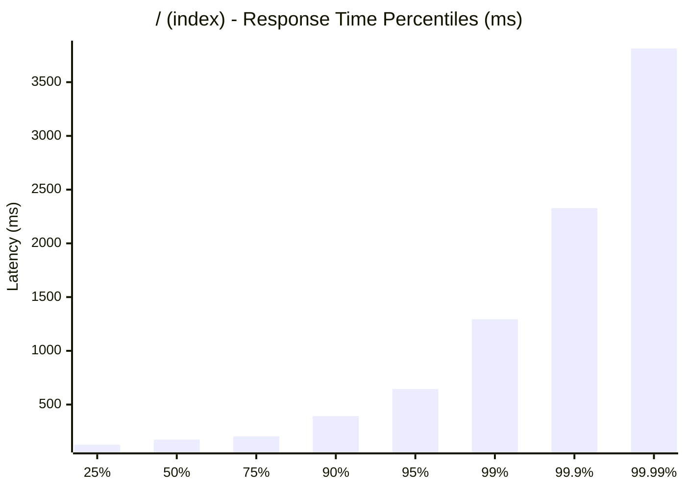
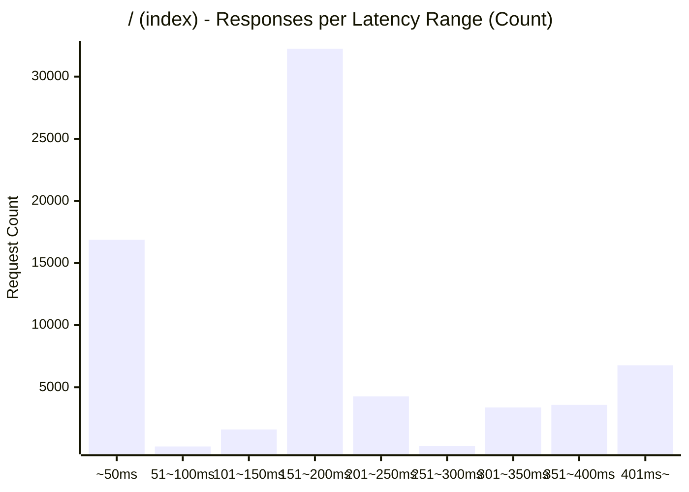

### / (index)
成功率:      100.00%
最遅:        6736.9470 ms
最速:        6.5720 ms
平均:        217.0789 ms
毎秒リクエスト数:   2250.2716/sec

```mermaid
xychart-beta
  title "/ (index) - Response Time Percentiles (ms)"
  x-axis ["25%", "50%", "75%", "90%", "95%", "99%", "99.9%", "99.99%"]
  y-axis "Latency (ms)"
  bar [126.6, 174.0, 203.8, 393.1, 644.7, 1294.3, 2328.4, 3813.9]
```

```mermaid
xychart-beta
  title "/ (index) - Responses per Latency Range (Count)"
  x-axis ["~50ms", "51~100ms", "101~150ms", "151~200ms", "201~250ms", "251~300ms", "301~350ms", "351~400ms", "401ms~"]
  y-axis "Request Count"
  bar [16868, 238, 1610, 32250, 4275, 299, 3377, 3590, 6772]
```
