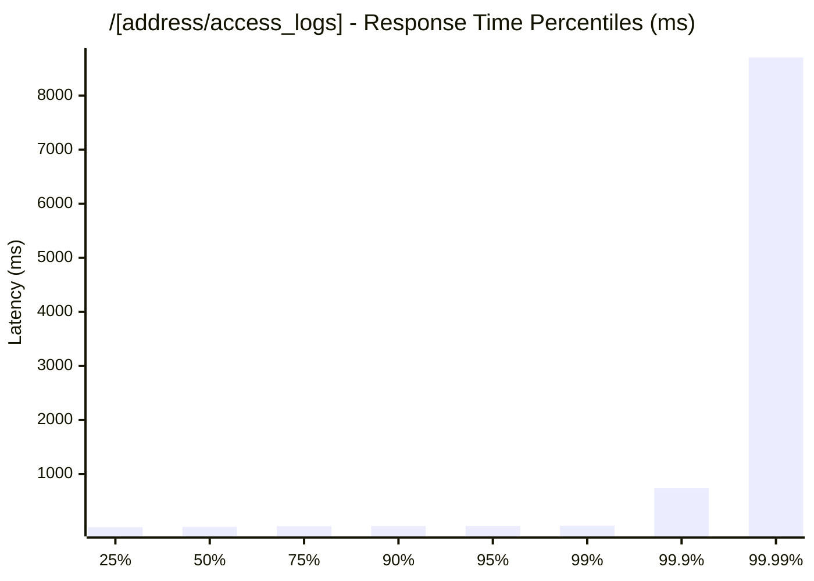
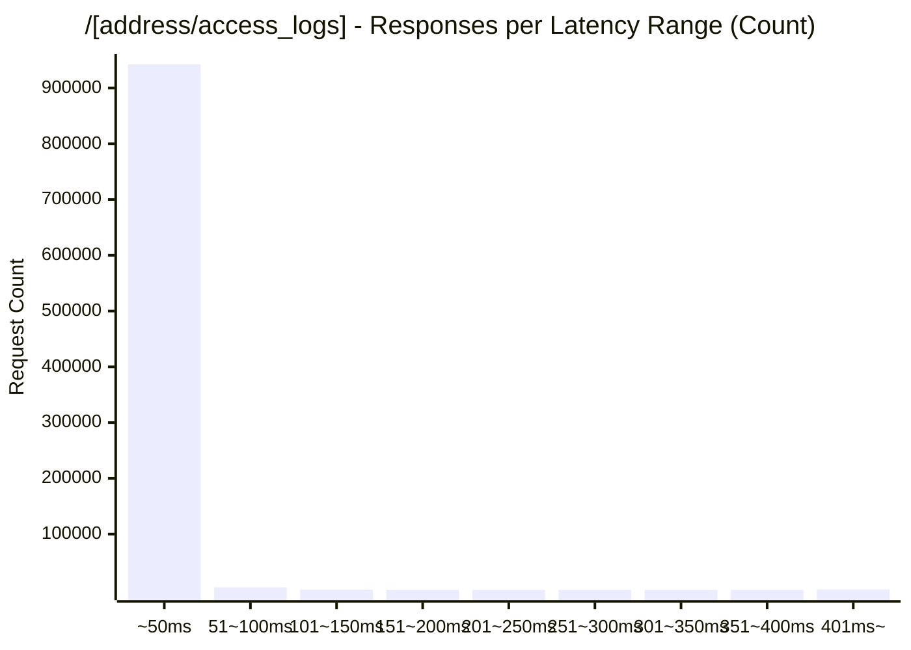

### /[address/access_logs]
| 項目 | 結果 |
| :--- | :--- |
| 成功率 | 100.00% |
| 最遅 | 8712.3600 ms |
| 最速 | 0.1820 ms |
| 平均 | 31.5918 ms |
| 毎秒リクエスト数 | 31587.0413/sec |

```mermaid
xychart-beta
  title "/[address/access_logs] - Response Time Percentiles (ms)"
  x-axis ["25%", "50%", "75%", "90%", "95%", "99%", "99.9%", "99.99%"]
  y-axis "Latency (ms)"
  bar [16.2, 25.0, 36.4, 39.4, 41.0, 45.6, 740.2, 8706.1]
```

```mermaid
xychart-beta
  title "/[address/access_logs] - Responses per Latency Range (Count)"
  x-axis ["~50ms", "51~100ms", "101~150ms", "151~200ms", "201~250ms", "251~300ms", "301~350ms", "351~400ms", "401ms~"]
  y-axis "Request Count"
  bar [942622, 4718, 395, 8, 2, 6, 4, 3, 976]
```
