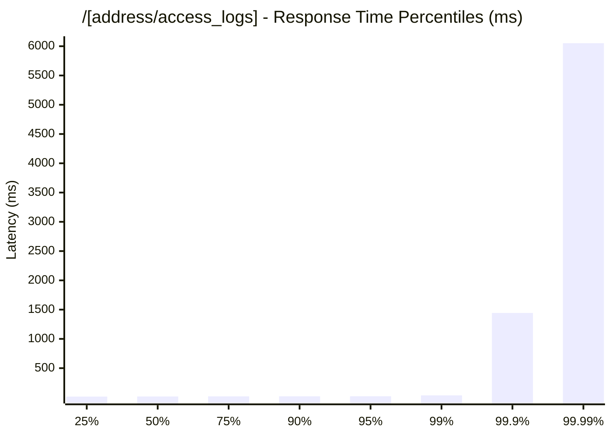
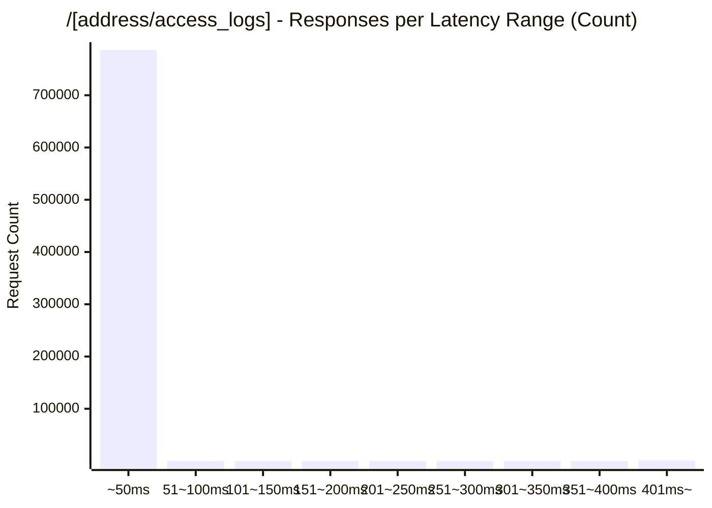

### /[address/access_logs]
成功率:      100.00%
最遅:        7221.3760 ms
最速:        0.1800 ms
平均:        19.4674 ms
毎秒リクエスト数:   23374.1037/sec

```mermaid
xychart-beta
  title "/[address/access_logs] - Response Time Percentiles (ms)"
  x-axis ["25%", "50%", "75%", "90%", "95%", "99%", "99.9%", "99.99%"]
  y-axis "Latency (ms)"
  bar [14.5, 16.3, 18.4, 19.3, 20.4, 35.1, 1443.2, 6051.5]
```

```mermaid
xychart-beta
  title "/[address/access_logs] - Responses per Latency Range (Count)"
  x-axis ["~50ms", "51~100ms", "101~150ms", "151~200ms", "201~250ms", "251~300ms", "301~350ms", "351~400ms", "401ms~"]
  y-axis "Request Count"
  bar [786190, 8, 8, 9, 7, 11, 6, 7, 953]
```
