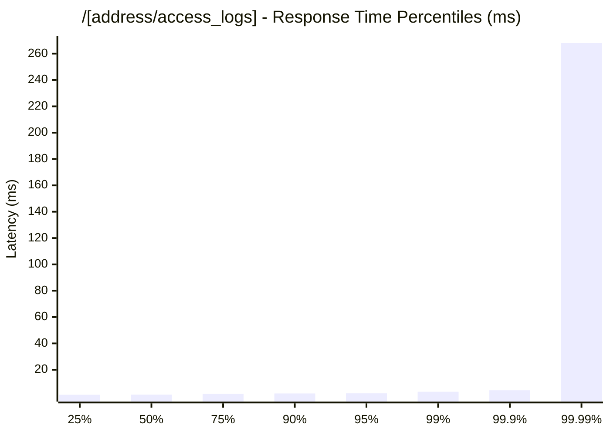
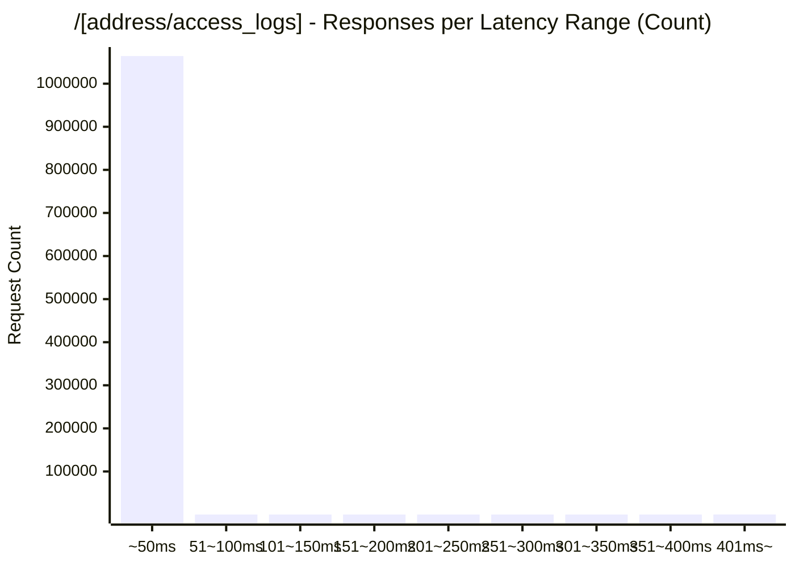

### /[address/access_logs]
| 項目 | 結果 |
| :--- | :--- |
| 成功率 | 100.00% |
| 最遅 | 849.9550 ms |
| 最速 | 0.1740 ms |
| 平均 | 1.3937 ms |
| 毎秒リクエスト数 | 35473.3549/sec |

```mermaid
xychart-beta
  title "/[address/access_logs] - Response Time Percentiles (ms)"
  x-axis ["25%", "50%", "75%", "90%", "95%", "99%", "99.9%", "99.99%"]
  y-axis "Latency (ms)"
  bar [1.0, 1.1, 1.7, 2.0, 2.1, 3.3, 4.4, 268.1]
```

```mermaid
xychart-beta
  title "/[address/access_logs] - Responses per Latency Range (Count)"
  x-axis ["~50ms", "51~100ms", "101~150ms", "151~200ms", "201~250ms", "251~300ms", "301~350ms", "351~400ms", "401ms~"]
  y-axis "Request Count"
  bar [1064125, 7, 5, 20, 8, 11, 14, 13, 72]
```
