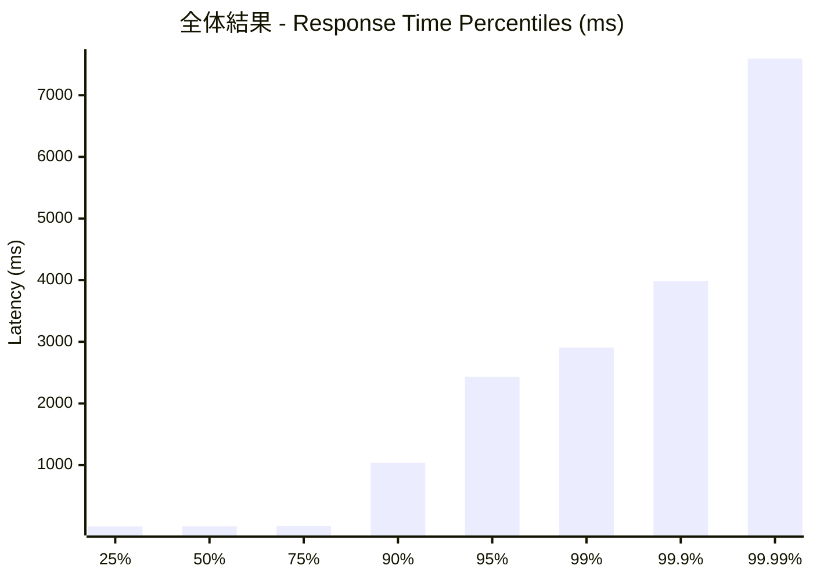
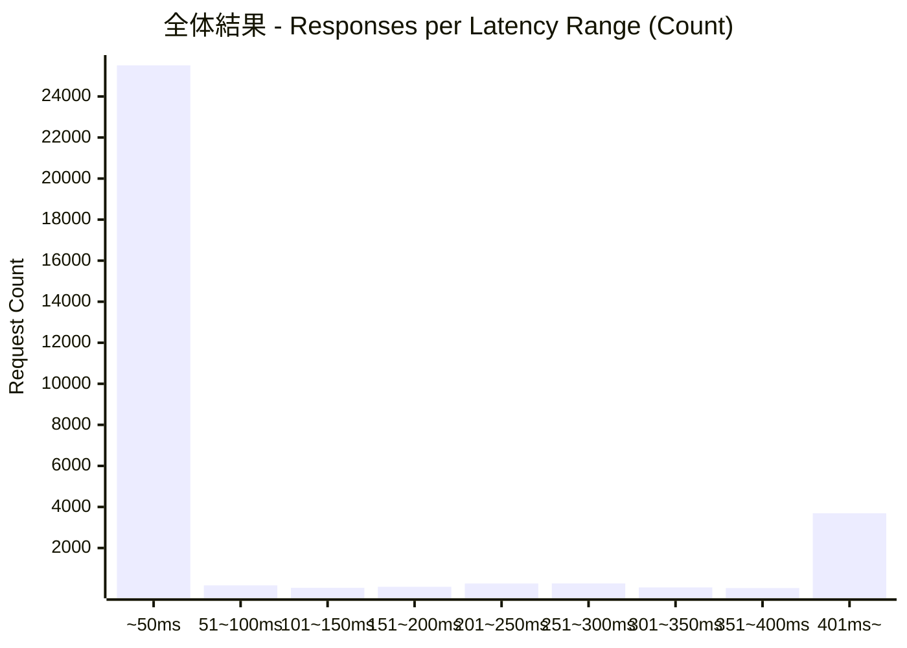
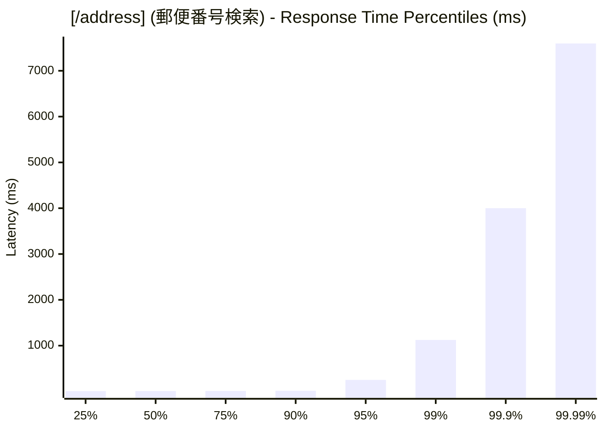
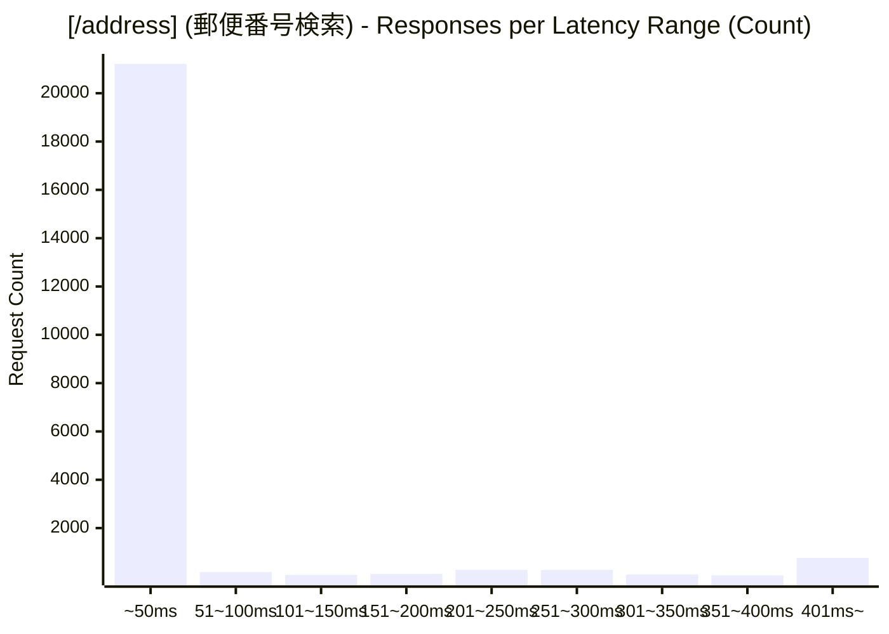
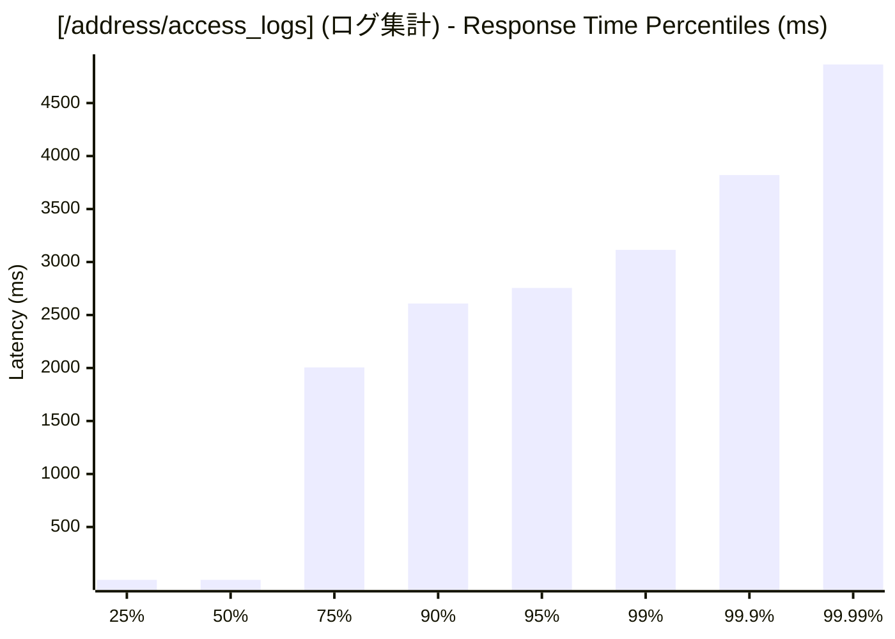
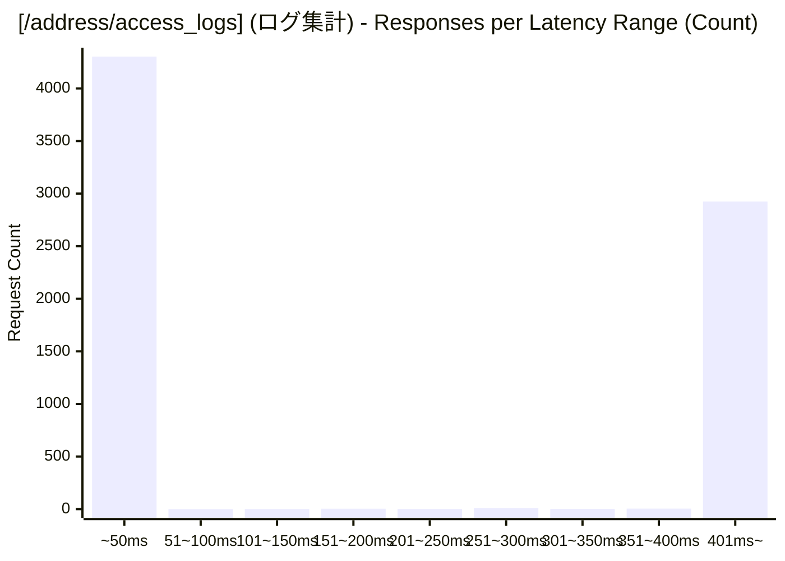

# 負荷テスト結果レポート: ts_address-mixed_1000_30s
テスト実行時間: 31.2787 sec

## エンドポイント別詳細

### 全体結果
成功率:      24.51%
最遅:        7600.2650 ms
最速:        0.2360 ms
平均:        248.4311 ms
毎秒リクエスト数:   966.4720/sec

---

### [/address] (郵便番号検索)
成功率:      0.70%
最遅:        7600.2650 ms
最速:        4.8370 ms
平均:        60.8693 ms
毎秒リクエスト数:   734.6849/sec

---

### [/address/access_logs] (ログ集計)
成功率:      100.00%
最遅:        5358.7730 ms
最速:        0.2360 ms
平均:        842.9373 ms
毎秒リクエスト数:   231.7870/sec

