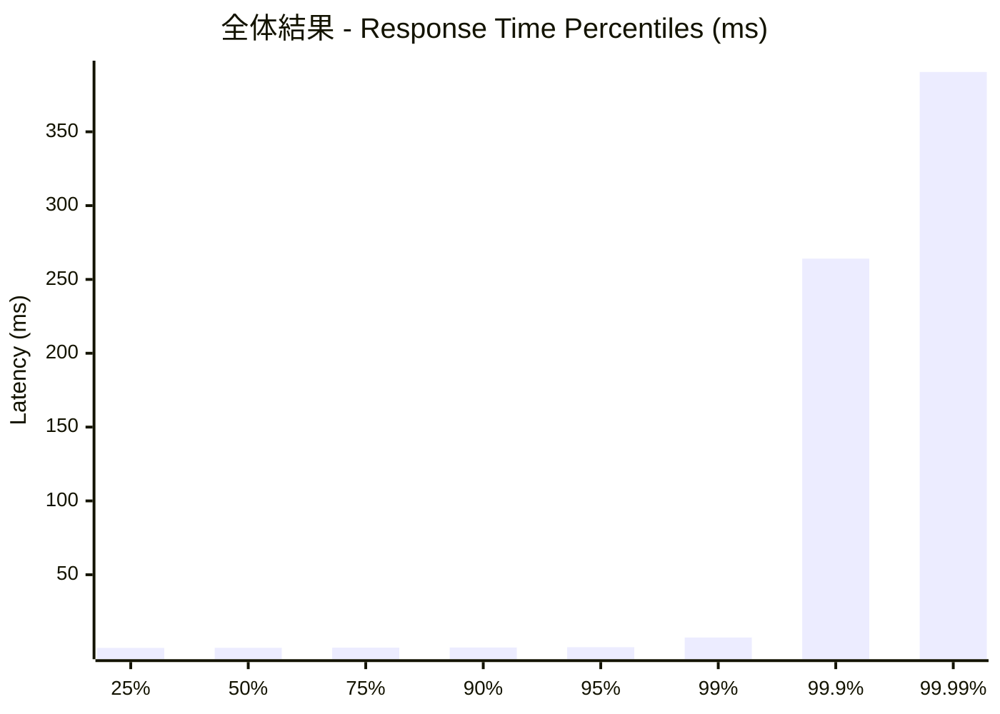
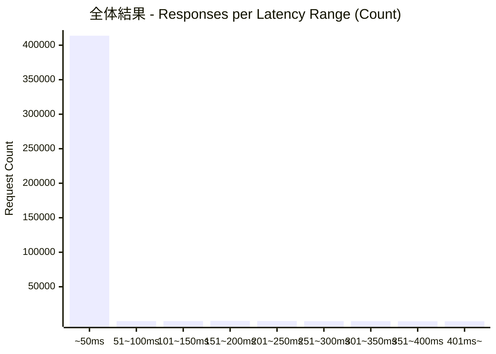
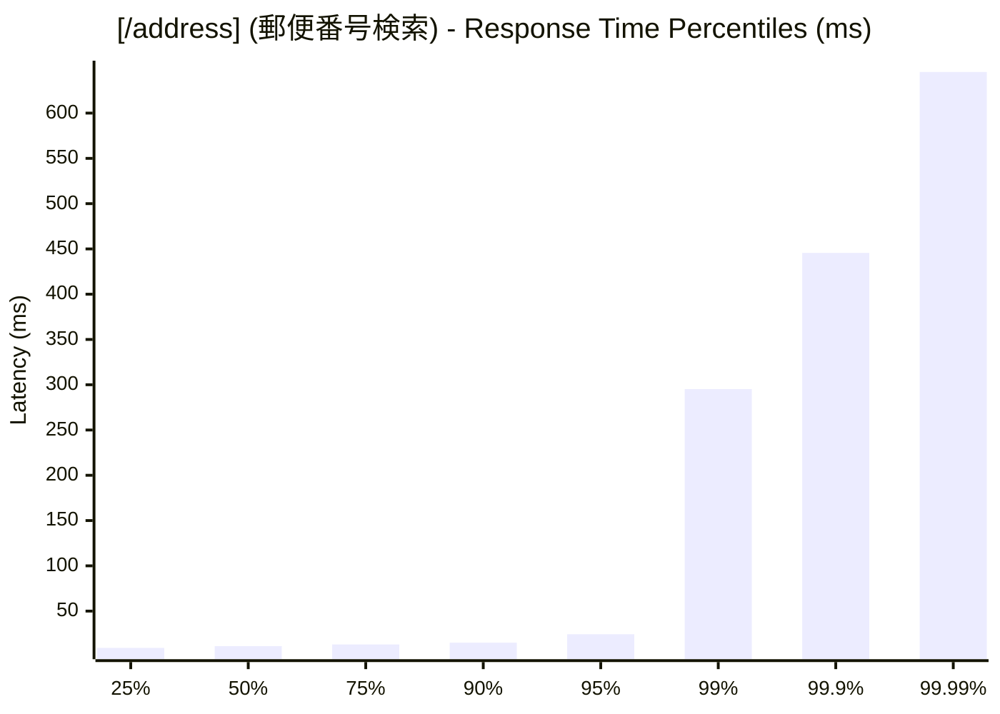
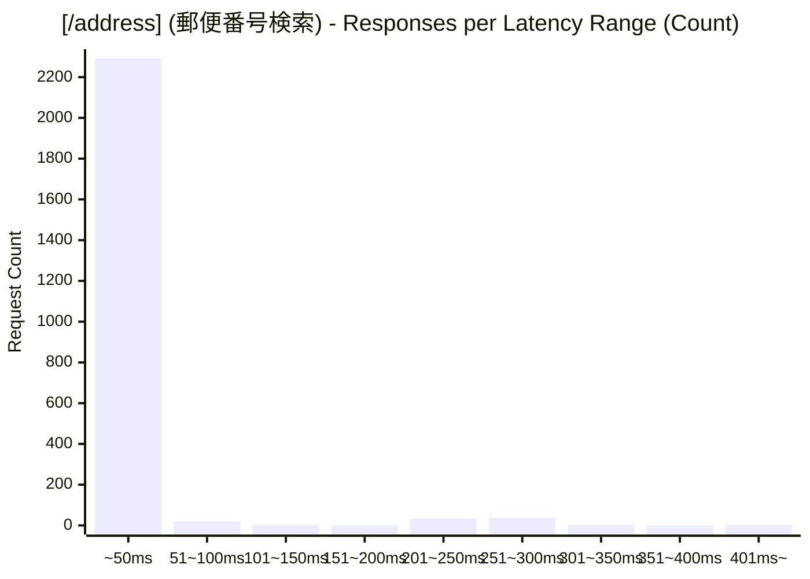
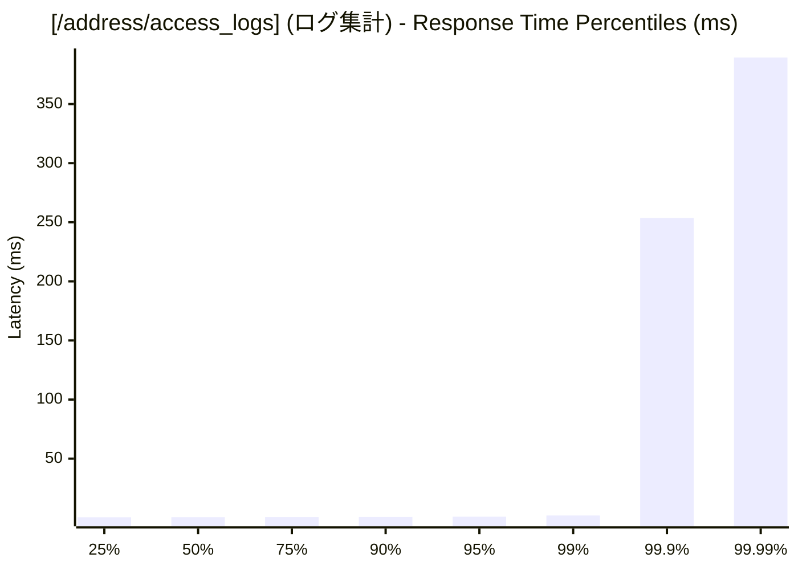
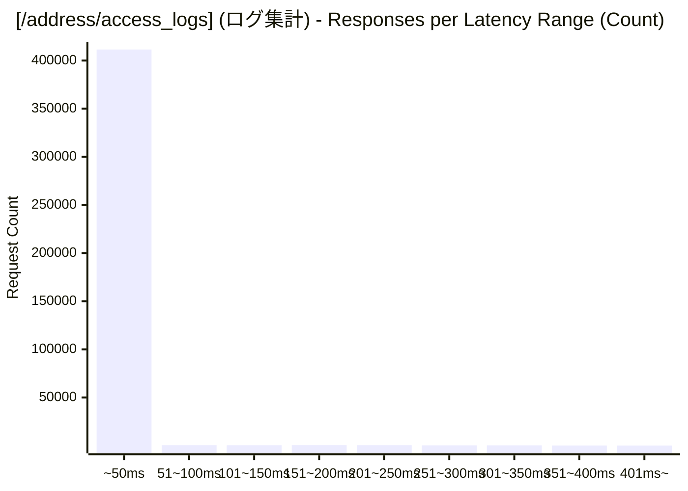

# 負荷テスト結果レポート: ts_address-mixed_100_30s
テスト実行時間: 30.9381 sec

## エンドポイント別詳細

### 全体結果

| 項目 | 結果 |
| :--- | :--- |
| 成功率 | 99.46% |
| 最遅 | 678.4980 ms |
| 最速 | 0.1590 ms |
| 平均 | 1.5532 ms |
| 毎秒リクエスト数 | 13438.1005/sec |

---

### [/address] (郵便番号検索)
| 項目 | 結果 |
| :--- | :--- |
| 成功率 | 6.68% |
| 最遅 | 678.4980 ms |
| 最速 | 5.5280 ms |
| 平均 | 20.9768 ms |
| 毎秒リクエスト数 | 77.4450/sec |

---

### [/address/access_logs] (ログ集計)
| 項目 | 結果 |
| :--- | :--- |
| 成功率 | 100.00% |
| 最遅 | 537.7440 ms |
| 最速 | 0.1590 ms |
| 平均 | 1.4406 ms |
| 毎秒リクエスト数 | 13360.6554/sec |

