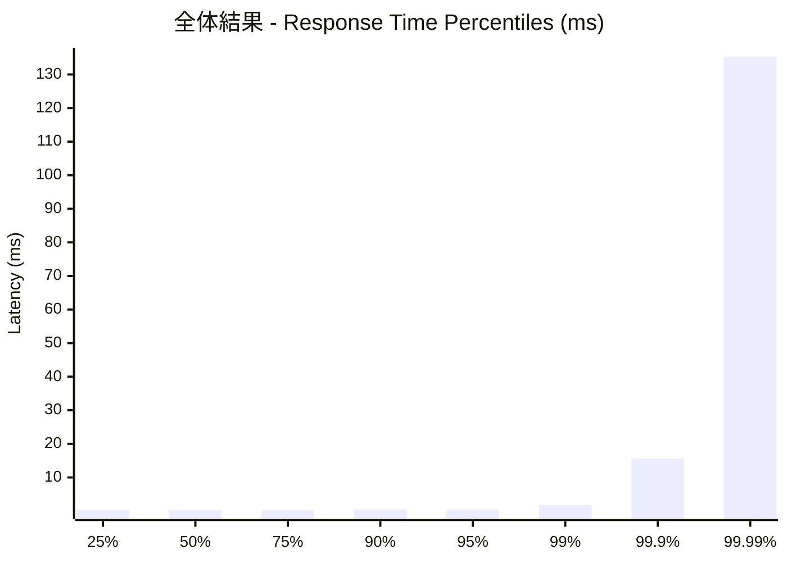
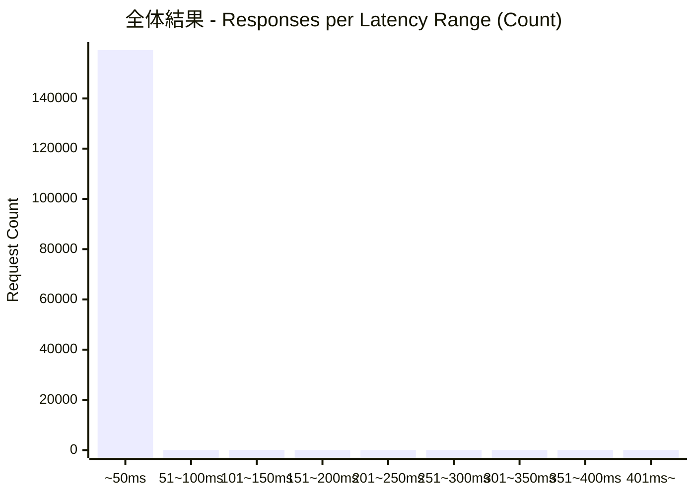
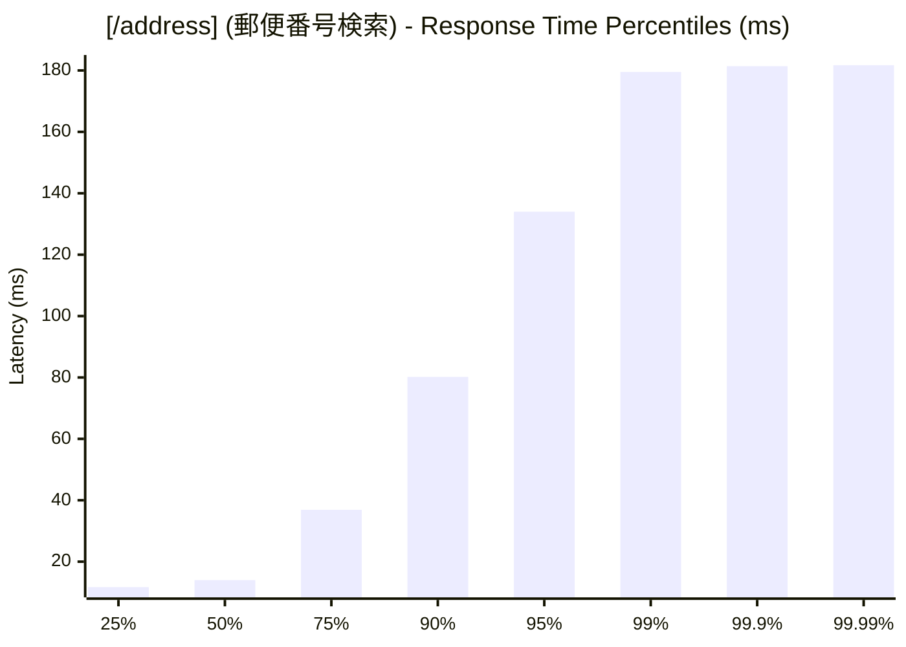
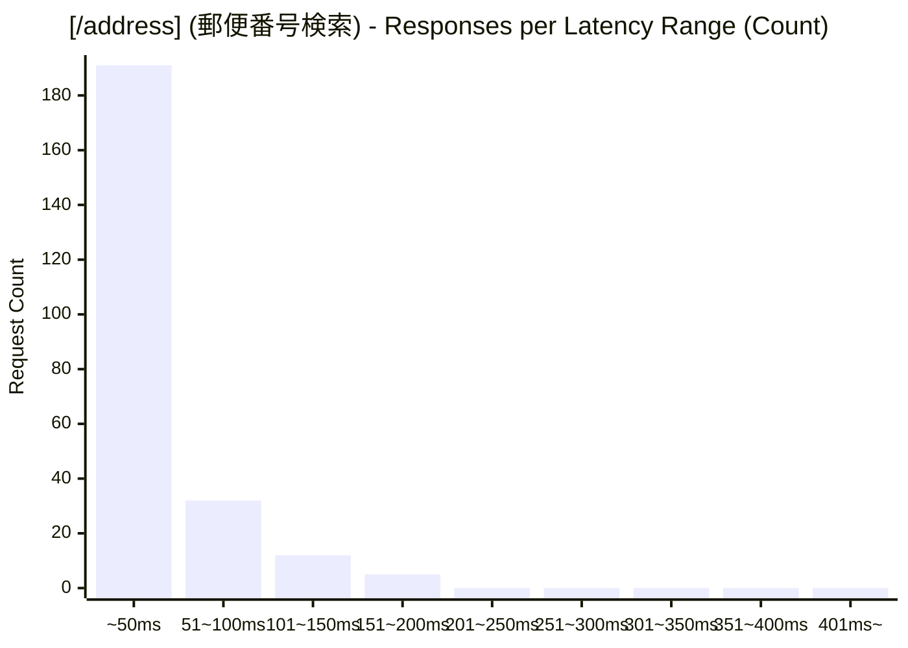
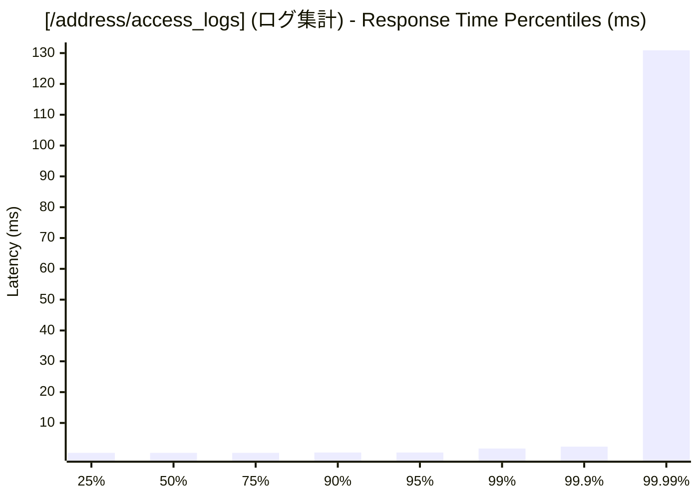
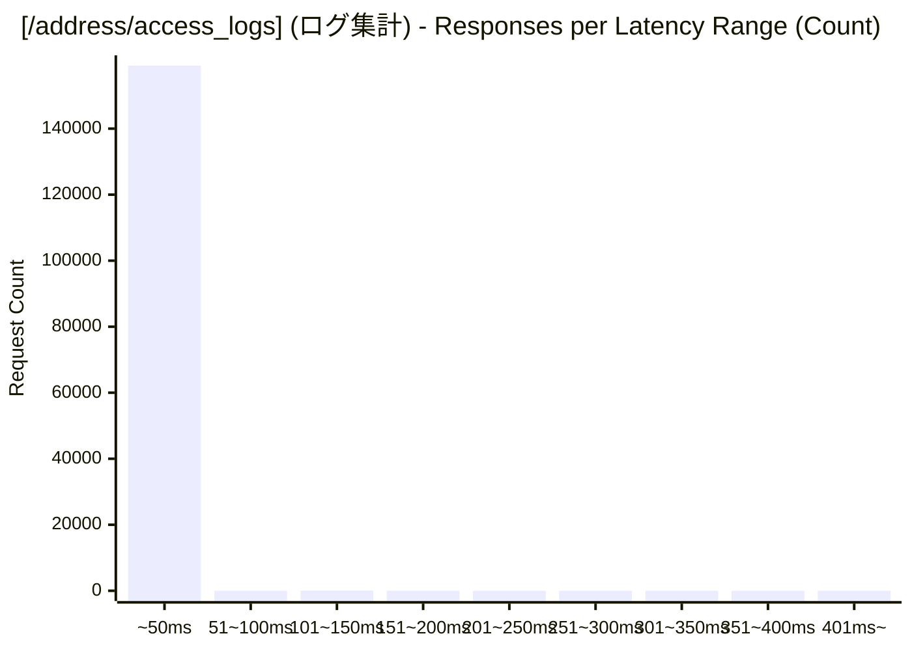

# 負荷テスト結果レポート: ts_address-mixed_10_30s
テスト実行時間: 30.9821 sec

## エンドポイント別詳細

### 全体結果
成功率:      99.95%
最遅:        181.7220 ms
最速:        0.1660 ms
平均:        0.4109 ms
毎秒リクエスト数:   5144.3637/sec

---

### [/address] (郵便番号検索)
成功率:      66.67%
最遅:        181.7220 ms
最速:        6.2680 ms
平均:        31.4289 ms
毎秒リクエスト数:   7.7464/sec

---

### [/address/access_logs] (ログ集計)
成功率:      100.00%
最遅:        142.6740 ms
最速:        0.1660 ms
平均:        0.3642 ms
毎秒リクエスト数:   5136.6173/sec

