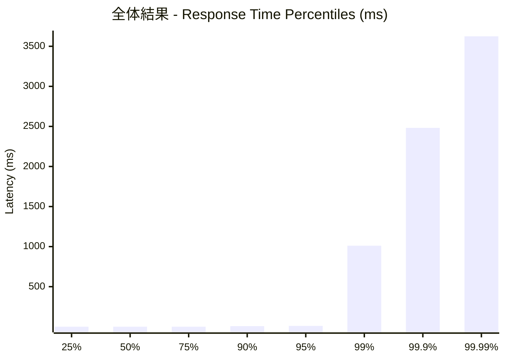
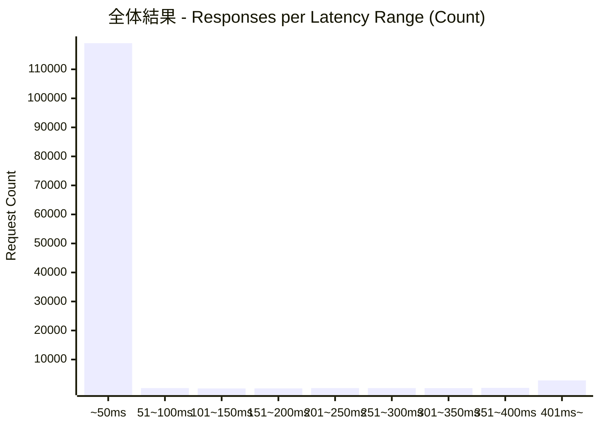
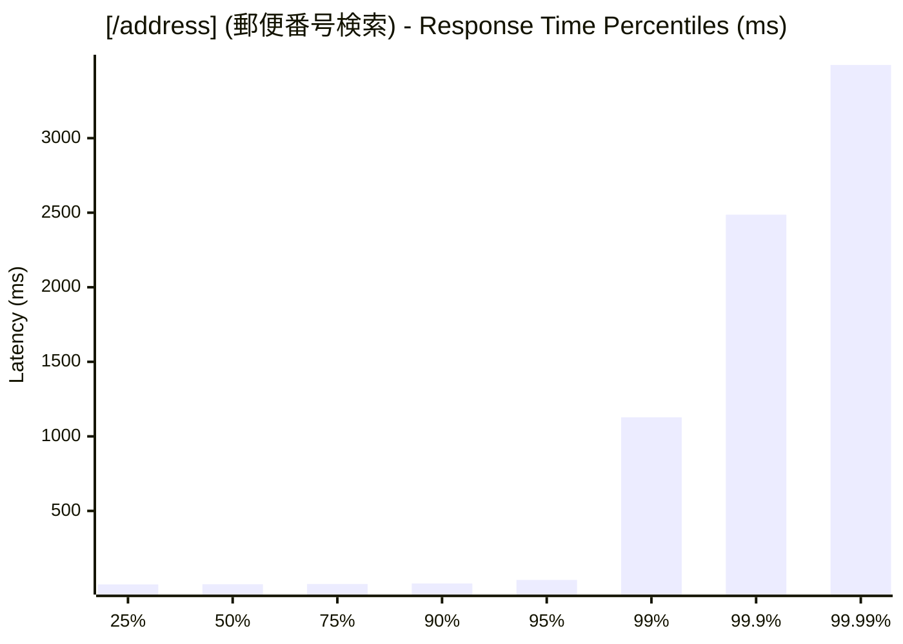
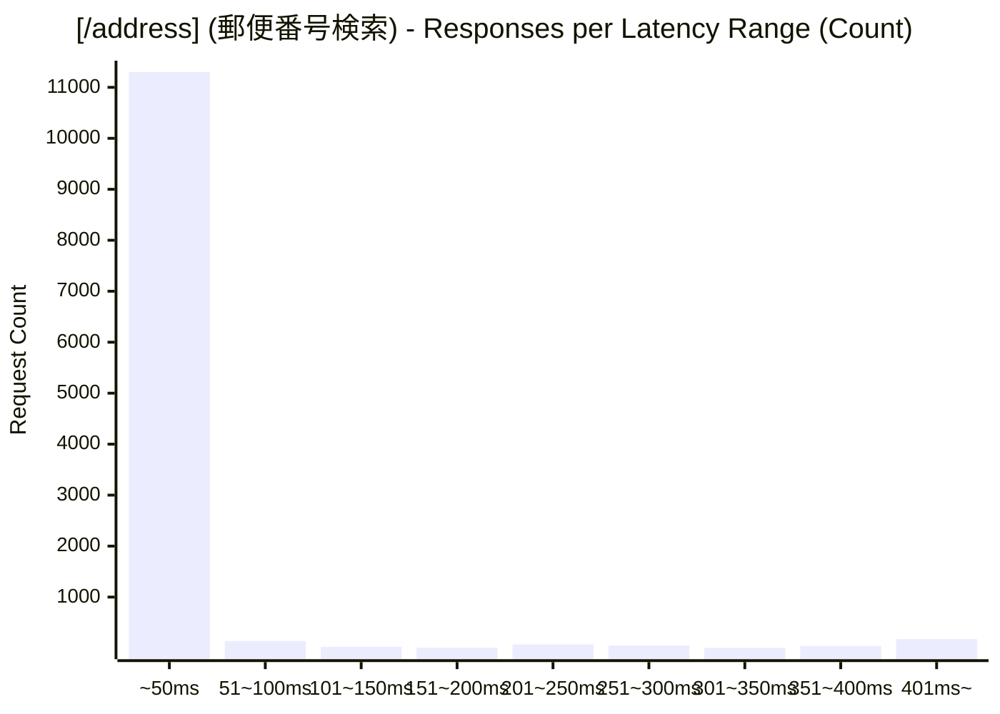
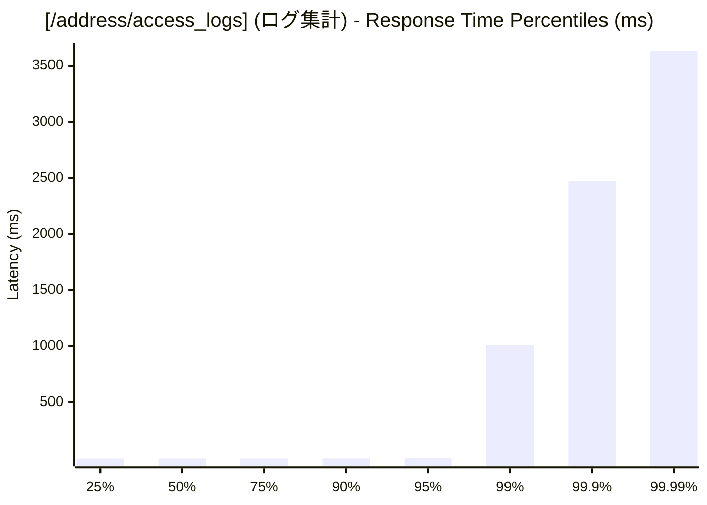
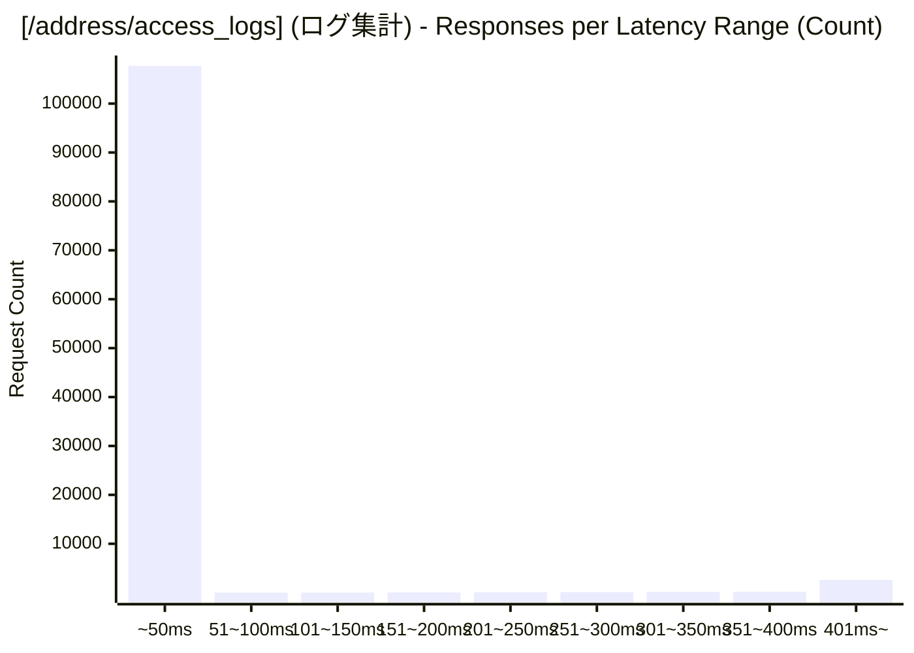

# 負荷テスト結果レポート: ts_address-mixed_500_30s
テスト実行時間: 32.5220 sec

## エンドポイント別詳細

### 全体結果
成功率:      90.51%
最遅:        5317.2180 ms
最速:        0.1730 ms
平均:        28.3777 ms
毎秒リクエスト数:   3775.6591/sec

---

### [/address] (郵便番号検索)
成功率:      1.33%
最遅:        3493.7890 ms
最速:        4.8030 ms
平均:        35.7775 ms
毎秒リクエスト数:   363.0773/sec

---

### [/address/access_logs] (ログ集計)
成功率:      100.00%
最遅:        5317.2180 ms
最速:        0.1730 ms
平均:        27.5904 ms
毎秒リクエスト数:   3412.5818/sec

