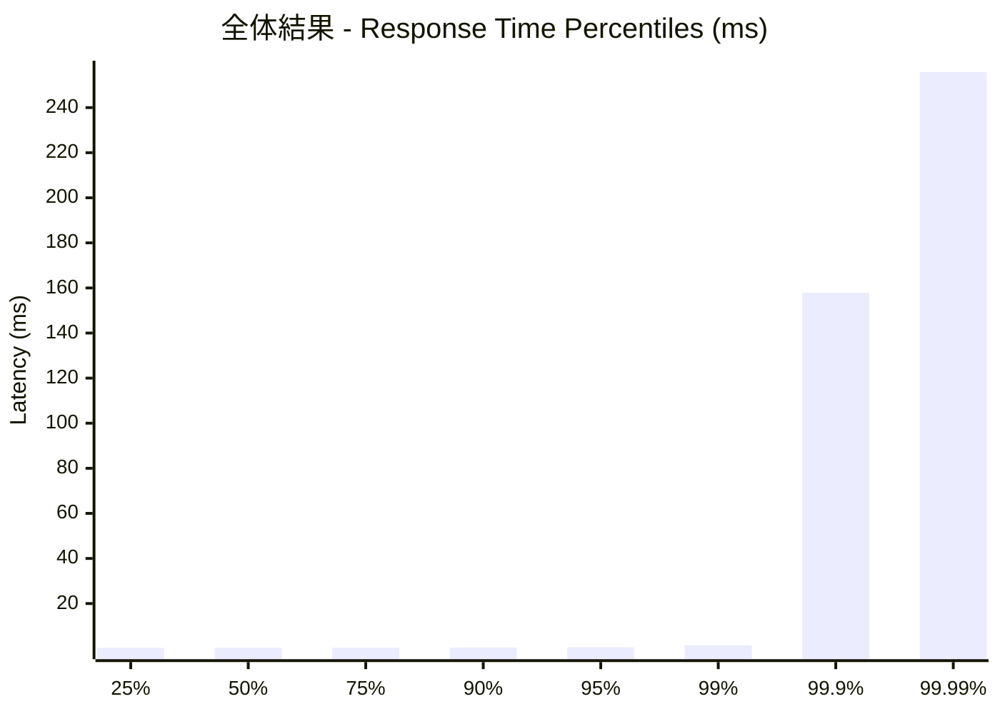
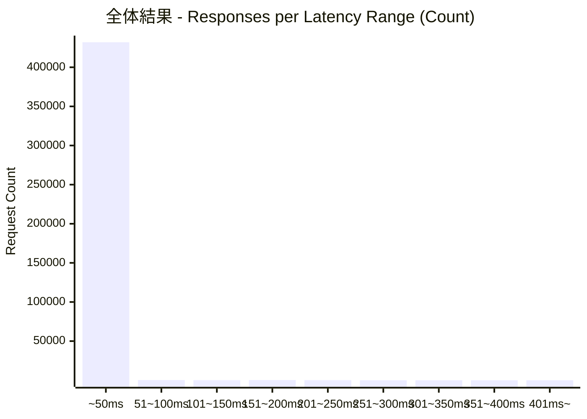
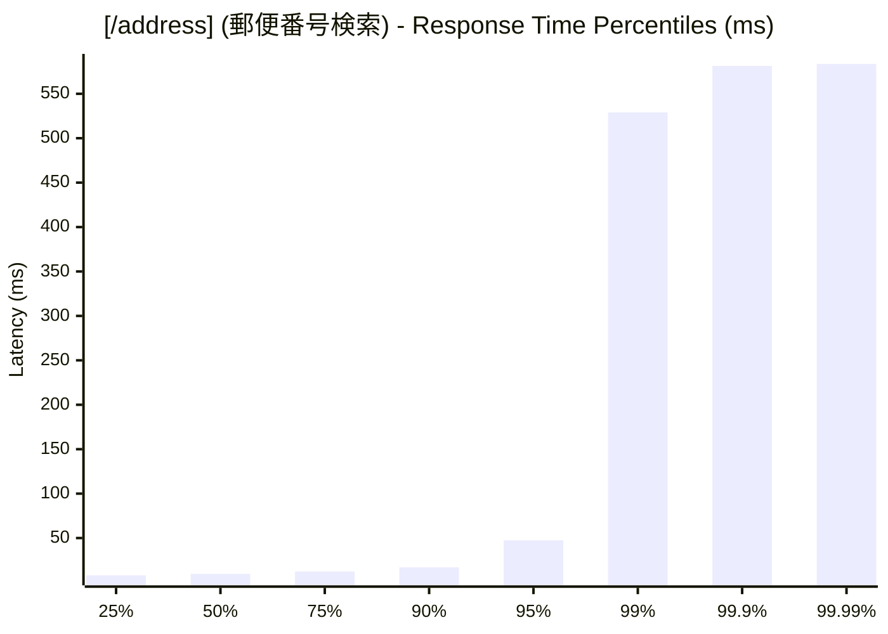
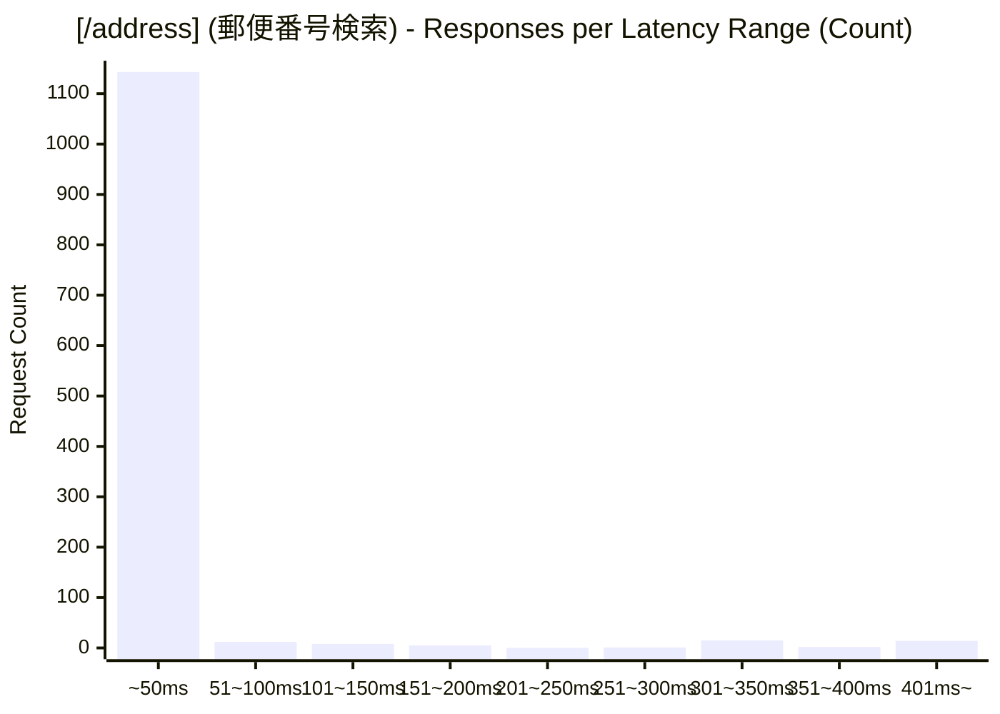
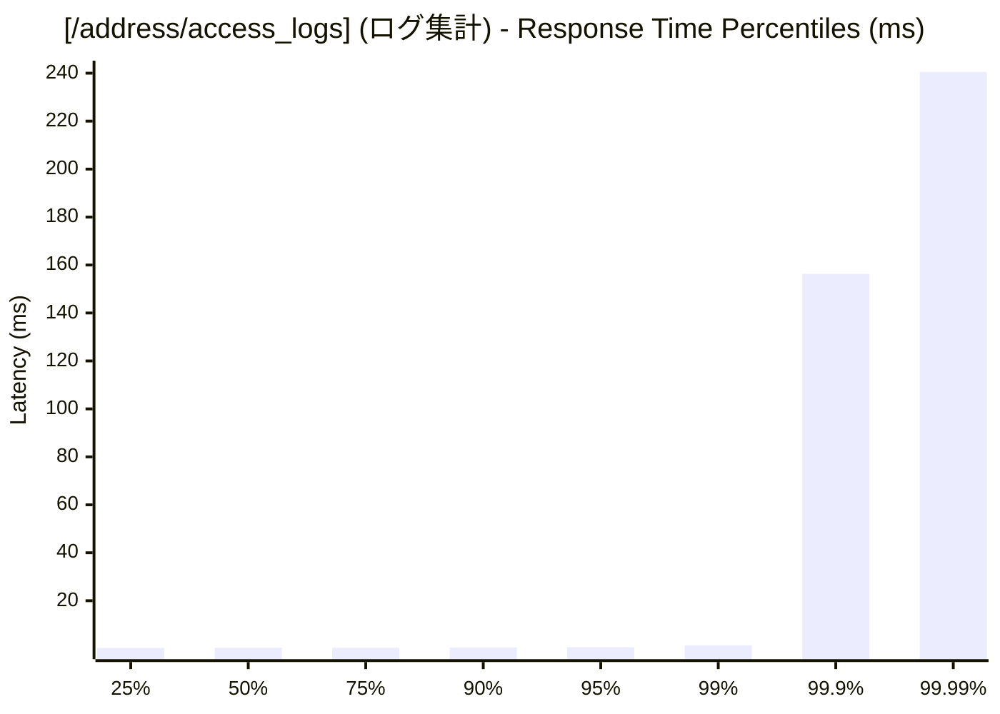
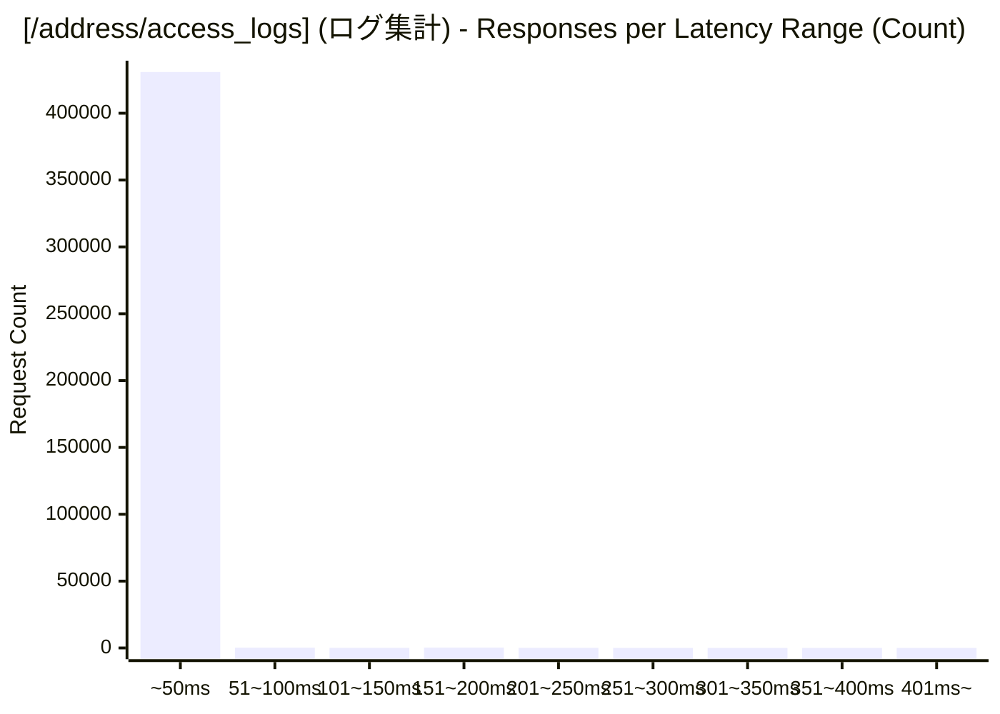

# 負荷テスト結果レポート: ts_address-mixed_50_30s
テスト実行時間: 30.9238 sec

## エンドポイント別詳細

### 全体結果

| 項目 | 結果 |
| :--- | :--- |
| 成功率 | 99.76% |
| 最遅 | 583.8160 ms |
| 最速 | 0.1500 ms |
| 平均 | 0.7442 ms |
| 毎秒リクエスト数 | 13996.5671/sec |

---

### [/address] (郵便番号検索)
| 項目 | 結果 |
| :--- | :--- |
| 成功率 | 13.08% |
| 最遅 | 583.8160 ms |
| 最速 | 5.7530 ms |
| 平均 | 23.8046 ms |
| 毎秒リクエスト数 | 38.8051/sec |

---

### [/address/access_logs] (ログ集計)
| 項目 | 結果 |
| :--- | :--- |
| 成功率 | 100.00% |
| 最遅 | 265.9110 ms |
| 最速 | 0.1500 ms |
| 平均 | 0.6801 ms |
| 毎秒リクエスト数 | 13957.7620/sec |

