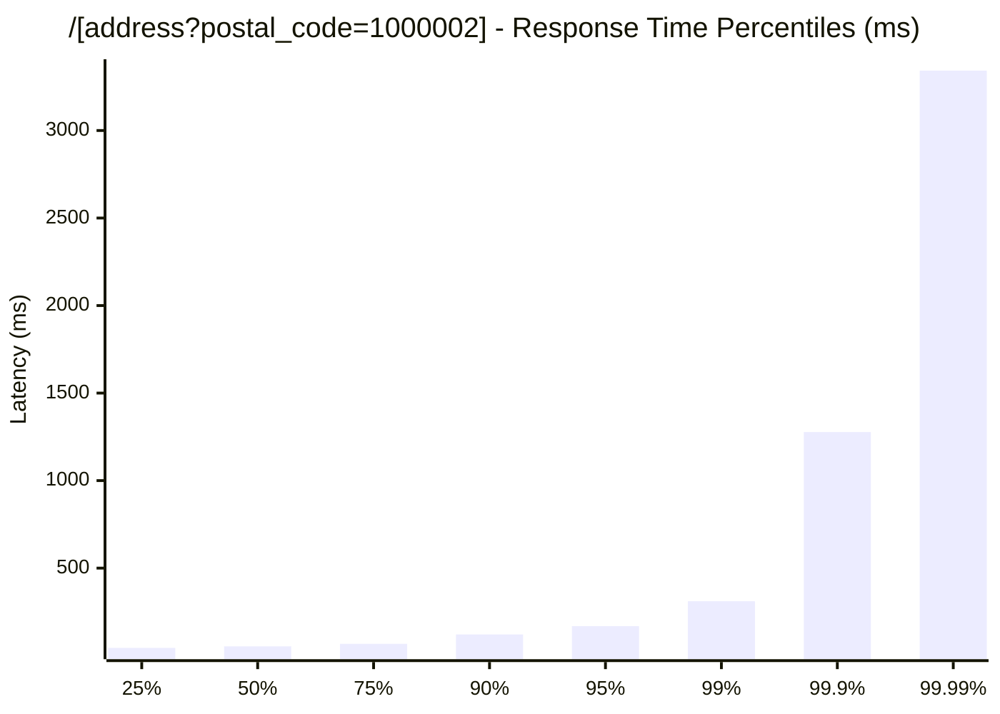
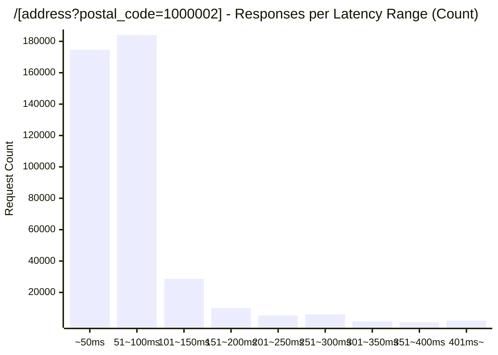

### /[address?postal_code=1000002]
| 項目 | 結果 |
| :--- | :--- |
| 成功率 | 0.04% |
| 最遅 | 11123.3150 ms |
| 最速 | 20.4680 ms |
| 平均 | 72.6123 ms |
| 毎秒リクエスト数 | 10987.1204/sec |

```mermaid
xychart-beta
  title "/[address?postal_code=1000002] - Response Time Percentiles (ms)"
  x-axis ["25%", "50%", "75%", "90%", "95%", "99%", "99.9%", "99.99%"]
  y-axis "Latency (ms)"
  bar [43.9, 53.0, 67.5, 121.0, 168.6, 310.8, 1277.3, 3342.4]
```

```mermaid
xychart-beta
  title "/[address?postal_code=1000002] - Responses per Latency Range (Count)"
  x-axis ["~50ms", "51~100ms", "101~150ms", "151~200ms", "201~250ms", "251~300ms", "301~350ms", "351~400ms", "401ms~"]
  y-axis "Request Count"
  bar [174624, 183987, 28663, 10035, 5319, 5956, 1560, 1063, 2040]
```
