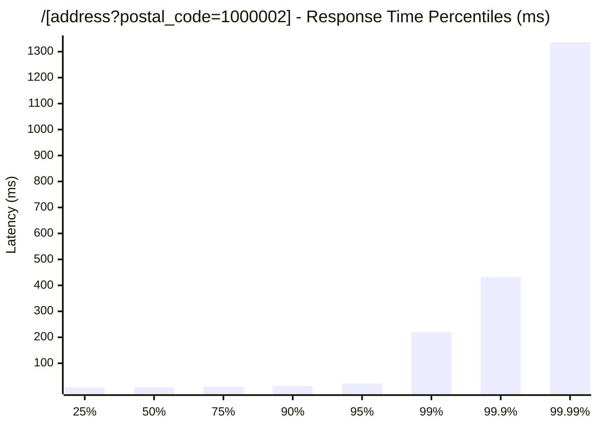
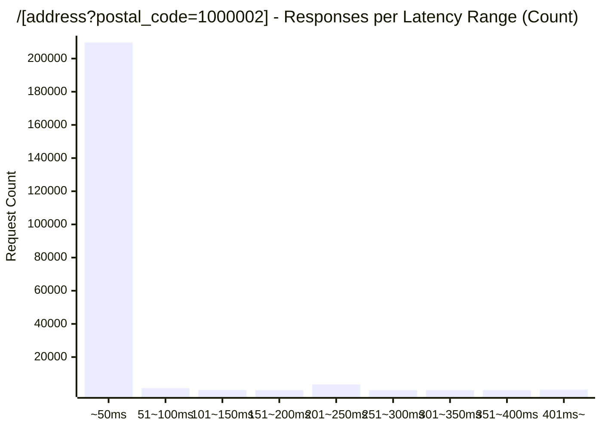

### /[address?postal_code=1000002]
| 項目 | 結果 |
| :--- | :--- |
| 成功率 | 0.07% |
| 最遅 | 3816.9930 ms |
| 最速 | 4.2790 ms |
| 平均 | 13.9250 ms |
| 毎秒リクエスト数 | 7152.6418/sec |

```mermaid
xychart-beta
  title "/[address?postal_code=1000002] - Response Time Percentiles (ms)"
  x-axis ["25%", "50%", "75%", "90%", "95%", "99%", "99.9%", "99.99%"]
  y-axis "Latency (ms)"
  bar [6.7, 7.8, 9.5, 12.9, 22.3, 219.8, 432.6, 1336.3]
```

```mermaid
xychart-beta
  title "/[address?postal_code=1000002] - Responses per Latency Range (Count)"
  x-axis ["~50ms", "51~100ms", "101~150ms", "151~200ms", "201~250ms", "251~300ms", "301~350ms", "351~400ms", "401ms~"]
  y-axis "Request Count"
  bar [209691, 1304, 121, 6, 3471, 43, 56, 23, 342]
```
