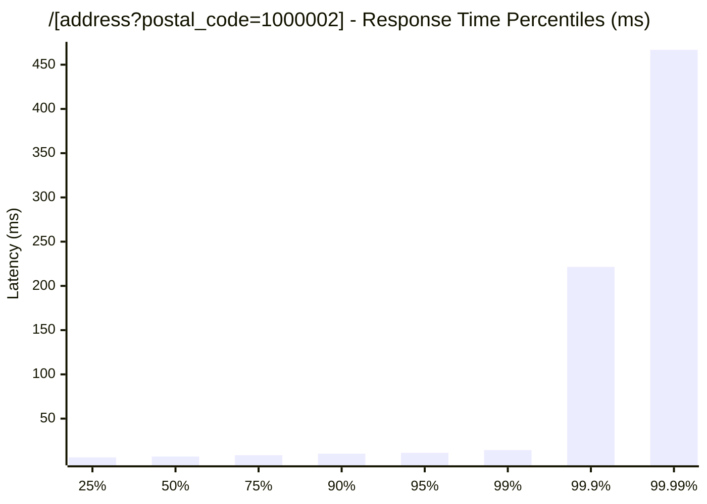
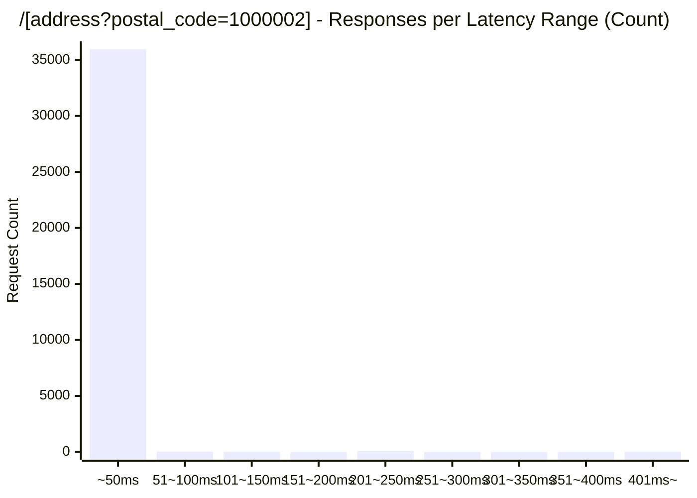

### /[address?postal_code=1000002]
| 項目 | 結果 |
| :--- | :--- |
| 成功率 | 0.44% |
| 最遅 | 475.1770 ms |
| 最速 | 4.4060 ms |
| 平均 | 8.2482 ms |
| 毎秒リクエスト数 | 1201.8087/sec |

```mermaid
xychart-beta
  title "/[address?postal_code=1000002] - Response Time Percentiles (ms)"
  x-axis ["25%", "50%", "75%", "90%", "95%", "99%", "99.9%", "99.99%"]
  y-axis "Latency (ms)"
  bar [6.2, 7.2, 8.7, 10.4, 11.4, 14.5, 221.5, 466.8]
```

```mermaid
xychart-beta
  title "/[address?postal_code=1000002] - Responses per Latency Range (Count)"
  x-axis ["~50ms", "51~100ms", "101~150ms", "151~200ms", "201~250ms", "251~300ms", "301~350ms", "351~400ms", "401ms~"]
  y-axis "Request Count"
  bar [35952, 31, 7, 1, 62, 0, 0, 0, 10]
```
