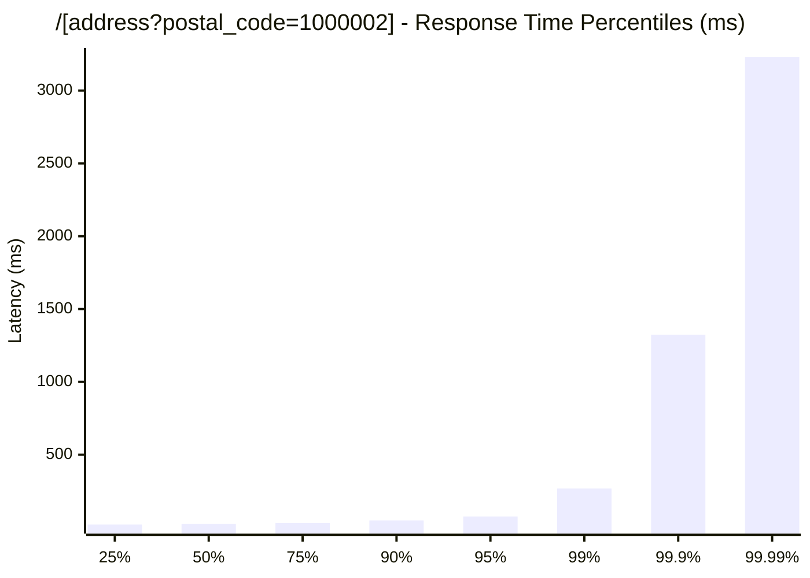
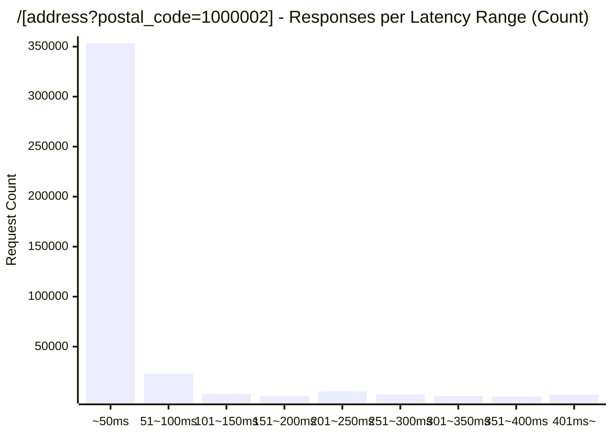

### /[address?postal_code=1000002]
| 項目 | 結果 |
| :--- | :--- |
| 成功率 | 0.04% |
| 最遅 | 10671.8960 ms |
| 最速 | 7.2840 ms |
| 平均 | 38.4516 ms |
| 毎秒リクエスト数 | 12923.7609/sec |

```mermaid
xychart-beta
  title "/[address?postal_code=1000002] - Response Time Percentiles (ms)"
  x-axis ["25%", "50%", "75%", "90%", "95%", "99%", "99.9%", "99.99%"]
  y-axis "Latency (ms)"
  bar [20.5, 24.3, 31.2, 48.5, 75.8, 267.7, 1323.8, 3229.5]
```

```mermaid
xychart-beta
  title "/[address?postal_code=1000002] - Responses per Latency Range (Count)"
  x-axis ["~50ms", "51~100ms", "101~150ms", "151~200ms", "201~250ms", "251~300ms", "301~350ms", "351~400ms", "401ms~"]
  y-axis "Request Count"
  bar [353437, 23022, 2914, 874, 5374, 2316, 689, 74, 1851]
```
