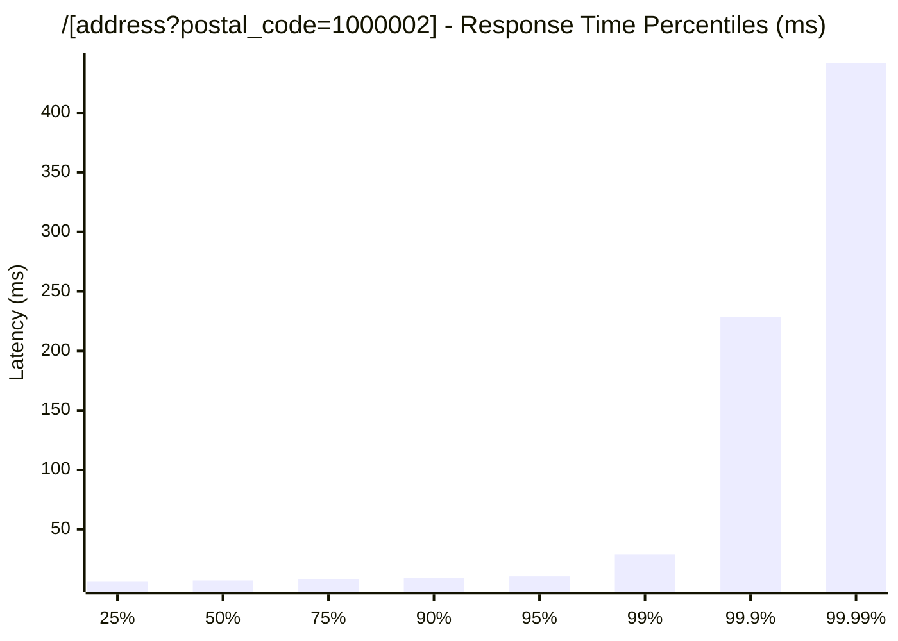
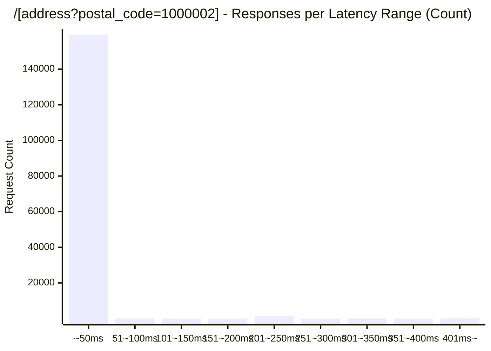

### /[address?postal_code=1000002]
成功率:      0.10%
最遅:        796.5290 ms
最速:        4.2680 ms
平均:        9.2907 ms
毎秒リクエスト数:   5355.9532/sec

```mermaid
xychart-beta
  title "/[address?postal_code=1000002] - Response Time Percentiles (ms)"
  x-axis ["25%", "50%", "75%", "90%", "95%", "99%", "99.9%", "99.99%"]
  y-axis "Latency (ms)"
  bar [6.0, 7.1, 8.2, 9.4, 10.5, 28.7, 228.2, 441.6]
```

```mermaid
xychart-beta
  title "/[address?postal_code=1000002] - Responses per Latency Range (Count)"
  x-axis ["~50ms", "51~100ms", "101~150ms", "151~200ms", "201~250ms", "251~300ms", "301~350ms", "351~400ms", "401ms~"]
  y-axis "Request Count"
  bar [159344, 26, 8, 2, 1272, 6, 17, 4, 53]
```
