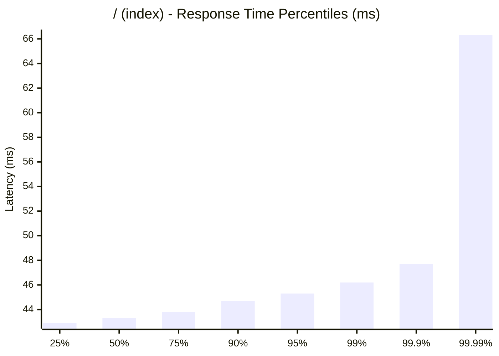
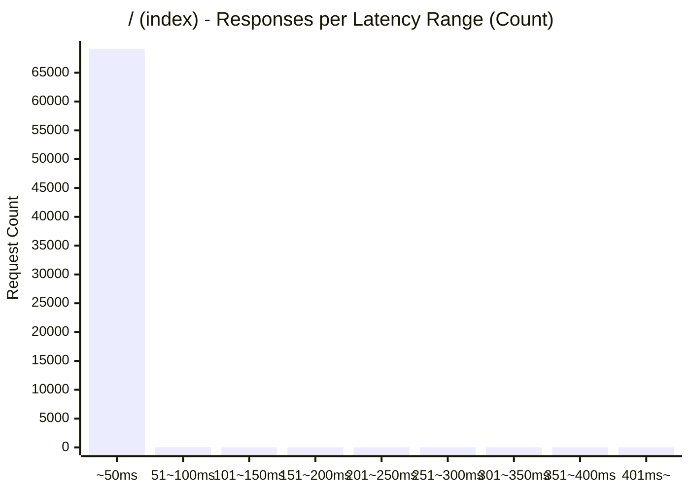

### / (index)
| 項目 | 結果 |
| :--- | :--- |
| 成功率 | 100.00% |
| 最遅 | 75.0250 ms |
| 最速 | 5.5330 ms |
| 平均 | 43.3457 ms |
| 毎秒リクエスト数 | 2303.0601/sec |

```mermaid
xychart-beta
  title "/ (index) - Response Time Percentiles (ms)"
  x-axis ["25%", "50%", "75%", "90%", "95%", "99%", "99.9%", "99.99%"]
  y-axis "Latency (ms)"
  bar [42.9, 43.3, 43.8, 44.7, 45.3, 46.2, 47.7, 66.3]
```

```mermaid
xychart-beta
  title "/ (index) - Responses per Latency Range (Count)"
  x-axis ["~50ms", "51~100ms", "101~150ms", "151~200ms", "201~250ms", "251~300ms", "301~350ms", "351~400ms", "401ms~"]
  y-axis "Request Count"
  bar [69157, 33, 0, 0, 0, 0, 0, 0, 0]
```
