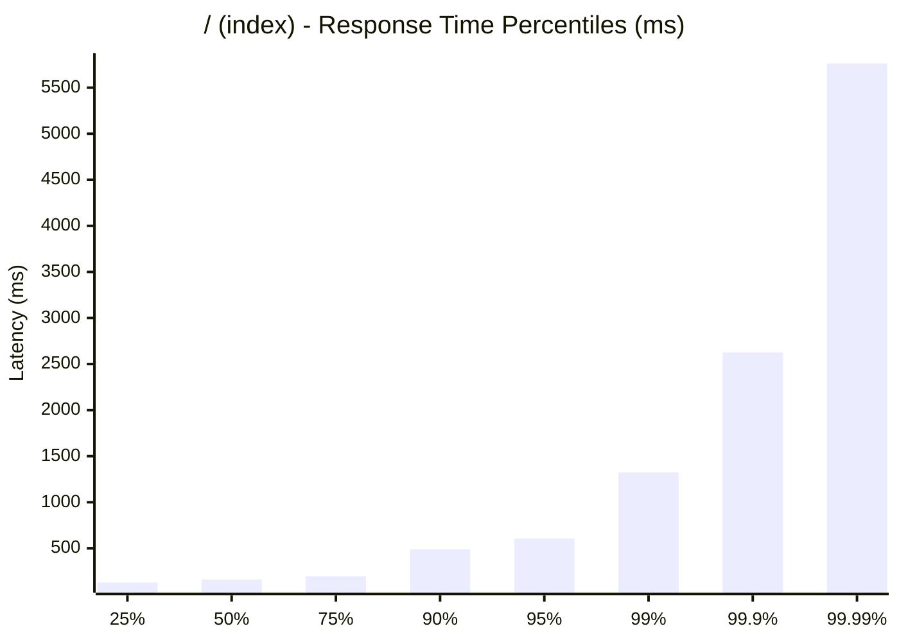
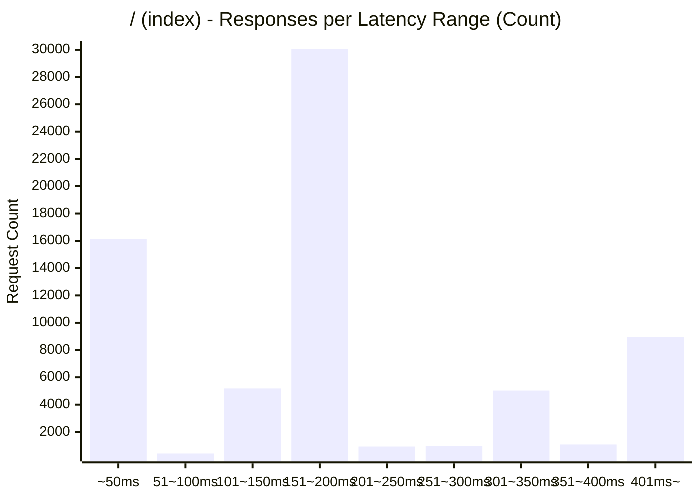

### / (index)
| 項目 | 結果 |
| :--- | :--- |
| 成功率 | 100.00% |
| 最遅 | 13800.8870 ms |
| 最速 | 6.5750 ms |
| 平均 | 218.9906 ms |
| 毎秒リクエスト数 | 1918.8921/sec |

```mermaid
xychart-beta
  title "/ (index) - Response Time Percentiles (ms)"
  x-axis ["25%", "50%", "75%", "90%", "95%", "99%", "99.9%", "99.99%"]
  y-axis "Latency (ms)"
  bar [127.7, 161.9, 196.7, 490.7, 606.8, 1325.3, 2625.3, 5762.6]
```

```mermaid
xychart-beta
  title "/ (index) - Responses per Latency Range (Count)"
  x-axis ["~50ms", "51~100ms", "101~150ms", "151~200ms", "201~250ms", "251~300ms", "301~350ms", "351~400ms", "401ms~"]
  y-axis "Request Count"
  bar [16134, 419, 5186, 30040, 931, 962, 5031, 1081, 8955]
```
