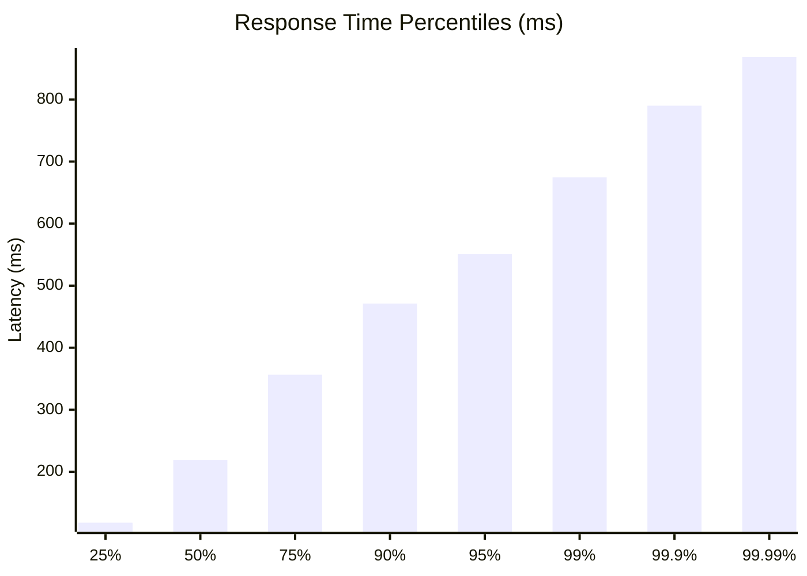
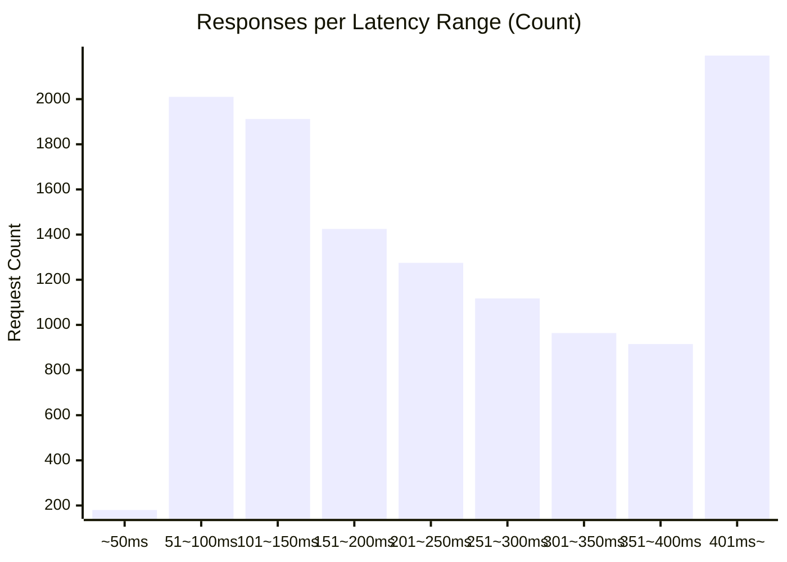

# 負荷テスト結果レポート: go_unuse_cache_address/access_logs_100_30s

## 結果
成功率:      99.48%
時間:        30.1984 sec
最遅:        884.8720 ms
最速:        6.4140 ms
平均:        250.8656 ms
毎秒リクエスト数:   397.0735/sec

## 秒数ごとのリクエスト回数ヒストグラム

