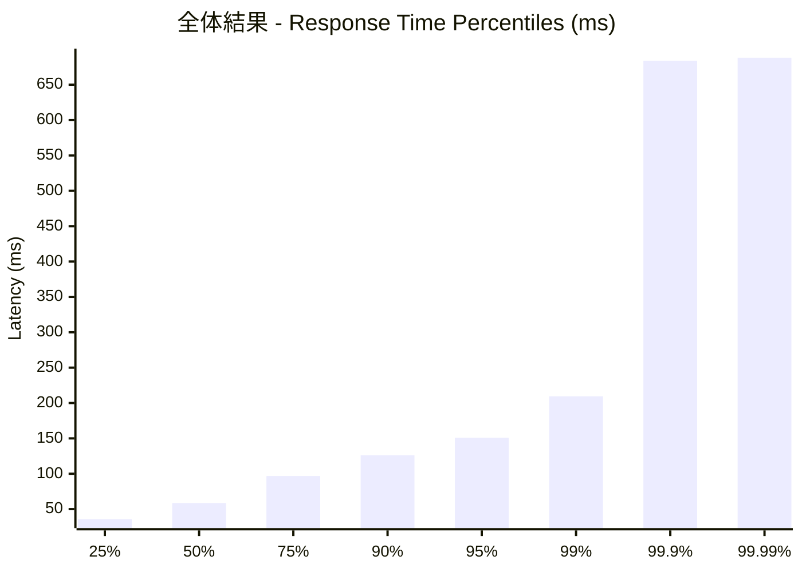
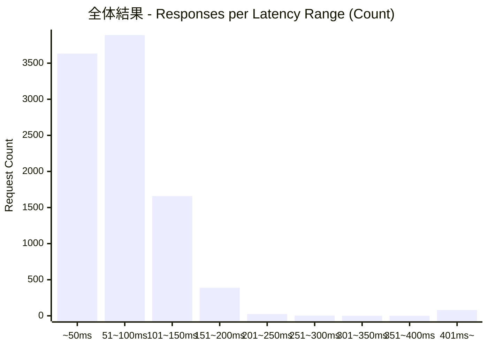
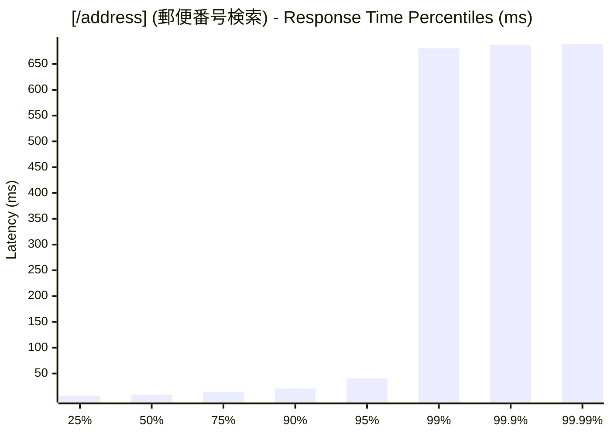
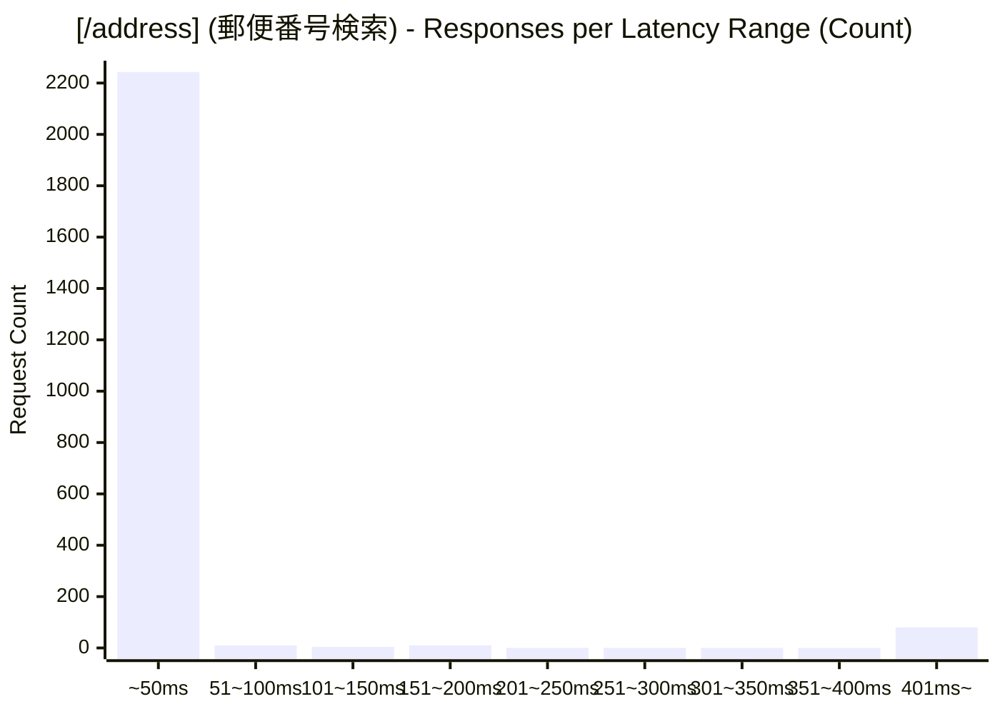
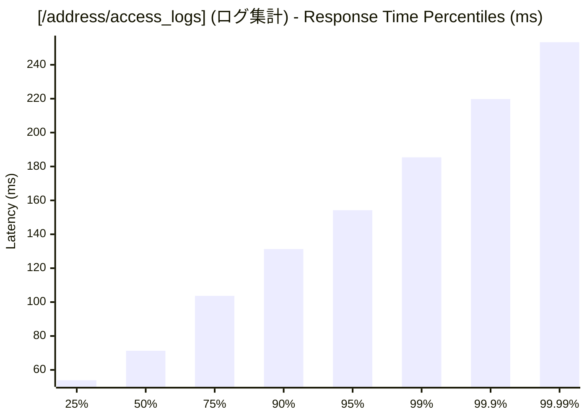
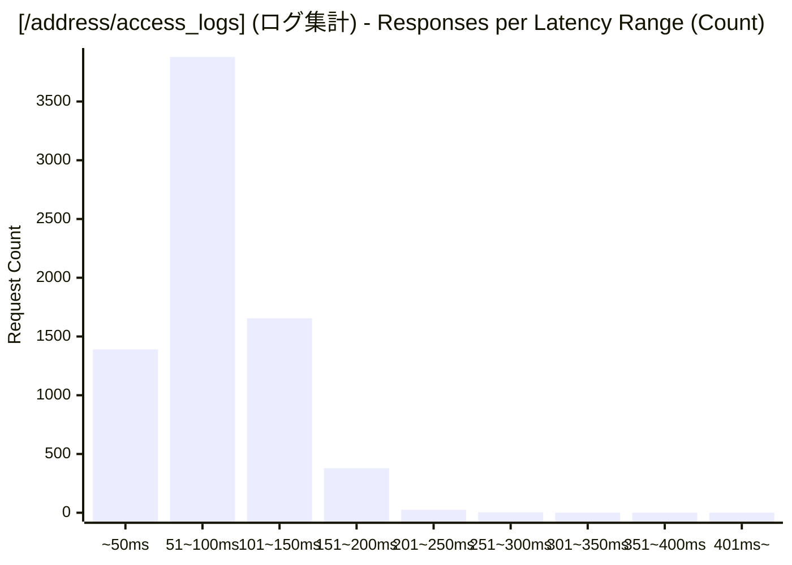

# 負荷テスト結果レポート: go_unuse_cache_address_mixed_address-mixed_100_30s
テスト実行時間: 31.0229 sec

## エンドポイント別詳細

### 全体結果
成功率:      77.37%
最遅:        689.1050 ms
最速:        5.1430 ms
平均:        70.4699 ms
毎秒リクエスト数:   311.9627/sec

---

### [/address] (郵便番号検索)
成功率:      6.69%
最遅:        689.1050 ms
最速:        5.1430 ms
平均:        34.8172 ms
毎秒リクエスト数:   75.6537/sec

---

### [/address/access_logs] (ログ集計)
成功率:      100.00%
最遅:        254.9660 ms
最速:        24.8090 ms
平均:        81.8840 ms
毎秒リクエスト数:   236.3090/sec

