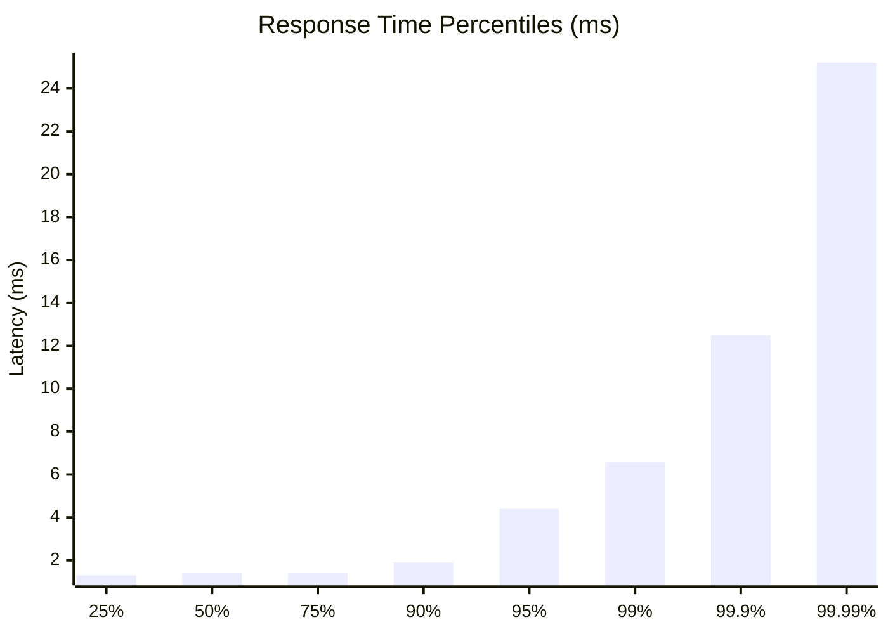
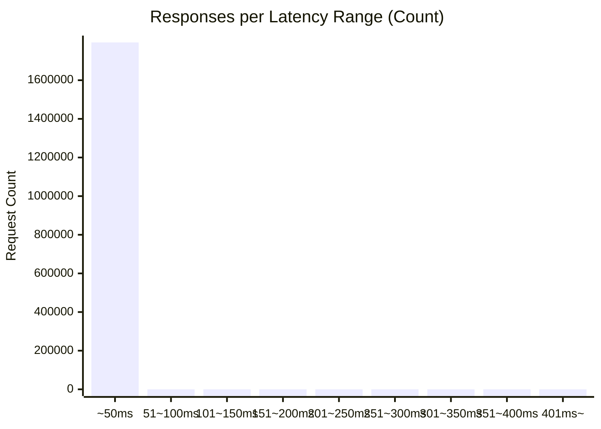

# 負荷テスト結果レポート: go_use_cache_address/access_logs_100_30s

## 結果
成功率:      100.00%
時間:        30.0010 sec
最遅:        106.2270 ms
最速:        0.2420 ms
平均:        1.6524 ms
毎秒リクエスト数:   59856.8854/sec

## 秒数ごとのリクエスト回数ヒストグラム

