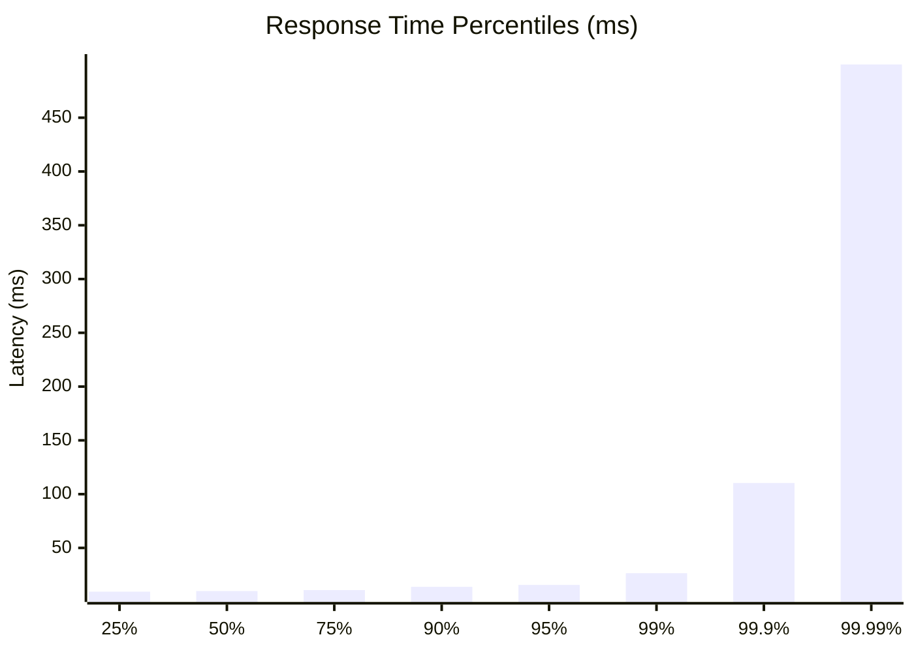
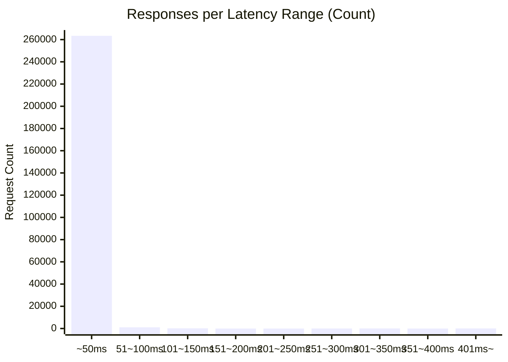

# 負荷テスト結果レポート: go_use_cache_address?postal_code=1330052_100_30s

## 結果
| 項目 | 結果 |
| :--- | :--- |
| 成功率 | 0.06% |
| 時間 | 30.0079 sec |
| 最遅 | 526.4290 ms |
| 最速 | 5.0150 ms |
| 平均 | 11.2559 ms |
| 毎秒リクエスト数 | 8828.9075/sec |

## 秒数ごとのリクエスト回数ヒストグラム

